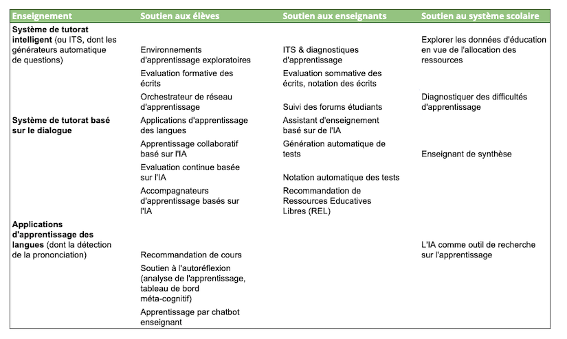

??? info "Metadata"
    - Id: EU.AI4T.O1.M1.3.1t
    - Title: 1.3.1 L'avenir de l'apprentissage par les experts en éducation
    - Type: text
    - Description: Indiquer les défis liés à l'IA en éducation et les compétences essentielles requises à l'ère de l'IA.
    - Subject: Artificial Intelligence for and by Teachers
    - Authors:
        - AI4T 
    - Licence: CC BY 4.0
    - Date: 2022-11-15

# Futurs de l'apprentissage par des experts de l'éducation
## L'intelligence artificielle est déjà présente dans les salles de classe.

Les technologies de l'intelligence artificielle (IA) ont le potentiel de soutenir de nouvelles pratiques pédagogiques et professionnelles au bénéfice des enseignants et des élèves. Voici quelques exemples d'activités dans le domaine de l'éducation qui sont déjà expérimentées dans les salles de classe et soutenues par les technologies d'IA :

- L'apprentissage personnalisé étape par étape

- Le regroupement dynamique des apprenants pour un travail en classe plus efficace

- L'analyse des écrits des élèves et évaluation automatique

- Les chatbots d'assistance aux étudiants

- La génération automatique de tests

- Le suivi des résultats d'apprentissage des étudiants

- La gestion de tâches administratives telles que l'organisation des cours ou la réponse aux questions courantes.

À ces quelques exemples, on pourrait ajouter une longue liste d'outils désormais intégrés dans le quotidien des enseignants et des élèves lorsqu'ils utilisent des services numériques, comme la correction automatique de l'orthographe, les recommandations et les suggestions de lecture, le filtre anti-spam pour les courriels, la reconnaissance automatique de la voix ou du visage, etc.

Si l'on considère uniquement les tâches spécifiques à l'éducation, un ensemble de quatre catégories d'applications émergentes et potentielles basées sur les besoins a été défini par Fengchun &amp; al. [^1]:

- La gestion et la prestation de l'éducation ;

- L'apprentissage et l'évaluation ;

- L'autonomisation des enseignants et l'amélioration de l'enseignement ;

- Et l'apprentissage tout au long de la vie.

Holmes &amp; al. [^2] ont classé les différents types de systèmes actuels basés sur l'IA pour l'éducation comme indiqué ci-dessous.

<figure>
	 
	 <figcaption> Différents types de systèmes actuels basés sur l'IA pour l'éducation (d'après Holmes &amp; al. 2019) </figcaption>
</figure>

## Défis liés à l'IA et éducation

Ces technologies émergentes de l'IA doivent également être questionnées dans le contexte de l'utilisation de l'éducation. Pour exploiter les opportunités et atténuer les risques potentiels de l'IA en éducation, les défis suivants ont été identifiés dans le rapport de Fengchun &amp; al. UNESCO, 2021 :

1.  **Comment l'IA peut-elle être utilisée pour améliorer l'éducation ?**

    "*Au cours de la dernière décennie, l'utilisation des outils d'IA pour soutenir ou améliorer l'apprentissage a connu une croissance exponentielle[^3]. Cette tendance n'a fait que s'accentuer à la suite des fermetures d'écoles du COVID-19. Cependant, les preuves restent rares sur la façon dont l'IA peut améliorer les résultats de l'apprentissage et si elle peut aider les scientifiques et les praticiens de l'apprentissage à mieux comprendre comment l'apprentissage efficace se produit[^4]. En outre, nous devons encore explorer le potentiel de l'IA dans le suivi des résultats d'apprentissage dans différents contextes ainsi que dans l'évaluation des compétences, en particulier celles acquises dans des contextes non formels et informels.*"

    "*Il existe également un potentiel pour l'IA pour faciliter de nouvelles approches de l'évaluation, telles que l'évaluation adaptative et continue basée sur l'IA[^5]. Cependant, il est important de reconnaître d'emblée que l'utilisation de l'IA pour l'apprentissage et l'évaluation soulève également diverses préoccupations qui n'ont pas encore été correctement traitées. Il s'agit notamment des préoccupations concernant leur approche de la pédagogie, du manque de preuves solides de leur efficacité et de leur impact potentiel sur le rôle des enseignants, ainsi que de questions éthiques plus larges[^6] [^7]*."

    "*De nombreuses applications d'IA destinées aux enseignants visent à aider ces derniers à réduire leur charge de travail en automatisant des tâches telles que l'évaluation, la détection du plagiat, l'administration et le retour d'information. Il est souvent dit que cela devrait permettre aux enseignants de libérer du temps qu'ils pourront investir dans d'autres tâches, telles que l'apport d'un soutien plus efficace à chaque élève.*"

2.  **Comment pouvons-nous garantir l'utilisation éthique, inclusive et équitable de l'IA en éducation ?**

    "*L'utilisation éthique, inclusive et équitable de l'IA en éducation a un impact sur chacun des objectifs de développement durable. Il existe des questions centrées sur les données et les algorithmes, sur les choix pédagogiques, sur l'inclusion et la "fracture numérique", sur le droit des enfants à la vie privée, à la liberté et au développement sans entrave, et sur l'équité en termes de genre, de handicap, de statut social et économique, d'origine ethnique et culturelle, et de localisation géographique.*"

3.  **Comment l'éducation peut-elle préparer les humains à vivre et à travailler avec l'IA ?**

    "*Si le monde veut s'assurer que l'IA n'exacerbe pas les inégalités existantes, il sera de plus en plus important que chaque citoyen ait la possibilité de développer une solide compréhension de l'IA - ce qu'elle est, comment elle fonctionne et comment elle pourrait avoir un impact sur sa vie. C'est ce qu'on appelle parfois la "culture de l'IA". Pour cela, les enseignants joueront un rôle clé.*"

    "*Aider les élèves à apprendre à vivre efficacement dans un monde de plus en plus impacté par l'IA nécessite une pédagogie qui mette davantage l'accent sur les compétences humaines (par exemple, la pensée critique, la communication, la collaboration et la créativité) et la capacité à collaborer avec des outils d'IA omniprésents dans la vie, l'apprentissage et le travail.*"

## Compétences de base requises à l'ère de l'IA

Le déploiement de technologies basées sur l'IA à l'école soulève des questions quant à l'impact de l'utilisation de ces systèmes sur les compétences pédagogiques, comme l'a souligné le Centre commun de recherche (JRC), le service de la science et de la connaissance de la Commission européenne[^8]:

- Dans quelle mesure l'enseignant ou l'utilisateur doit-il être conscient de la technologie sous-jacente ?

- Dans quelle mesure les éducateurs doivent-ils avoir des connaissances sur l'IA pour pouvoir agir en connaissance de cause et efficacement en tant qu'éducateurs ?

- Les technologies émergentes d'aujourd'hui auront-elles un impact sur les compétences professionnelles des enseignants à l'avenir ?

Les auteurs du rapport du Centre commun de recherche soulignent qu'en plus des connaissances pédagogiques générales, des connaissances spécifiques à une matière et des compétences en matière de gestion de classe, les éducateurs devront disposer :

- De compétences numériques générales pour utiliser et appliquer les technologies numériques comme pour tout citoyen[^9] concernant la maîtrise de l'information et du numérique,la communication et la collaboration, la création de contenu numérique, la sécurité et la résolution de problèmes.

- et de compétences permettant de faire un usage éducatif valable de ces technologies numériques.

Un défi spécifique d'introduction de l'IA en éducation et de préparation des étudiants à un contexte alimenté par l'IA a été présenté par l'UNESCO en 2019[^10]:
"*Préparer les enseignants à une éducation alimentée par l'IA tout en préparant l'IA à comprendre l'éducation, ce qui doit néanmoins être un chemin à double sens : les enseignants doivent acquérir de nouvelles compétences numériques pour utiliser l'IA de manière pédagogique et significative et les développeurs d'IA doivent apprendre comment les enseignants travaillent et créer des solutions durables dans des environnements réels.*"

Dans les modules suivants de ce cours nous entendons aider à comprendre ce qu'est l'IA et ses technologies sous-jacentes, à prendre conscience des avantages et des limites pour agir de manière informée et efficace en tant qu'enseignant et à s'interroger sur l'impact des systèmes d'IA sur l'apprentissage, l'enseignement et l'éducation.

[^1]: L'IA et l'éducation : Guide pour les décideurs - Miao Fengchun, Holmes Wayne, Ronghuai Huang, Hui Zhang - ISBN : 978-92-3-100447-6 - UNESCO, 2021

[^2]: Artificial Intelligence In Education: Promises and Implications for Teaching and Learning - Wayne Holmes, Maya Bialik, Charles Fadel - Boston, MA, Center for Curriculum Redesign, 2019

[^3]: Artificial Intelligence In Education: Promises and Implications for Teaching and Learning - Wayne Holmes, Maya Bialik, Charles Fadel - Boston, MA, Center for Curriculum Redesign, 2019

[^4]: Zawacki-Richter, O., Marín, V. I., Bond, M. and Gouverneur, F. 2019. Systematic review of research on artificial intelligence applications in higher education -- where are the educators? International Journal of Educational Technology in Higher Education, Vol. 16, No. 1, pp. 1--27.

[^5]: Luckin, R. 2017. Towards artificial intelligence-based assessment systems. Nat Hum Behav 1, 0028

[^6]: Holmes, W., Bektik, D., Whitelock, D. and Woolf, B. P. 2018b. Ethics in AIED: Who cares? C. Penstein Rosé, R. Martínez- Maldonado, H. U. Hoppe, R. Luckin, M. Mavrikis, K. Porayska-Pomsta, B. McLaren, and B. du Boulay (eds.), Lecture Notes in Computer Science. London, Springer International Publishing, vol. 10948, pp. 551--553.

[^7]: Artificial Intelligence In Education: Promises and Implications for Teaching and Learning - Wayne Holmes, Maya Bialik, Charles Fadel - Boston, MA, Center for Curriculum Redesign, 2019

[^8]: Emerging technologies and the teaching profession: Ethical and pedagogical considerations based on near-future scenarios- Vuorikari Riina, Punie Yves,Marcelino Cabrera - Joint Research Center report - 2020

[^9]:  DigComp 2.2: The Digital Competence Framework for Citizens - With new examples of knowledge, skills and attitudes, Vuorikari, R., Kluzer, S. and Punie, Y., EUR 31006 EN, Publications Office of the European Union, Luxembourg, 2022, ISBN 978-92-76-48883-5, doi:10.2760/490274, JRC128415.

[^10]: Artificial intelligence in education: challenges and opportunities for sustainable development- Pedró Francesc, Subosa Miguel, Rivas Axel, Valverde Paula, ED-2019/WS/8, UNESCO, 2019.
