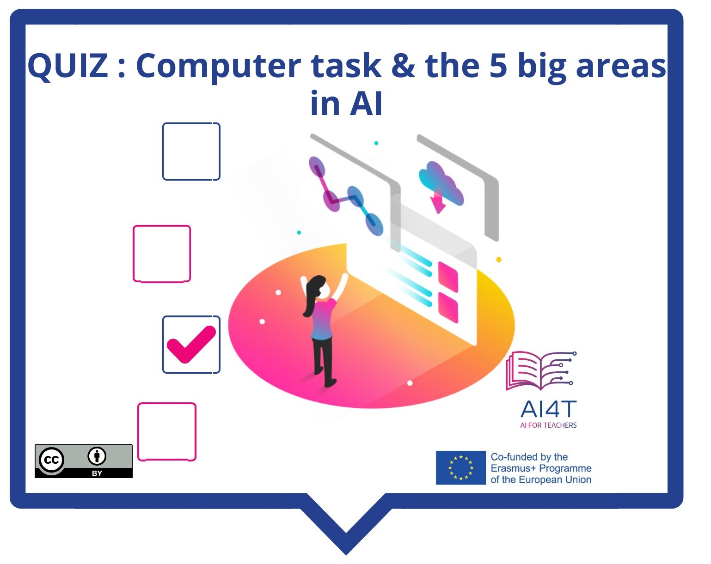

# Activity:  

Now that you have discovered a first definition of AI, let's match some computing tasks to one of the 5 main areas of AI.

**"Access to the activity"**  
_Click on the image below_
<a href="2-1-2-what-is-the-definition-of-ai/2-1-2.html" target="_blank"><figure> 
    
</figure></a>
