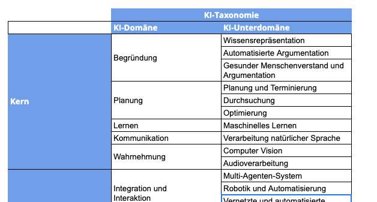

??? info "Metadata"
    - Id: EU.AI4T.O1.M2.2.5t
    - Title: 2.2.5 Welche Arten von KI-Anwendungen im Bildungswesen
    - Type: text
    - Description: Die bestehenden KI-Systeme, ihr Potenzial und ihre bestehenden Anwendungen im Bildungswesen
    - Subject: Artificial Intelligence for and by Teachers
    - Authors:
        - AI4T 
    - Licence: CC BY 4.0
    - Date: 2022-11-15

# Welche Arten von KI-Anwendungen im Bildungswesen

Unter den möglichen Klassifizierungen von KI-Wissenschaftsbereichen wird in der folgenden Tabelle eine KI-Taxonomie[^1] nach den von KI möglicherweise ausgeführten Familienfunktionen vorgestellt.
<figure>
    
</figure>
_Abbildung: KI-Taxonomie - KI-Wissenschaftsbereiche und Unterbereiche (aus Samoili &amp; al., 2021 JRC report[^1])._

Schauen wir uns an, welche KI-Techniken in den von Holmes &amp; al. 2019[^2] vorgeschlagenen bildungsorientierten KI-Anwendungen eingesetzt werden.
<figure>
  
</figure>
_Abbildung: Unterschiedliche Arten aktueller KI-basierter Systeme für das Bildungswesen (aus Holmes &amp; al. 2019[^2])._

Jedes spezifische KI-basierte Bildungswerkzeug oder -mittel hat seine eigenen spezifischen Techniken. Es ist jedoch manchmal möglich, zu erraten, welche Techniken für eine bestimmte Ressource wahrscheinlich verwendet werden.

Nehmen wir einige Beispiele:

- **Dialogbasiertes Nachhilfesystem**, als Dienstleistung für den Studentenunterricht
Solche Systeme werden wahrscheinlich verwendet: **Kommunikationstechniken**, wie z. B. die Verarbeitung natürlicher Sprache zum Verstehen und Erzeugen von Sprache, und **Überlegungstechniken** für Nachhilfezwecke

- **Kursempfehlung**, als unterstützende Dienstleistung für Studenten
Wie bei personalisierten Marketingangeboten und Empfehlungsfunktionen, die im Internet zu finden sind, basieren Kursempfehlungssysteme wahrscheinlich auf **maschinellen Lerntechniken**, indem sie relevante aktuelle Daten in Bezug auf den Lernpfad des Studenten analysieren und Ähnlichkeiten mit früheren verallgemeinerten Lernpfaden der Studenten erkennen.

- **Aufmerksamkeits- und Emotionserkennung bei Schülern** als lehrerunterstützender Dienst
Ein solches System wird wahrscheinlich **Wahrnehmungstechniken** (z. B. Computer Vision für die Gesichtserkennung) und **maschinelle Lerntechniken** einsetzen, um die Mimik oder das Verhalten des Schülers zu analysieren, wenn solche Informationen gesammelt und analysiert werden.

[^1]: AI Watch - Defining Artificial Intelligence - 2.0. Towards an operational definition and taxonomy for the AI landscape - Samoili, S., López Cobo, M., Delipetrev, B., Martínez-Plumed, F., Gómez, E., and De Prato, G. - EUR 30873 EN, Publications Office of the European Union, Luxembourg, 2021, ISBN 978-92-76-42648-6, doi:10.2760/019901, JRC126426.

[^2]: Artificial Intelligence In Education: Promises and Implications for Teaching and Learning - Wayne Holmes, Maya Bialik, Charles Fadel - Boston, MA, Center for Curriculum Redesign, 2019.
