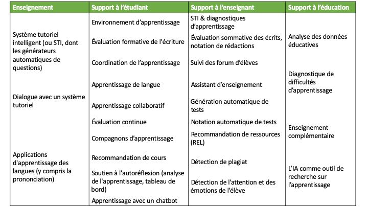

??? info "Metadata"
    - Id: EU.AI4T.O1.M2.2.5t
    - Title: 
    - Type: text
    - Description: 
    - Subject: Artificial Intelligence for and by Teachers
    - Authors:
        - AI4T 
    - Licence: CC BY 4.0
    - Date: 2022-11-15

# Quels types d'applications de l'IA en éducation ?

Parmi les classifications possibles des domaines scientifiques de l'IA, le tableau suivant présente une taxonomie de l'IA[^1] par rapport aux fonctions de la famille que peut remplir l'IA.
<figure>
    
</figure>
_Figure : Taxonomie de l'IA - domaines et sous-domaines scientifiques de l'IA (d'après Samoili &amp; al., 2021 JRC report[^1])._

Voyons quelles techniques d'IA sont utilisées dans les applications orientées éducation basées sur l'IA proposées par Holmes &amp; al. en 2019[^2].
<figure>
  
</figure>
_Figure : Différents types de systèmes actuels basés sur l'IA pour l'éducation (d'après Holmes &amp; al. 2019[^2])._

Chaque outil ou ressource pédagogique spécifique basé sur l'IA possède ses propres techniques spécifiques. Cependant, il est parfois possible de deviner celles qui sont susceptibles d'être utilisées pour une ressource donnée.

Prenons quelques exemples :

- **Système de tutorat basé sur le dialogue**, en tant que service d'enseignement aux apprenants.
De tels systèmes sont susceptibles d'utiliser : des techniques de **communication** telles que le traitement du langage naturel pour la compréhension et la génération de la parole et du langage et des techniques de **raisonnement** à des fins de tutorat.

- **Recommandation de cours**, en tant que service de soutien aux apprenants.
Comme pour les offres commerciales personnalisées et les fonctions de recommandation que l'on peut trouver sur Internet, les systèmes de recommandation de cours sont probablement basés sur des techniques d'apprentissage automatique en analysant les données actuelles pertinentes liées au parcours d'apprentissage de l'étudiant et en identifiant les similitudes avec des parcours d'apprentissage généralisés antérieurs.

- **Détection de l'attention et des émotions de l'étudiant**, en tant que service d'aide à l'enseignant. << ce point doit être repris et délimité au seul maintien de l'engagement de l'élève >>
Un tel système est susceptible d'utiliser des techniques de **perception** (vision par ordinateur pour la reconnaissance faciale, par exemple) et des techniques d'**apprentissage automatique** pour analyser les expressions faciales ou le comportement de l'apprenant, si ces informations sont collectées et analysées.

[^1]: AI Watch - Defining Artificial Intelligence - 2.0. Towards an operational definition and taxonomy for the AI landscape - Samoili, S., López Cobo, M., Delipetrev, B., Martínez-Plumed, F., Gómez, E., and De Prato, G. - EUR 30873 EN, Publications Office of the European Union, Luxembourg, 2021, ISBN 978-92-76-42648-6, doi:10.2760/019901, JRC126426.

[^2]: Artificial Intelligence In Education: Promises and Implications for Teaching and Learning - Wayne Holmes, Maya Bialik, Charles Fadel - Boston, MA, Center for Curriculum Redesign, 2019.
