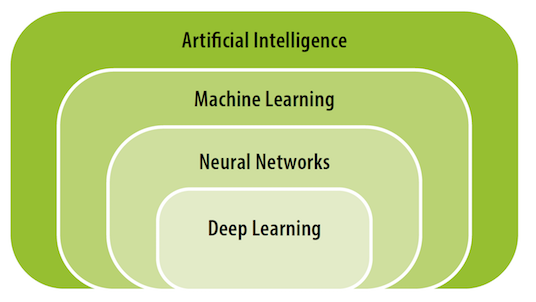

??? info "Metadata"
    - Id: EU.AI4T.O1.M3.1.2t
    - Title: 3.1.2 What kind of AI?
    - Type: text
    - Description: Get a first understanding of AI types
    - Subject: Artificial Intelligence for and by Teachers
    - Authors:
        - AI4T 
    - Licence: CC BY 4.0
    - Date: 2022-11-15

# What kind of AI?  
Many AI types can be found in the literature. Let's see what they refer to.

## Weak or strong AI?
- Weak Artificial Intelligence  
  This is the artificial intelligence we know today: it is an algorithm that "learns", by adapting its parameters to learning data, and is not endowed with mental and cognitive capacities, but is capable of performing a specific task much more efficiently sometimes than a human being.
- Strong Artificial Intelligence  
  An artificial intelligence that would be capable of copying human aptitudes (learning, understanding, apprehending, reasoning, making decisions, having a conscience, emotions, etc.). A so-called "strong" artificial intelligence, which would be able to be autonomous and versatile in unexpected situations, is a scientific objective. However, at present, there are results that show that this ideal goal of strong artificial intelligence is technically impossible. To date, strong artificial intelligence does not exist, it is a belief.

## Symbolic or Machine Learning Approach?

Within Weak Artificial Intelligence, what do the symbolic or Machine Learning approaches refer to?

- A symbolic AI approach  
  Also known as "rule-based" or "classical" AI, it is based on logic and a priori knowledge provided by expert humans.
  Historically, the symbolic approach is older, corresponding to expert systems, and more recently to the so-called semantic web.
- A machine learning (or Digital) approach  
  Also known as "digital" approach, it is based on data and learning.
  The numerical or Machine Learning (ML) approach includes artificial neural networks and deep learning when there are several layers of such computing units[^1]. It has become effective more recently, and it is this approach that allows us to automatically transcribe texts that we dictate, or to recognise objects in images. It requires a lot of data and is based on statistical approaches.

<figure> 
   
  <figcaption>The relationship between artificial intelligence, neural networks and deep learning - Source: AI and education: Guidance for policy-makers, UNESCO, 2021</figcaption> 
</figure>

## Supervised or Unsupervised Learning Approach?

Within Machine Learning approaches, AI systems come in two flavours depending on the way data is used to train them:[^2]

- Supervised Learning  
  "*Supervised learning refers to the use of labelled data -such as pictures that say whether or not they contain cats- to train algorithms. These approaches devise their own methods of predicting how pictures should be labelled.*"
- Unsupervised Learning  
  "*Unsupervised learning may be used where good quality labelled data is not available. They excel in finding new clusters and associations within data which might not otherwise have been identified or labelled by humans. Since labels are often incomplete or inaccurate, many applications such as content recommendation systems combine both supervised and unsupervised ML approaches.*"

Many artificial intelligence mechanisms today work through supervised learning. To describe how it works, let's imagine that we want to teach an artificial intelligence to recognise a cat in an image.

To do this, we will provide a lot of data, namely, many images where a cat can be seen and many images where no cat can be seen, so that the calculation adjusts its parameters in order to give an output value corresponding to the presence or not of the feline. All these images constitute the input data, and the expected result, whether or not there is a cat in the image, the output data. These "input" and "output" data are the only information provided for its training.

The computational mechanism must therefore adjust internal parameters (such as the control knobs of a camera) to determine whether or not there is a cat in the image. The first time, a random and therefore most likely false result will be provided, then little by little the mechanism will observe the errors and by successive trials will adjust the parameters to reduce them. This process is known as machine learning.

In fact, many AI applications use ML and almost always some symbolic AI in the background. For example, many chatbot applications are pre-programmed with human-defined rules about how to reply to anticipated questions. And it is a current research topic to see how to combine the symbolic and machine learning approaches.

[^1]:[AI and education: Guidance for policy-makers](https://unesdoc.unesco.org/ark:/48223/pf0000376709) - Miao Fengchun, Holmes Wayne, Ronghuai Huang, Hui Zhang - ISBN: 978-92-3-100447-6 - UNESCO, 2021

[^2]:[Artificial intelligence: How does it work, why does it matter, and what can we do about it?](https://www.europarl.europa.eu/thinktank/en/document/EPRS_STU(2020)641547) - Philip Boucher, Scientific Foresight Unit (STOA) - ISBN: 978-92-846-6770-3 - European Union, 2020
