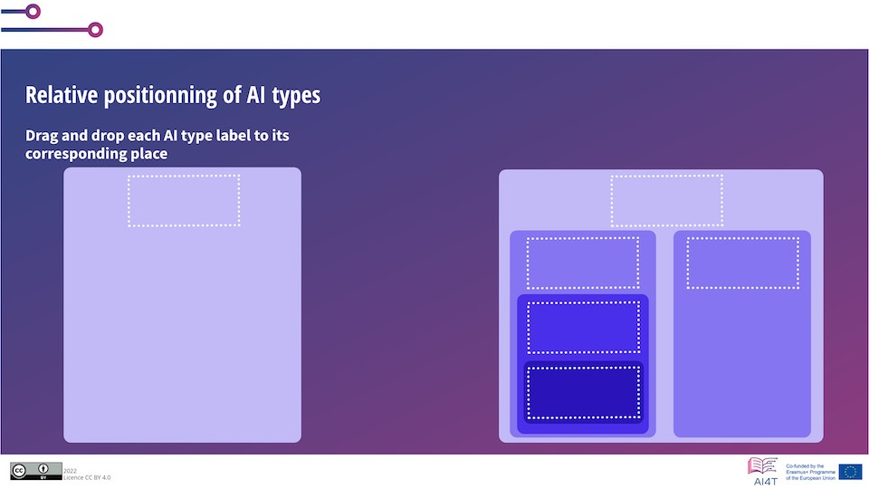

# Activity: AI types classification  

In the following activity, you will have to identify the different types of AI and the relationships between them.

**"Access to the activity"**  
_Click on the image below_

<a href="3-1-2-1-activity-what-type-of-ai/3-1-2-1.html" target="_blank"><figure> 
    
</figure></a>
