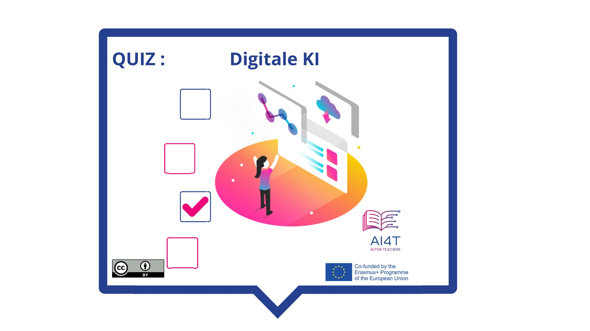

# Aktivität: Digitale KI

Eine kurze Aktivität zur Bestandsaufnahme der digitalen KI (auch "maschinelles Lernen" genannt), was sie kann und was nicht.

**"Zugang zur Aktivität"**  
_Klick auf das Bild unten_

<figure>
    
</figure>

<iframe width="818" height="404" src="3-1-4a-activity-what-type-of-ai/3-1-4a-Digital-AI.html" frameborder="0" allowfullscreen></iframe>

