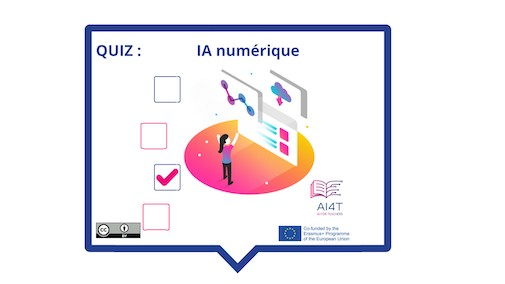

??? info "Metadata"
    - Id: EU.AI4T.O1.M3.1.4a
    - Title: 3.1.4 Activité : Identifier l'IA numérique 
    - Type: activity
    - Description: Qu'est-ce que l'IA numérique et ce qu'elle n'est pas
    - Subject: Artificial Intelligence for and by Teachers
    - Authors:
        - AI4T 
    - Licence: CC BY 4.0
    - Date: 2022-11-15

# Activité : IA numérique

Une courte activité pour faire le point sur l'IA numérique (aussi appelée "Machine Learning"), ce qu'elle peut et ne peut pas faire.

**"Accès à l'activité"**  
_En-dessous de l'image_

<figure>
    
</figure>

<iframe width="818" height="404" src="3-1-4a-activity-what-type-of-ai/3-1-4a-Digital-AI.html" frameborder="0" allowfullscreen></iframe>

