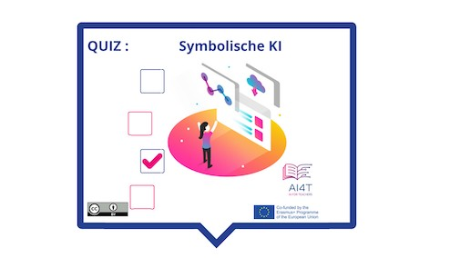

??? info "Metadata"
    - Id: EU.AI4T.O1.M3.1.5a
    - Title: 3.1.5 Aktivität: Symbolische KI identifizieren
    - Type: activity
    - Description: Was ist symbolische KI und was ist sie nicht
    - Subject: Artificial Intelligence for and by Teachers
    - Authors:
        - AI4T 
    - Licence: CC BY 4.0
    - Date: 2022-11-15

# Aktivität: Symbolische KI

Eine kurze Aktivität zur Bestandsaufnahme der Symbolischen KI, was sie kann und was nicht.

**"Zugang zur Aktivität"**  
_Klick auf das Bild unten_

<figure>
    
</figure>

<iframe width="818" height="404" src="3-1-5a-activity-what-type-of-ai/3-1-5a-Symbolic-AI.html" frameborder="0" allowfullscreen></iframe>

