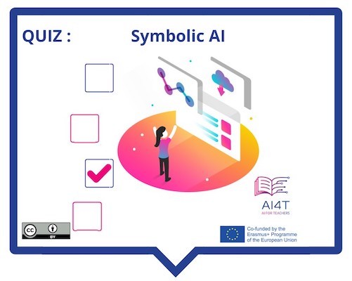

??? info "Metadata"
    - Id: EU.AI4T.O1.M3.1.5a
    - Title: 3.1.5 Activity: Identify Symbolic AI
    - Type: activity
    - Description: What is Symbolic AI and what it is not
    - Subject: Artificial Intelligence for and by Teachers
    - Authors:
        - AI4T 
    - Licence: CC BY 4.0
    - Date: 2022-11-15

# Activity: Symbolic AI

A short activity to take stock of Symbolic AI, what it can and cannot do.

**"Access to the activity"**  
_Click on the image below_

<figure> 
    
</figure>

<iframe width="818" height="404" src="3-1-5a-activity-what-type-of-ai/3-1-5a-Symbolic-AI.html" frameborder="0" allowfullscreen></iframe>

