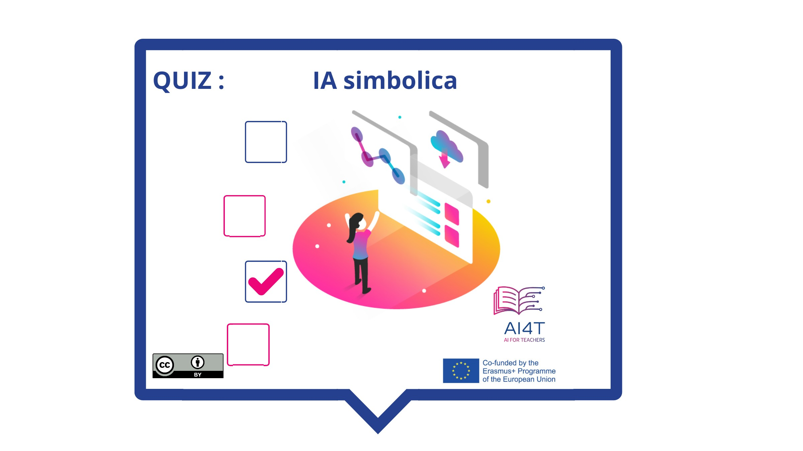

??? info "Metadata"
    - Id: EU.AI4T.O1.M3.1.5a
    - Title: 3.1.5 Attività: Identificare l'intelligenza artificiale simbolica
    - Type: activity
    - Description: Cos'è l'IA simbolica e cosa non è
    - Subject: Artificial Intelligence for and by Teachers
    - Authors:
        - AI4T 
    - Licence: CC BY 4.0
    - Date: 2022-11-15

# Attività: IA simbolica

Una breve attività per fare il punto sull'IA simbolica, su ciò che può o non può fare.

**"Accesso all'attività"**  
_Clicca sull'immagine qui sotto_

<figure>
    
</figure>

<iframe width="818" height="404" src="3-1-5a-activity-what-type-of-ai/3-1-5a-Symbolic-AI.html" frameborder="0" allowfullscreen></iframe>

