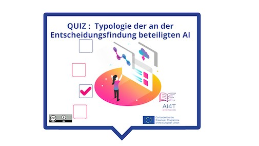

??? info "Metadata"
    - Id: EU.AI4T.O1.M4.1.3a
    - Title: 4.1.3 Aktivität: Entscheidungsfindung mit KI
    - Type: video
    - Description: Verstehen, wie Entscheidungsfindungswerkzeuge Praktiken verändern, verbessern können, aber auch in Frage gestellt werden müssen
    - Subject: Artificial Intelligence for and by Teachers
    - Authors:
        - AI4T 
    - Licence: CC BY 4.0
    - Date: 2022-11-15

# Aktivität: Entscheidungsfindung mit AI im Bildungswesen

Diese kurze Aktivität schlägt vor, die 3 Hauptstufen der Einbeziehung von KI in die Entscheidungsfindung mit einem Feedback, das jede Art von Entscheidung im Bereich der Bildung illustriert, zu überdenken.

**"Zugang zur Aktivität"**  
_Klicken Sie auf das Bild unten_

<figure>
    
</figure>

<iframe width="818" height="404" src="4-1-3a-activity-making-decision-with-ai/4-1-3a-decision-making-and-education.html" frameborder="0" allowfullscreen></iframe>

