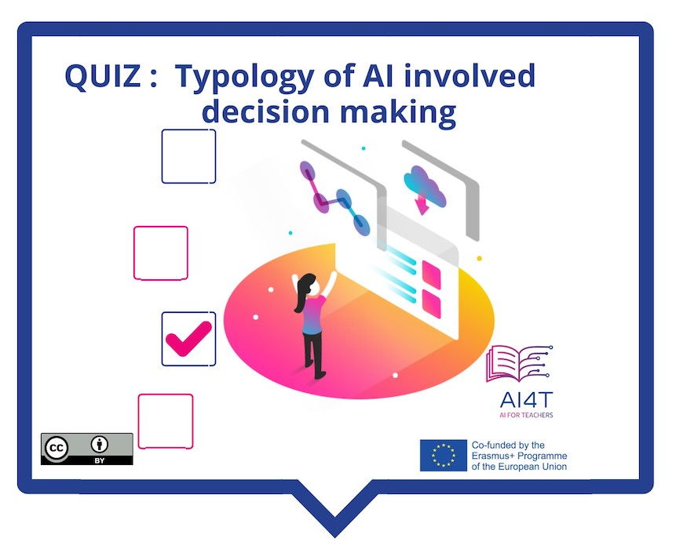

# Activity: Decision Making with AI in Education

This short activity proposes to revisit the 3 main degrees of involvement of AI in decision making with a feedback illustrating each type of decision in the field of education.

**"Access to the activity"**  
_Click on the image below_

<figure> 
    
</figure>

<iframe width="818" height="404" src="4-1-3a-activity-making-decision-with-ai/4-1-3a-decision-making-and-education.html" frameborder="0" allowfullscreen></iframe>

