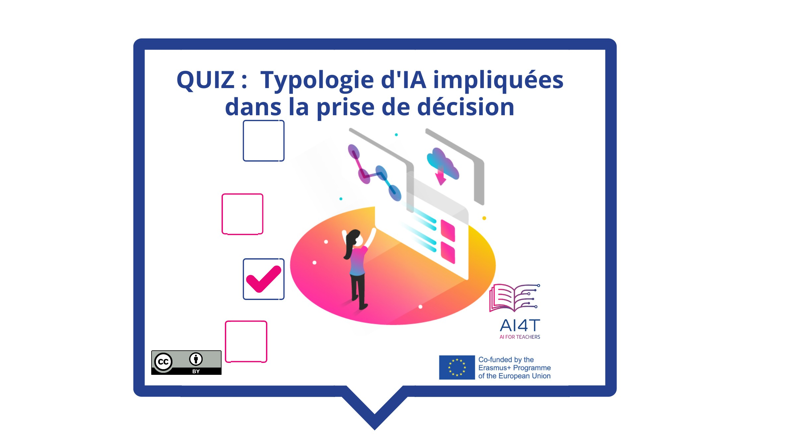

??? info "Metadata"
    - Id: EU.AI4T.O1.M4.1.3a
    - Title: 4.1.3 Activité : Prise de décision avec l'IA
    - Type: activity
    - Description: Comprendre comment les outils de prise de décision modifient les pratiques, peuvent les améliorer mais doivent être questionnés.
    - Subject: Artificial Intelligence for and by Teachers
    - Authors:
        - AI4T 
    - Licence: CC BY 4.0
    - Date: 2022-11-15

# Activité : Prise de décision avec l'IA en éducation

Cette courte activité propose de revenir sur les 3 principaux degrés d'implication de l'IA dans la prise de décision avec un retour d'expérience illustrant chaque type de décision dans le domaine de l'éducation.

**"Accès à l'activité"**  
_En-dessous de l'image_

<figure>
    
</figure>

<iframe width="818" height="404" src="4-1-3a-activity-making-decision-with-ai/4-1-3a-decision-making-and-education.html" frameborder="0" allowfullscreen></iframe>

