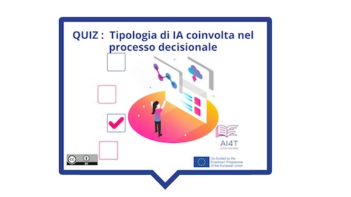

??? info "Metadata"
    - Id: EU.AI4T.O1.M4.1.3a
    - Title: 4.1.3 Attività: Prendere decisioni con l'intelligenza artificiale
    - Type: activity
    - Description: Capire come gli strumenti decisionali cambiano le pratiche, possono migliorarle ma devono essere messi in discussione.
    - Subject: Artificial Intelligence for and by Teachers
    - Authors:
        - AI4T 
    - Licence: CC BY 4.0
    - Date: 2022-11-15

# Attività: Il processo decisionale con l'intelligenza artificiale nell'istruzione

Questa breve attività propone di rivisitare i 3 principali gradi di coinvolgimento dell'IA nel processo decisionale con un feedback che illustra ogni tipo di decisione nel campo dell'istruzione.

**"Accesso all'attività"**  
Cliccare sull'immagine sottostante

<figure>
    
</figure>

<iframe width="818" height="404" src="4-1-3a-activity-making-decision-with-ai/4-1-3a-decision-making-and-education.html" frameborder="0" allowfullscreen></iframe>

