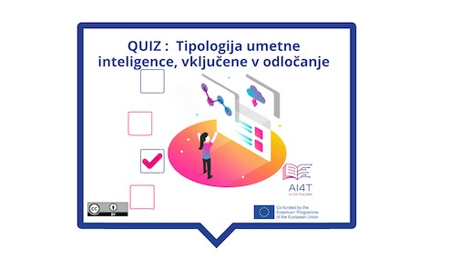

??? info "Metadata"
    - Id: EU.AI4T.O1.M4.1.3a
    - Title: 4.1.3 Dejavnost: Odločanje z umetno inteligenco
    - Type: activity
    - Description: Razumeti, kako orodja za odločanje spreminjajo prakse, jih lahko izboljšajo, vendar jih je treba postaviti pod vprašaj
    - Subject: Artificial Intelligence for and by Teachers
    - Authors:
        - AI4T 
    - Licence: CC BY 4.0
    - Date: 2022-11-15

# Dejavnost: Izvedba: odločanje z umetno inteligenco v izobraževanju

Ta kratka dejavnost predlaga ponovni pregled treh glavnih stopenj vključevanja umetne inteligence v odločanje s povratnimi informacijami, ki ponazarjajo vsako vrsto odločitve na področju izobraževanja.

**"Dostop do dejavnosti"**  
Kliknite na spodnjo sliko_

<figure>
    
</figure>

<iframe width="818" height="404" src="4-1-3a-activity-making-decision-with-ai/4-1-3a-decision-making-and-education.html" frameborder="0" allowfullscreen></iframe>

