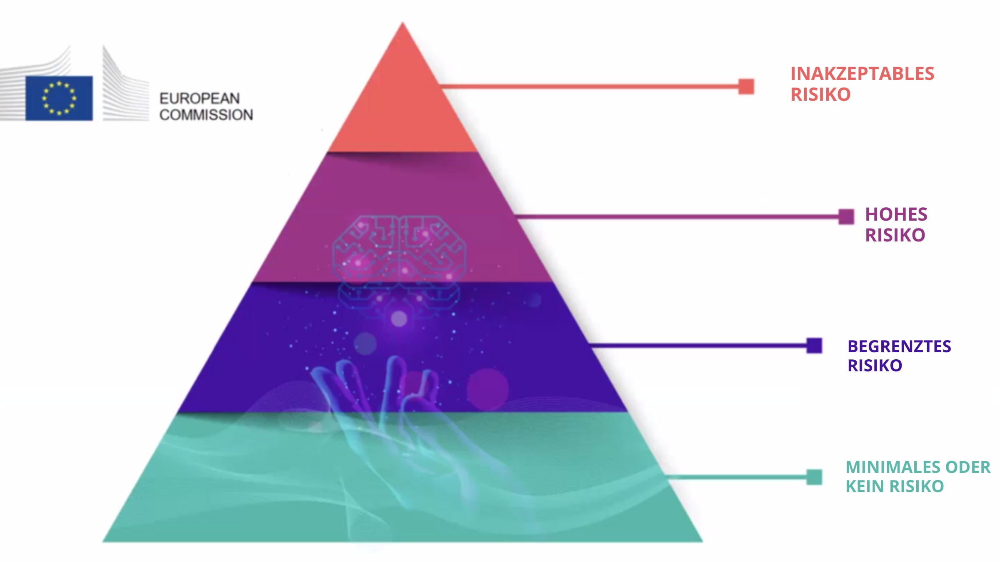

??? info "Metadata"
    - Id: EU.AI4T.O1.M4.1.4t
    - Title: 4.1.4 Risiken und KI-gestützte Entscheidungsfindung
    - Type: text
    - Description: Verstehen der Klassifizierung von Risiken im Zusammenhang mit dem Einsatz von KI-Systemen bei der Entscheidungsfindung
    - Subject: Artificial Intelligence for and by Teachers
    - Authors:
        - AI4T 
    - Licence: CC BY 4.0
    - Date: 2022-11-15

# Risiken im Zusammenhang mit dem Einsatz von KI-Systemen in der Entscheidungsfindung

## Die 4 Ebenen des Risikos bei KI

Der **Regulierungsrahmenvorschlag zur künstlichen Intelligenz**[^1] der Europäischen Kommission (EK) aus dem Jahr 2021 nennt vier Risikostufen, die mit dem Einsatz von KI-Systemen verbunden sind. Es wird daran erinnert, dass "*während die meisten KI-Systeme nur ein begrenztes oder gar kein Risiko darstellen und zur Lösung vieler gesellschaftlicher Herausforderungen beitragen können, schaffen bestimmte KI-Systeme Risiken, die wir angehen müssen, um unerwünschte Ergebnisse zu vermeiden*". [deepl translation]  
Der Schwerpunkt liegt dabei auf der Tatsache, dass "*es oft nicht möglich ist, herauszufinden, warum ein KI-System eine Entscheidung oder Vorhersage getroffen und eine bestimmte Handlung vorgenommen hat. So kann es schwierig werden, zu beurteilen, ob jemand ungerechtfertigt benachteiligt wurde, z. B. bei einer Einstellungsentscheidung oder bei der Beantragung einer öffentlichen Leistung*". [deepl translation]

Es wurden vier Risikostufen ermittelt, von minimal bis unannehmbar:  

1. **Unannehmbares Risiko**: Alle KI-Systeme, die als eindeutige Bedrohung für die Sicherheit, den Lebensunterhalt und die Rechte der Menschen angesehen werden, werden verboten, von der sozialen Bewertung durch Regierungen bis hin zu Spielzeug, das durch Sprachassistenz zu gefährlichem Verhalten ermutigt.  

2. **Hohes Risiko**: Zu den als hochriskant eingestuften KI-Systemen gehören KI-Technologien, die in folgenden Bereichen eingesetzt werden:
    - Kritische Infrastrukturen (z. B. Verkehr), die das Leben und die Gesundheit von Bürgern gefährden könnten;  
    - **Bildungs- oder Berufsausbildung, die über den Zugang zu Bildung und den beruflichen Werdegang einer Person entscheiden kann (z. B. Bewertung von Prüfungen)**;  
    - Sicherheitskomponenten von Produkten (z. B. KI-Anwendung bei robotergestützter Chirurgie);  
    - Beschäftigung, Verwaltung von Arbeitnehmern und Zugang zur Selbständigkeit (z. B. Lebenslaufsortierungssoftware für Einstellungsverfahren);  
    - Grundlegende private und öffentliche Dienstleistungen (z. B. Kreditwürdigkeitsprüfung, die den Bürgern die Möglichkeit nimmt, einen Kredit zu erhalten);  
    - Strafverfolgung, die in die Grundrechte der Menschen eingreifen kann (z. B. Bewertung der Zuverlässigkeit von Beweismitteln);  
    - Migrations-, Asyl- und Grenzkontrollmanagement (z. B. Überprüfung der Echtheit von Reisedokumenten);  
    - Rechtspflege und demokratische Prozesse (z. B. Anwendung des Rechts auf einen konkreten Sachverhalt).

3. **Geschränktes Risiko**: Das begrenzte Risiko bezieht sich auf KI-Systeme mit spezifischen Transparenzpflichten. Bei der Nutzung von KI-Systemen wie Chatbots sollten sich die Nutzer bewusst sein, dass sie mit einer Maschine interagieren, damit sie eine fundierte Entscheidung treffen können, ob sie fortfahren oder zurücktreten wollen.  

4. **Minimales oder kein Risiko**: Der Vorschlag erlaubt die freie Nutzung von KI mit minimalem Risiko. Dazu gehören Anwendungen wie KI-gestützte Videospiele oder Spam-Filter. Die große Mehrheit der derzeit in der EU eingesetzten KI-Systeme fällt in diese Kategorie.

<figure>

<figcaption>Die vorgeschlagenen 4 Risikostufen der Künstlichen Intelligenz des KI-Gesetzes der EG.</figcaption>
</figure>

Die Einstufung der allgemeinen und beruflichen Bildung in die Hochrisikokategorie bedeutet nicht, dass in diesen Bereichen keine KI-Systeme eingesetzt werden sollten, sondern dass zusätzliche Vorsichtsmaßnahmen zu treffen sind. In dem bereits erwähnten Rechtsrahmen heißt es, dass "*KI-Systeme mit hohem Risiko strengen Auflagen unterliegen, bevor sie auf den Markt gebracht werden können "*. [deepl translation]

## Ethik für eine vertrauenswürdige KI

KI-Systeme, die in der Bildung eingesetzt werden, müssen vertrauenswürdig sein, d. h. sie müssen die folgenden 7 Anforderungen erfüllen, die KI-Systeme erfüllen sollten, um als vertrauenswürdig zu gelten[^2]:

- Technische Robustheit und Sicherheit,

- Datenschutz und Data Governance,

- Transparenz,

- Diversität, Nichtdiskriminierung und Fairness,

- Gesellschaftliches und ökologisches Wohlergehen,

- Rechenschaftspflicht,

- und **Menschliches Handeln und Kontrolle**: "*KI-Systeme sollten Menschen befähigen, fundierte Entscheidungen zu treffen und ihre Grundrechte zu fördern. Gleichzeitig müssen angemessene Kontrollmechanismen gewährleistet werden, was durch Human-in-the-Loop-, Human-on-the-Loop- und Human-in-Command-Ansätze erreicht werden kann.*" [deepl translation]

[^1]: ["Laying down Harmonised Rules on Artificial Intelligence (Artificial Intelligence Act) and Amending certain Union Legislatives Acts"](https://digital-strategy.ec.europa.eu/en/library/proposal-regulation-laying-down-harmonised-rules-artificial-intelligence) - Regulatory Framework Proposal on Artificial Intelligence, European Commission - 2021

[^2]: ["Ethics guidelines for trustworthy AI"](https://digital-strategy.ec.europa.eu/en/library/ethics-guidelines-trustworthy-ai), European Commission, High-Level Expert Group on AI - 2019.
