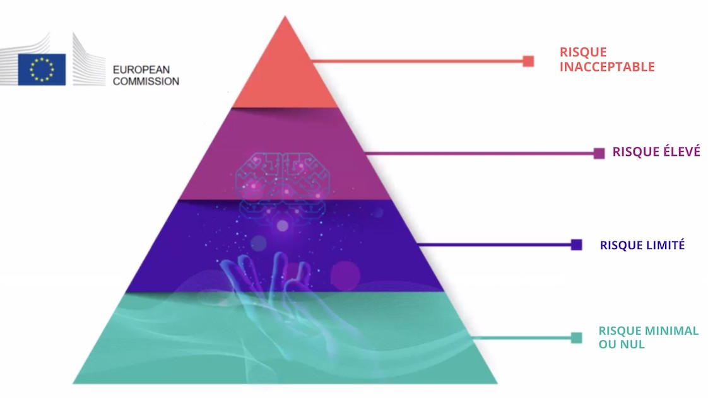

??? info "Metadata"
    - Id: EU.AI4T.O1.M4.1.4t
    - Title: 4.1.4 Risques et prise de décision basée sur l'IA
    - Type: text
    - Description: Comprendre la classification des risques liés à l'utilisation de systèmes d'IA dans la prise de décision.
    - Subject: Artificial Intelligence for and by Teachers
    - Authors:
        - AI4T 
    - Licence: CC BY 4.0
    - Date: 2022-11-15

# Risques liés à l'utilisation de systèmes d'IA dans la prise de décision

## Les 4 niveaux de risque en IA

La **proposition de cadre réglementaire sur l'intelligence artificielle**[^1] mise en place par la Commission européenne (CE) en 2021 identifie quatre niveaux de risque liés à l'utilisation des systèmes d'IA. Il est rappelé que "*Si la plupart des systèmes d'IA présentent un risque limité, voire nul, et peuvent contribuer à résoudre de nombreux défis sociétaux, certains systèmes d'IA créent des risques que nous devons traiter pour éviter des résultats indésirables*".
En mettant l'accent sur le fait que "*il n'est souvent pas possible de savoir pourquoi un système d'IA a pris une décision ou fait une prédiction et entrepris une action particulière. Il peut donc s'avérer difficile de déterminer si une personne a été injustement désavantagée, par exemple lors d'une décision d'embauche ou d'une demande de prestations publiques "*.

Quatre niveaux de risque ont été identifiés, de inacceptable à minimal:

1. **Risque inacceptable** : Tous les systèmes d'IA considérés comme une menace claire pour la sécurité, les moyens de subsistance et les droits des personnes seront interdits, du marquage social par les gouvernements aux jouets utilisant une assistance vocale qui encourage les comportements dangereux.  

2. **Risque élevé** : Les systèmes d'IA identifiés comme étant à haut risque comprennent les technologies d'IA utilisées dans :

    - Les infrastructures critiques (par exemple, les transports), qui pourraient mettre en danger la vie et la santé des citoyens ;
    - **La formation éducative ou professionnelle, qui peut déterminer l'accès à l'éducation et le parcours professionnel d'une personne (par exemple, la notation des examens)** ;
    - Les composants de sécurité des produits (par exemple, l'application de l'IA dans la chirurgie assistée par robot) ;
    - L'emploi, la gestion des travailleurs et l'accès au travail indépendant (par exemple, un logiciel de tri des CV pour les procédures de recrutement) ;
    - Les services privés et publics essentiels (par exemple, l'évaluation du crédit qui prive les citoyens de la possibilité d'obtenir un prêt) ;
    - L'application de la loi qui peut interférer avec les droits fondamentaux des personnes (par exemple, l'évaluation de la fiabilité des preuves) ;
    - La gestion des migrations, de l'asile et des contrôles aux frontières (par exemple, la vérification de l'authenticité des documents de voyage) ;
    - L'administration de la justice et les processus démocratiques (par exemple, l'application de la loi à un ensemble concret de faits).

3. **Risque limité** : Le risque limité fait référence aux systèmes d'IA ayant des obligations de transparence spécifiques. Lors de l'utilisation de systèmes d'IA tels que les chatbots, les utilisateurs doivent être conscients qu'ils interagissent avec une machine afin de pouvoir prendre une décision éclairée de poursuivre ou de prendre du recul.  

4. **Risque minimal ou nul** : La proposition permet la libre utilisation de l'IA à risque minimal. Cela inclut des applications telles que les jeux vidéo ou les filtres anti-spam utilisant l'IA. La grande majorité des systèmes d'IA actuellement utilisés dans l'UE entrent dans cette catégorie.

<figure>

<figcaption>Les 4 niveaux risques liés à l'intelligence artificielle exposés dans la législation sur l'IA de la Commission européenne.</figcaption>
</figure>

Le classement de l'enseignement et de la formation professionnelle dans la catégorie à haut risque ne signifie pas qu'aucun système d'IA ne doit être utilisé dans ces domaines, mais que des précautions supplémentaires doivent être prises. Le cadre mentionné précédemment indique que "*les systèmes d'IA à haut risque seront soumis à des obligations strictes avant de pouvoir être mis sur le marché "*.

## Éthique pour une IA digne de confiance

Les systèmes d'IA utilisés dans le domaine de l'éducation doivent être dignes de confiance, c'est-à-dire qu'ils doivent respecter les 7 conditions suivantes pour être considérés comme dignes de confiance[^2] :

- Robustesse technique et sécurité,

- Vie privée et gouvernance des données,

- Transparence,

- Diversité, non-discrimination et équité,

- Bien-être sociétal et environnemental,

- Responsabilité,

- et **Intervention humaine et surveillance** : "*Les systèmes d'IA devraient donner du pouvoir aux êtres humains, en leur permettant de prendre des décisions éclairées et en favorisant leurs droits fondamentaux. Dans le même temps, des mécanismes de surveillance appropriés doivent être mis en place, ce qui peut être réalisé par des approches de type "humain dans la boucle", "humain sur la boucle" et "humain au commandement*".

[^1]: [Laying down Harmonised Rules on Artificial Intelligence (Artificial Intelligence Act) and Amending certain Union Legislatives Acts"] (https://digital-strategy.ec.europa.eu/en/library/proposal-regulation-laying-down-harmonised-rules-artificial-intelligence) - Proposition de cadre réglementaire sur l'intelligence artificielle, Commission européenne - 2021

[^2]: [Lignes directrices en matière d'éthique pour une IA digne de confiance](https://digital-strategy.ec.europa.eu/en/library/ethics-guidelines-trustworthy-ai), Commission européenne, Groupe d'experts de haut niveau sur l'IA - 2019.
