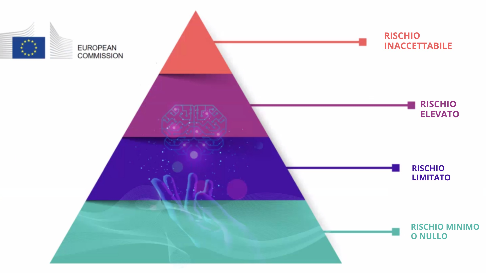

??? info "Metadata"
    - Id: EU.AI4T.O1.M4.1.4t
    - Title: 4.1.4 Rischi e processo decisionale basato sull'IA
    - Type: text
    - Description: Comprendere la classificazione dei rischi legati all'uso dei sistemi di IA nel processo decisionale.
    - Subject: Artificial Intelligence for and by Teachers
    - Authors:
        - AI4T 
    - Licence: CC BY 4.0
    - Date: 2022-11-15

# Rischi associati all'uso dei sistemi di IA nel processo decisionale

## I 4 livelli di rischio nell'IA

La **Proposta quadro di regolamentazione sull'intelligenza artificiale**[^1] elaborata dalla Commissione europea (CE) nel 2021 identifica quattro livelli di rischio legati all'uso dei sistemi di IA. Si ricorda che "*mentre la maggior parte dei sistemi di IA presenta rischi limitati o nulli e può contribuire a risolvere molte sfide sociali, alcuni sistemi di IA creano rischi che dobbiamo affrontare per evitare risultati indesiderati*". [deepl translation]  
Con un'attenzione particolare al fatto che "*spesso non è possibile scoprire perché un sistema di IA abbia preso una decisione o una previsione e abbia intrapreso una particolare azione. Può quindi diventare difficile valutare se qualcuno sia stato ingiustamente svantaggiato, ad esempio in una decisione di assunzione o in una domanda di ammissione a un programma di benefici pubblici "*. [deepl translation]

Sono stati individuati quattro livelli di rischio, da minimo a inaccettabile:  

1. **Rischio inaccettabile**: Tutti i sistemi di intelligenza artificiale considerati una chiara minaccia per la sicurezza, i mezzi di sussistenza e i diritti delle persone saranno vietati, dal social scoring dei governi ai giocattoli che utilizzano un'assistenza vocale che incoraggia comportamenti pericolosi.  

2. **Alto rischio**: I sistemi di IA identificati come ad alto rischio includono la tecnologia di IA utilizzata in:
    - Infrastrutture critiche (ad es. trasporti), che potrebbero mettere a rischio la vita e la salute dei cittadini;  
    - Formazione scolastica o professionale, che può determinare l'accesso all'istruzione e il corso professionale della vita di una persona (ad esempio, la valutazione degli esami)**;  
    - Componenti di sicurezza dei prodotti (ad esempio, applicazione dell'intelligenza artificiale nella chirurgia assistita da robot);  
    - Occupazione, gestione dei lavoratori e accesso al lavoro autonomo (ad esempio, software di selezione dei CV per le procedure di assunzione);  
    - Servizi pubblici e privati essenziali (ad esempio, il credit scoring che nega ai cittadini l'opportunità di ottenere un prestito);  
    - Applicazione della legge che può interferire con i diritti fondamentali delle persone (ad esempio, valutazione dell'affidabilità delle prove);  
    - Gestione della migrazione, dell'asilo e del controllo delle frontiere (ad esempio, verifica dell'autenticità dei documenti di viaggio);  
    - Amministrazione della giustizia e processi democratici (ad esempio, applicazione della legge a una serie di fatti concreti).

3. **Rischio limitato**: Il rischio limitato si riferisce ai sistemi di IA con specifici obblighi di trasparenza. Quando si utilizzano sistemi di IA come i chatbot, gli utenti devono essere consapevoli che stanno interagendo con una macchina, in modo da poter decidere con cognizione di causa se continuare o fare un passo indietro.  

4. **Rischio minimo o nullo**: La proposta consente il libero utilizzo dell'IA a rischio minimo. Ciò include applicazioni come i videogiochi abilitati all'IA o i filtri antispam. La grande maggioranza dei sistemi di IA attualmente utilizzati nell'UE rientra in questa categoria.

<figure>

<figcaption>I 4 livelli di rischio dell'intelligenza artificiale proposti dalla legge sull'intelligenza artificiale della CE.</figcaption>
</figure>

La classificazione della formazione scolastica e professionale nella categoria ad alto rischio non significa che nessun sistema di IA debba essere utilizzato in questi campi, ma che devono essere prese ulteriori precauzioni. Il quadro normativo precedentemente citato afferma che "*i sistemi di IA ad alto rischio saranno soggetti a obblighi rigorosi prima di poter essere immessi sul mercato "*. [deepl translation]

## Etica per un'IA affidabile

I sistemi di IA utilizzati nel campo dell'istruzione devono essere affidabili, ossia conformi ai 7 requisiti seguenti che i sistemi di IA dovrebbero soddisfare per essere considerati affidabili[^2]:

- Robustezza tecnica e sicurezza,

- Privacy e governance dei dati,

- Trasparenza,

- Diversità, non discriminazione ed equità,

- Benessere sociale e ambientale,

- Responsabilità,

- e **Agenzia e supervisione umana**: *"I sistemi di IA dovrebbero dare potere agli esseri umani, consentendo loro di prendere decisioni informate e promuovendo i loro diritti fondamentali. Allo stesso tempo, devono essere garantiti adeguati meccanismi di supervisione, che possono essere ottenuti attraverso approcci di tipo human-in-the-loop, human-on-the-loop e human-in-command "*. [deepl translation]

[^1]: ["Laying down Harmonised Rules on Artificial Intelligence (Artificial Intelligence Act) and Amending certain Union Legislatives Acts"](https://digital-strategy.ec.europa.eu/en/library/proposal-regulation-laying-down-harmonised-rules-artificial-intelligence) - Regulatory Framework Proposal on Artificial Intelligence, European Commission - 2021

[^2]: ["Orientamenti etici per un'IA affiadabile"](https://digital-strategy.ec.europa.eu/en/library/ethics-guidelines-trustworthy-ai),EU - Gruppo Indipendente Di Esperti Ad Alto Livello Sull'intelligenza Artificiale - 2019.
