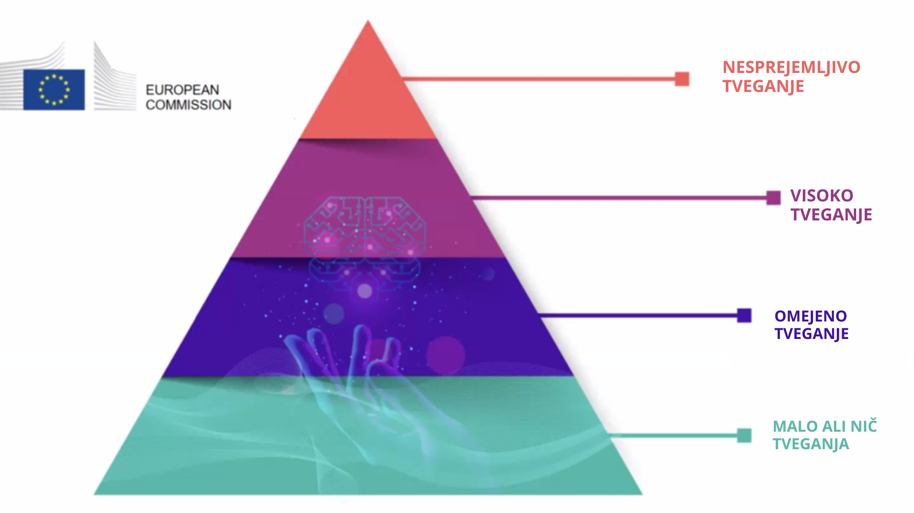

??? info "Metadata"
    - Id: EU.AI4T.O1.M4.1.4t
    - Title: 4.1.4 Tveganja in odločanje na podlagi umetne inteligence
    - Type: text
    - Description: Razumeti razvrstitev tveganj, povezanih z uporabo sistemov umetne inteligence pri odločanju.
    - Subject: Artificial Intelligence for and by Teachers
    - Authors:
        - AI4T 
    - Licence: CC BY 4.0
    - Date: 2022-11-15

# Tveganja, povezana z uporabo sistemov umetne inteligence pri odločanju

## 4 ravni tveganja pri umetni inteligenci

V **predlogu regulativnega okvira o umetni inteligenci**[^1], ki ga je Evropska komisija (EK) pripravila leta 2021, so opredeljene štiri ravni tveganja, povezane z uporabo sistemov umetne inteligence. Opozarja, da "*Čeprav večina sistemov umetne inteligence predstavlja omejeno tveganje ali ga ne predstavlja in lahko prispeva k reševanju številnih družbenih izzivov, pa nekateri sistemi umetne inteligence ustvarjajo tveganja, ki jih moramo obravnavati, da bi se izognili nezaželenim posledicam*". [deepl translation]  
S poudarkom na dejstvu, da "*pogosto ni mogoče ugotoviti, zakaj je sistem umetne inteligence sprejel odločitev ali napoved in izvedel določeno dejanje. Zato je morda težko oceniti, ali je bil nekdo nepravično prikrajšan, na primer pri odločitvi o zaposlitvi ali pri vlogi za program javnih ugodnosti "*. [deepl translation]

Opredeljene so bile štiri stopnje tveganja, od minimalne do nesprejemljive:  

1. **Prijemljivo tveganje**: Prepovedani bodo vsi sistemi umetne inteligence, za katere velja, da jasno ogrožajo varnost, preživetje in pravice ljudi, od socialnega točkovanja s strani vlad do igrač, ki uporabljajo glasovno pomoč, ki spodbuja nevarno vedenje.  

2. **Visoko tveganje**: Sistemi umetne inteligence, ki so opredeljeni kot zelo tvegani, vključujejo tehnologijo umetne inteligence, ki se uporablja v:
    - kritičnih infrastrukturah (npr. promet), ki bi lahko ogrozile življenje in zdravje državljanov;  
    - **izobraževanje ali poklicno usposabljanje, ki lahko določa dostop do izobraževanja in poklicno pot posameznika (npr. točkovanje izpitov)**;  
    - varnostne komponente izdelkov (npr. uporaba umetne inteligence v robotsko podprti kirurgiji);  
    - zaposlovanje, upravljanje delavcev in dostop do samozaposlitve (npr. programska oprema za razvrščanje življenjepisov v postopkih zaposlovanja);  
    - bistvene zasebne in javne storitve (npr. ocenjevanje kreditov, ki državljanom onemogoča pridobitev posojila);  
    - kazenski pregon, ki lahko posega v temeljne pravice ljudi (npr. ocenjevanje zanesljivosti dokazov);  
    - upravljanje migracij, azila in mejnega nadzora (npr. preverjanje pristnosti potnih listin);  
    - Upravljanje pravosodja in demokratični procesi (npr. uporaba prava za konkretna dejstva).

3. **Majhno tveganje**: Omejeno tveganje se nanaša na sisteme umetne inteligence s posebnimi obveznostmi glede preglednosti. Pri uporabi sistemov UI, kot so klepetalni boti, se morajo uporabniki zavedati, da komunicirajo s strojem, da lahko sprejmejo informirano odločitev o nadaljevanju ali umiku.  

4. **Minimalno tveganje ali brez tveganja**: Predlog omogoča prosto uporabo umetne inteligence z minimalnim tveganjem. To vključuje aplikacije, kot so videoigre z umetno inteligenco ali filtri za nezaželeno pošto. Velika večina sistemov umetne inteligence, ki se trenutno uporabljajo v EU, spada v to kategorijo.

<figure>

<figcaption>Predlagane štiri ravni tveganj umetne inteligence v Aktu o umetni inteligenci ES.</figcaption>
</figure>

Razvrstitev izobraževanja in poklicnega usposabljanja v kategorijo visokega tveganja ne pomeni, da se na teh področjih ne sme uporabljati noben sistem UI, temveč da je treba sprejeti dodatne previdnostne ukrepe. V prej omenjenem okviru je navedeno, da "*za sisteme umetne inteligence z visokim tveganjem veljajo stroge obveznosti, preden se lahko dajo na trg "*. [deepl translation]

## Etika za zaupanja vredno umetno inteligenco

Sistemi UI, ki se uporabljajo v izobraževanju, morajo biti zaupanja vredni, tj. izpolnjevati naslednjih 7 zahtev, ki jih morajo sistemi UI izpolnjevati, da se štejejo za zaupanja vredne[^2]:

- Tehnična zanesljivost in varnost,

- zasebnost in upravljanje podatkov,

- preglednost,

- raznolikost, nediskriminacija in pravičnost,

- družbena in okoljska blaginja,

- Odgovornost,

- in **človeško posredovanje in nadzor**: "*Sistemi UI bi morali opolnomočiti ljudi, jim omogočiti sprejemanje informiranih odločitev in spodbujati njihove temeljne pravice. Hkrati je treba zagotoviti ustrezne mehanizme nadzora, kar je mogoče doseči s pristopi človek v zanki, človek na zanki in človek v poveljstvu".* [deepl translation]

[^1]: ["Laying down Harmonised Rules on Artificial Intelligence (Artificial Intelligence Act) and Amending certain Union Legislatives Acts"](https://digital-strategy.ec.europa.eu/en/library/proposal-regulation-laying-down-harmonised-rules-artificial-intelligence) - Regulatory Framework Proposal on Artificial Intelligence, European Commission - 2021

[^2]: ["Ethics guidelines for trustworthy AI"](https://digital-strategy.ec.europa.eu/en/library/ethics-guidelines-trustworthy-ai), European Commission, High-Level Expert Group on AI - 2019.
