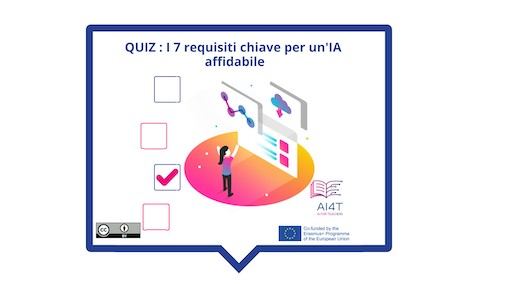

??? info "Metadata"
    - Id: EU.AI4T.O1.M4.1.5a
    - Title: 4.1.5 Attività: Processo decisionale basato sull'intelligenza artificiale
    - Type: activity
    - Description: Cos'è l'IA affidabile? 7 requisiti da soddisfare per i sistemi di IA
    - Subject: Artificial Intelligence for and by Teachers
    - Authors:
        - AI4T 
    - Licence: CC BY 4.0
    - Date: 2022-11-15

# Attività: I 7 requisiti chiave per un'IA affidabile

Ci sono 7 requisiti che un sistema di IA deve rispettare per essere considerato affidabile.
Abbiniamo a questi requisiti le loro definizioni.

**"Accesso all'attività"**  
_Cliccare sull'immagine sottostante_

<figure>  
</figure>

<iframe width="960" height="600" src="4-1-5a-risks-associated-to-the-use-of-AI-systems/4-1-5a-making-decision-with-AI.html" frameborder="0" allowfullscreen></iframe>

