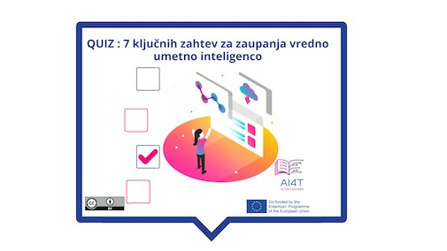

??? info "Metadata"
    - Id: EU.AI4T.O1.M4.1.5a
    - Title: 4.1.5 Dejavnost: Odločanje na podlagi umetne inteligence
    - Type: activity
    - Description: Kaj je zaupanja vredna umetna inteligenca? 7 zahtev, ki jih morajo izpolnjevati sistemi umetne inteligence
    - Subject: Artificial Intelligence for and by Teachers
    - Authors:
        - AI4T 
    - Licence: CC BY 4.0
    - Date: 2022-11-15

# Dejavnost: 7 ključnih zahtev za zaupanja vredno umetno inteligenco

Obstaja 7 zahtev, ki jih mora sistem umetne inteligence izpolnjevati, da bi veljal za zaupanja vrednega.
Ujemajmo te zahteve z njihovimi opredelitvami.

**"Dostop do dejavnosti"**  
_Kliknite na spodnjo sliko_

<figure>  
</figure>

<iframe width="960" height="600" src="4-1-5a-risks-associated-to-the-use-of-AI-systems/4-1-5a-making-decision-with-AI.html" frameborder="0" allowfullscreen></iframe>

