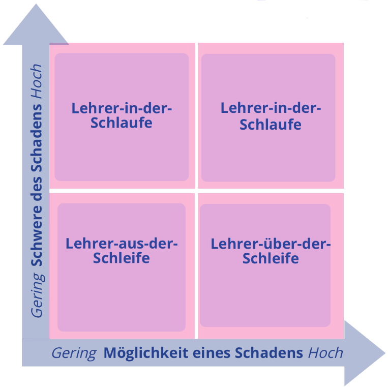

??? info "Metadata"
    - Id: EU.AI4T.O1.M4.1.6t
    - Title: 4.1.6 Lehrer in der Schleife (Teacher-in-the-Loop)
    - Type: text
    - Description: Das Teacher-in-the-Loop-Modell verstehen und als Werkzeug nutzen, um Nutzer in der Kontrolle für KI-Systeme in der Bildung zu fördern
    - Subject: Artificial Intelligence for and by Teachers
    - Authors:
        - AI4T 
    - Licence: CC BY 4.0
    - Date: 2022-11-15

# Teacher-in-the-Loop

Im Bereich der allgemeinen und beruflichen Bildung "*sollten alle Beteiligten die Auswirkungen der Übertragung von Befugnissen auf neu entstehende Technologien auf pädagogische Entscheidungen bedenken, die ansonsten von einer Lehrkraft mit angemessenen pädagogischen und fachspezifischen Kenntnissen getroffen werden würden*" [deepl translation] [^1].  
Damit KI-Systeme im Bildungswesen vertrauenswürdig sind, bedarf es einer angemessenen Analyse unter Verwendung des **Teacher-in-the-loop Modells**.

In ihrem Bericht[^1] schlägt die Gemeinsame Forschungsstelle vor, dass: "*Für Bildungsanwendungen und -dienste, die auf autonomen Entscheidungen beruhen, können drei verschiedene Ansätze in Betracht gezogen werden, um die Verteilung der Verantwortung zwischen Mensch und Algorithmus/Maschine zu regeln*" [deepl translation] [^1], nämlich Teacher-in-the-Loop, Teacher-out-of-the-Loop und Teacher-over-the-Loop:  

- ***Lehrer-in-der-Schlaufe / Teacher-in-the-loop***: Stellen Sie sich eine Anwendung vor, die selbstständig Prüfungen mit hohem Schwierigkeitsgrad bewertet oder eine Diagnose einer Lernschwäche durchführt. In solchen Situationen könnte eine falsche Entscheidung dem Endnutzer schweren Schaden zufügen (z. B. Verlust von Chancen, unfaire Praktiken). Entscheidungen oder Anwendungen, die dem Endnutzer Schaden zufügen oder schwerwiegende Auswirkungen haben könnten, sollten zunächst einem Pädagogen eine Entscheidung empfehlen, wobei genügend transparente Informationen zur Verfügung stehen sollten, damit der Pädagoge sie überprüfen kann - und erst dann entscheiden, ob die endgültige Entscheidung ausgeführt werden soll oder nicht (Abbildung 1, oben rechts).

- ***Lehrer-aus-der-Schleife / Teacher-over-the-loop***: Es gibt andere Arten von Entscheidungen, bei denen es ausreicht, dass ein Erzieher den Überblick über die von einer Anwendung getroffene Entscheidung behält. Dies könnte zum Beispiel der Fall sein, wenn eine adaptive Lernplattform einem Lernenden eine Lernaktivität empfiehlt, um ein beabsichtigtes Lernergebnis zu erreichen (Abbildung 1, unten rechts).

- ***Lehrer-über-der-Schleife / Teacher-out-of-the-loop***: In einer Situation, in der eine geringe Wahrscheinlichkeit und ein geringer Schweregrad eines Schadens besteht, der z. B. durch eine Bildungs-App verursacht wird, die außerhalb der Schule genutzt wird, ist die Aufsicht des Lehrers nicht erforderlich (Abbildung 1, unten links).

## Interaktive Darstellung des "Teacher in the loop"-Modells
Klicken Sie auf das Bild unten, um das "Teacher in the Loop"-Modell zu vertiefen!

<a href="https://view.genial.ly/63c54b6349a00a0018bbb3b7" target="_blank">
<figure>
  
  <figcaption>Abbildung 1: Unterschiedliche Grade der menschlichen Aufsicht bei der autonomen Entscheidungsfindung in der allgemeinen und beruflichen Bildung. (Adaptiert aus dem Bericht "Emerging technologies and the teaching profession").</figcaption>
</figure></a>  

[^1]: ["Emerging technologies and the teaching profession: Ethical and pedagogical considerations based on near-future scenarios"](https://publications.jrc.ec.europa.eu/repository/handle/JRC120183) - Vuorikari Riina, Punie Yves, Marcelino Cabrera - Joint Research Center report - European Commission, 2020.
