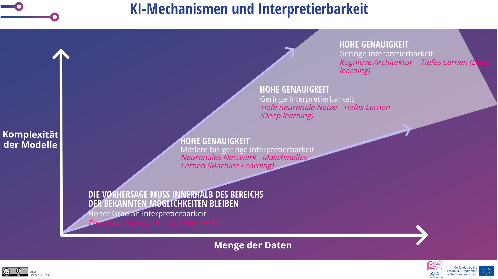

??? info "Metadata"
    - Id: EU.AI4T.O1.M4.2.1t
    - Title: 4.2.1 Bereit, KI für die Entscheidungsfindung zu vertrauen?
    - Type: text
    - Description: Verstehen der Auswirkungen des Einsatzes von KI-Tools zur Entscheidungsfindung und der notwendigen Vorsichtsmaßnahmen beim Einsatz
    - Subject: Artificial Intelligence for and by Teachers
    - Authors:
        - AI4T 
        - AI4T
        - Ikram Chraibi Kaadoud, KI-Forscher
    - Licence: CC BY 4.0
    - Date: 2022-11-15

# Sind Sie bereit, KI bei der Entscheidungsfindung zu vertrauen?

Nicht alle Entscheidungen, die mit KI-basierten Tools getroffen werden, haben die gleichen Auswirkungen.

Bei einigen automatisierten Entscheidungen, wie z. B. den "Lösungsschritten", die einem Schüler von einer mathematischen Problemlösungsanwendung vorgeschlagen werden, können das langfristige Risiko und der Schaden als eher gering *betrachtet* werden.

Andere Entscheidungen hingegen stellen einen potenziellen Schaden und/oder ein Risiko dar.

In diesem Fall ist ein Maximum an Vorsichtsmaßnahmen zu treffen, und zuallererst muss die Entscheidung erklärbar sein (warum diese Entscheidung für diese spezielle Situation, für diesen speziellen Schüler oder diese Gruppe von Schülern vorgeschlagen wird).

Schauen wir uns einige Kriterien an, die zur "Bewertung" des Entscheidungsprozesses von KI-basierten Systemen verwendet werden.

## Erklärbarkeit

Erklärbarkeit - eine der 7 Schlüsselanforderungen für vertrauenswürdige KI: "_Erklärbarkeit betrifft die Fähigkeit, sowohl die technischen Prozesse eines KI-Systems als auch die damit verbundenen menschlichen Entscheidungen (z.B. Anwendungsbereiche eines Systems) zu erklären. Technische Erklärbarkeit setzt voraus, dass die von einem KI-System getroffenen Entscheidungen von Menschen verstanden und nachvollzogen werden können[^1]_" [deepl translation]

Für den Bildungsbereich bedeutet dies, dass bei jedem KI-Entscheidungstool die Art und Weise, wie eine Entscheidung vorgeschlagen wird, und die damit verbundene menschliche Interaktion Elemente sind, die zugänglich gemacht werden müssen.

Diese Anforderung ist mehr oder weniger leicht zu erfüllen, aber bei einigen KI-Technologien ist die Erklärbarkeit nicht so einfach zu gewährleisten. Bei neuronalen Netzen mit vielen Schichten kann es beispielsweise schwierig sein, Erklärungen zu geben. Daher entwickelt sich jetzt ein neuer Bereich der KI: eXplainable AI oder XAI, definiert als _künstliche Intelligenz, bei der Menschen die von der KI getroffenen Entscheidungen oder Vorhersagen verstehen können. Sie steht im Gegensatz zum "Blackbox"-Konzept des maschinellen Lernens, bei dem selbst die Entwickler nicht erklären können, warum eine KI zu einer bestimmten Entscheidung gekommen ist._" [deepl translation] [^2]

## Interpretierbarkeit

Vorhersagen, die mit einigen KI-Techniken gemacht werden, sind leichter zu interpretieren als andere. Eine Vorhersage, die mit einem Entscheidungsbaum getroffen wurde, ist zum Beispiel erklärbar. Aber es sind nicht immer die interessantesten Vorhersagen, die gemacht werden.

Am anderen Ende des Erklärungsspektrums steht das Deep Learning, das zwar schwer zu erklären ist, dessen Ergebnisse aber viel aussagekräftiger sein können als die mit hochgradig erklärbarer KI gemachten.

<figure>
  
  <figcaption>Abbildung 1: KI-Mechanismen und Interpretierbarkeit.
 Adaptiert von Mooc IAI / Ikram Chraibi Kaadoud - CC.BY.SA 2.0.</figcaption>
</figure>

So kann die Entscheidungshilfe, die von Werkzeugen mit geringer Interpretierbarkeit bereitgestellt wird, bedeutender sein als die Unterstützung durch Werkzeuge mit hoher Interpretierbarkeit.

## Von der Beschreibung zur Verschreibung

Hier ist eine Darstellung, die die verwendete Technologie, ihre Komplexität und ihr strategisches Ergebnis in Beziehung setzt.

<figure>
  
</figure>
Abbildung 2: Klassifizierung des Einsatzes von Datenanalyse von der Beschreibung bis zur Verordnung[^3] (angepasst aus dem Video "Learning Analytics" dieses Kurses).

In den folgenden 4 Kategorien lässt sich die Korrelation zwischen der Komplexität der verwendeten Methoden und den strategischen Ergebnissen erkennen.

### Beschreibende Analytik

Die deskriptive Analytik untersucht Daten, um die Frage "Was ist passiert?" zu beantworten.
Diese können in Form von "*einfachen Zusammenfassungen über die Stichprobe und über die gemachten Beobachtungen" gegeben werden. Solche Zusammenfassungen können entweder quantitativ oder visuell sein, d. h. in Form von einfach zu verstehenden Diagrammen*" [deepl translation] [^4]. Sie basiert auf traditionellen Instrumenten ohne KI.

### Diagnostische Analytik

Diagnostic Analytics beantwortet die Frage "Warum ist das passiert?".
Sie führt zur Identifizierung der Art und Ursache eines Phänomens, um Abhilfemaßnahmen und Lösungen zu bestimmen. Einige Techniken, die für die diagnostische Analytik verwendet werden: Statistische Methoden wie Data Discovery, Data Mining und Korrelationen. Diese Methoden können KI einbeziehen.

### Prädiktive Analytik

Predictive Analytics untersucht Daten oder Ereignisse, um die Frage zu beantworten: "Was wird passieren?" oder genauer: "Was wird wahrscheinlich passieren?".
"*"Zu den statistischen Techniken der prädiktiven Analyse gehören Datenmodellierung, maschinelles Lernen, KI, Deep-Learning-Algorithmen und Data Mining*" [deepl translation] [^5].

### Prescriptive Analytics

Die präskriptive Analyse beantwortet die Frage "Was sollte getan werden?" oder "Wie können wir es erreichen?".

"*Die präskriptive Analytik nimmt nicht nur vorweg, was passieren wird und wann es passieren wird, sondern auch warum es passieren wird. Darüber hinaus schlägt die präskriptive Analytik Entscheidungsoptionen vor, wie eine künftige Chance genutzt oder ein künftiges Risiko gemindert werden kann, und zeigt die Auswirkungen jeder Entscheidungsoption*." [deepl translation] [^6]

Zusammenfassend lässt sich sagen, dass die Informationstechnologien umso komplexer und schwieriger zu erklären sind, je relevanter die Instrumente als Entscheidungshilfe sein können.
In Bezug auf die angebotene Unterstützung muss jedoch die Aufmerksamkeit auf die Erklärbarkeit und die erforderliche Wachsamkeit bei der Verwendung des IA-Instruments in einem Bereich gerichtet werden, in dem die Folgen der Entscheidungen bedeutend und dauerhaft sind.

[^1]: "*Moreover, trade-offs might have to be made between enhancing a system's explainability (which may reduce its accuracy) or increasing its accuracy (at the cost of explainability). Whenever an AI system has a significant impact on people's lives, it should be possible to demand a suitable explanation of the AI system's decision-making process. Such explanation should be timely and adapted to the expertise of the stakeholder concerned (e.g. layperson, regulator or researcher). In addition, explanations of the degree to which an AI system influences and shapes the organisational decision-making process, design choices of the system, and the rationale for deploying it, should be available (hence ensuring business model transparency).*" From ["Ethics Guidelines for Trustworthy AI"](https://ec.europa.eu/futurium/en/ai-alliance-consultation/guidelines/1.html#Transparency) (consulted 10/16/2022).

[^2]: From wikipedia article on ["Explainable artificial intelligence"](https://en.wikipedia.org/wiki/Explainable_artificial_intelligence) (consulted 10/16/2022).  

[^3]: See in this course the section 1.1.3. on Learning analytics (video).  

[^4]: From wikipedia article on ["Descriptive statistics"](https://en.wikipedia.org/wiki/Descriptive_statistics) (consulted 10/16/2022).  

[^5]: From wikipedia article on ["Predictive Analytics"](https://en.wikipedia.org/wiki/Predictive_analytics) (consulted 10/16/2022).  

[^6]: From wikipedia article on ["Prescriptive Analytics"](https://en.wikipedia.org/wiki/Prescriptive_analytics) (consulted 10/16/2022).
