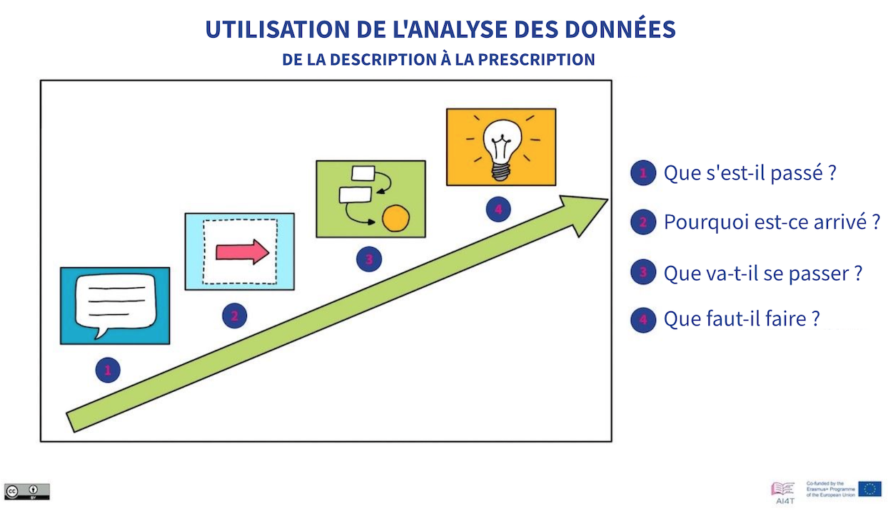

??? info "Metadata"
    - Id: EU.AI4T.O1.M4.2.1t
    - Title: 
    - Type: text
    - Description: 
    - Subject: Artificial Intelligence for and by Teachers
    - Authors:
        - AI4T 
    - Licence: CC BY 4.0
    - Date: 2022-11-15

# Êtes-vous prêt à faire confiance à l'IA pour prendre des décisions ?

Toutes les décisions prises avec des outils basés sur l'IA n'ont pas toutes le même impact.

Pour certaines décisions automatisées, telles que les "étapes de résolution" suggérées à un élève par une application de résolution de problèmes mathématiques, le risque et le préjudice à long terme peuvent être *considérés* comme plutôt faibles.

D'autres décisions, au contraire, présentent un préjudice et/ou un risque potentiel.

Il y a alors un maximum de précautions à prendre. Tout d'abord la décision doit être explicable : pourquoi cette décision est proposée pour cette situation particulière, pour cet élève ou ce groupe d'élèves en particulier ?

Voyons quelques critères utilisés pour "évaluer" le processus de décision des systèmes basés sur l'IA.

## Explicabilité

Explicabilité - l'une des 7 conditions requises pour une IA digne de confiance : "_L'explicabilité concerne la capacité à expliquer à la fois les processus techniques d'un système d'IA et les décisions humaines correspondantes (par exemple, les domaines d'application d'un système). L'explicabilité technique exige que les décisions prises par un système d'IA puissent être comprises et retracées par des êtres humains_". [Traduction Deepl] [^1]

Dans le domaine de l'éducation, cela signifie que dans tout outil décisionnel d'IA, la manière dont une décision est proposée et le degré d'implication humaine sont des éléments auxquels il faut avoir accès.

Cette condition est plus ou moins facile à satisfaire, mais pour certaines technologies d'IA, l'explicabilité n'est pas si simple à obtenir. Par exemple, dans le cas des réseaux neuronaux comportant de nombreuses couches, les explications peuvent être difficiles à fournir. C'est pourquoi un nouveau domaine de l'IA se développe actuellement : l'IA eXplicable ou XAI, définie comme une "_intelligence artificielle dans laquelle les humains peuvent comprendre les décisions ou les prédictions faites par l'IA. Elle contraste avec le concept de "boîte noire" de l'apprentissage automatique, où même les concepteurs ne peuvent expliquer pourquoi l'IA est parvenue à une décision spécifique_" [Traduction Deepl] [^2].

## Interprétabilité

Les prédictions réalisées avec certaines techniques d'IA sont plus faciles à interpréter que d'autres. Une prédiction faite à partir d'un arbre de décision, par exemple, est explicable. Mais, il ne s'agit pas toujours des prédictions les plus intéressantes à réaliser.

À l'opposé du spectre de l'explicabilité, il y a le Deep learning, qui peut être difficile à expliquer, mais dont les résultats peuvent être beaucoup plus significatifs que ceux réalisés avec une IA hautement explicable.

<figure>
  
  <figcaption>Figure1 : Mécanismes d'IA et interprétabilité.
 Adapté du Mooc IAI / Ikram Chraibi Kaadoud - CC.BY.SA 2.0.</figcaption>
</figure>

Ainsi, l'aide à la décision fournie par des outils à faible interprétabilité peut être plus importante que celle fournie par des outils à haute interprétabilité.

### De la description à la prescription

Voici une représentation qui met en relation la technologie utilisée, sa complexité et ses résultats stratégiques.

<figure>
  
</figure>
Figure 2 : Classification de l'utilisation de l'analyse des données, de la description à la prescription [^3] (Adaptée de la vidéo "Analytique de l’apprentissage" de ce cours).

Dans les 4 catégories suivantes, on peut noter la corrélation entre la complexité des méthodes utilisées et les résultats stratégiques.

### Analyse descriptive

L'analyse descriptive examine les données pour répondre à la question "Que s'est-il passé ?".
Les résultats peuvent être fournis sous la forme de "*résumés simples sur l'échantillon et sur les observations qui ont été faites. Ces résumés peuvent être quantitatifs ou visuels, c'est-à-dire des graphiques simples à comprendre*" [Traduction DeepL] [^4]. Il est basé sur des outils traditionnels sans IA.

### Analyse diagnostique

L'analyse diagnostique répond à la question "Pourquoi est-ce arrivé ?".
Elle conduit à l'identification de la nature et de la cause d'un phénomène pour déterminer les atténuations, et les solutions. Quelques techniques utilisées pour l'analyse diagnostique : des méthodes statistiques comme la découverte de données, l'exploration de données et les corrélations. Ces méthodes peuvent faire appel à l'IA.

### Analyse prédictive

L'analyse prédictive examine des données ou des événements pour répondre à la question "Que va-t-il se passer ?" ou plus précisément, "Que risque-t-il de se passer ?".
"*L'analyse prédictive est prospective, elle utilise les événements passés pour anticiper l'avenir. Les techniques statistiques de l'analyse prédictive comprennent la modélisation des données, l'apprentissage automatique, l'IA, les algorithmes d'apprentissage profond et l'exploration de données.*" [Traduction DeepL] [^5]

### L'analyse prescriptive

L'analytique prescriptive répond à la question "Que faut-il faire ?" ou "Comment faire pour que cela se produise ?".

"*L'analyse prescriptive anticipe non seulement ce qui va se produire et quand cela va se produire, mais aussi pourquoi cela va se produire. De plus, l'analytique prescriptive suggère des options de décision sur la façon de profiter d'une opportunité future ou d'atténuer un risque futur et montre l'implication de chaque option de décision*." [Traduction DeepL] [^6]

En résumé, plus les outils peuvent être pertinents en tant qu'aide à la prise de décision, plus les technologies de l'information sont complexes et plus elles peuvent être difficiles à expliquer.
Mais en termes d'aide apportée, l'attention doit être maintenue sur l'explicabilité et la vigilance éventuellement requise dans l'utilisation de l'outil d'AI dans un domaine où les conséquences des décisions sont importantes et durables.

[^1]: "*En outre, des compromis pourraient devoir être faits entre l'amélioration de l'explicabilité d'un système (ce qui pourrait réduire sa précision) ou l'augmentation de sa précision (au prix de l'explicabilité). Chaque fois qu'un système d'IA a un impact significatif sur la vie des gens, il devrait être possible d'exiger une explication appropriée du processus décisionnel du système d'IA. Cette explication devrait être fournie en temps utile et adaptée à l'expertise de la partie prenante concernée (par exemple, un profane, un régulateur ou un chercheur). En outre, des explications sur la mesure dans laquelle un système d'IA influence et façonne le processus décisionnel de l'organisation, les choix de conception du système et les raisons de son déploiement devraient être disponibles (ce qui garantit la transparence du modèle d'entreprise)*". [Traduction DeepL] - Extrait de "[Ethics Guidelines for Trustworthy AI (document en anglais) au sujet de "Explainability"](https://ec.europa.eu/futurium/en/ai-alliance-consultation/guidelines/1.html#Transparency)" (consulté le 16/10/2022).

[^2]: Extrait de l'article en anglais de wikipedia ["Explainable artificial intelligence"](https://en.wikipedia.org/wiki/Explainable_artificial_intelligence) (consulté le 16/10/2022).

[^3]: Voir, dans ce cours, la section 1.1.3. sur l'analytique de l'apprentissage (vidéo).

[^4]: Extrait de l'article en anglais de wikipedia ["Descriptive statistics"](https://en.wikipedia.org/wiki/Descriptive_statistics)"(consulté le 16/10/2022).

[^5]: Extrait de l'article en anglais de wikipedia ["Predictive Analytics"](https://en.wikipedia.org/wiki/Predictive_analytics)" (consulté le 16/10/2022).

[^6]: Extrait de l'article en anglais de wikipedia ["Prescriptive Analytics"](https://en.wikipedia.org/wiki/Prescriptive_analytics)" (consulté le 16/10/2022).
