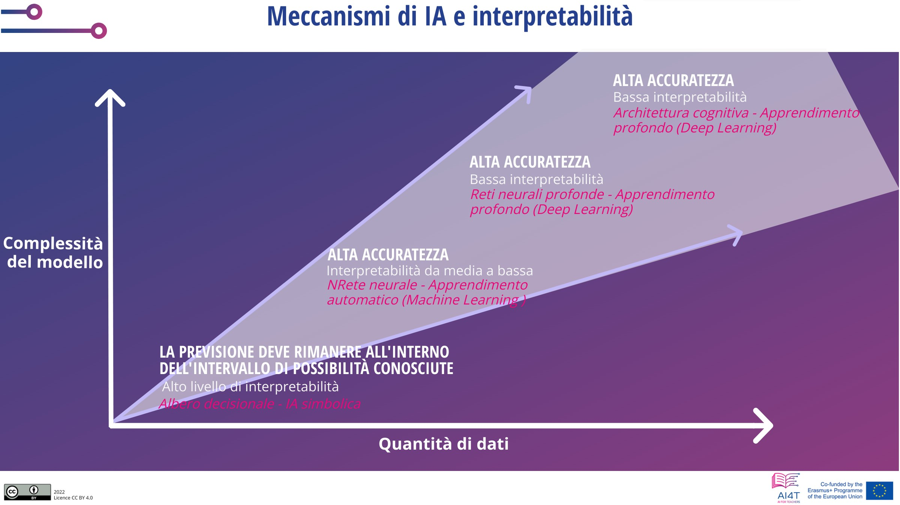

??? info "Metadata"
    - Id: EU.AI4T.O1.M4.2.1t
    - Title: 4.2.1 Pronti a fidarsi dell'IA per il processo decisionale?
    - Type: text
    - Description: Comprendere l'impatto dell'utilizzo di strumenti di IA per il processo decisionale e le necessarie precauzioni d'uso.
    - Subject: Artificial Intelligence for and by Teachers
    - Authors:
        - AI4T 
        - AI4T
        - Ikram Chraibi Kaadoud, ricercatore AI
    - Licence: CC BY 4.0
    - Date: 2022-11-15

# Siete pronti a fidarvi dell'IA per prendere decisioni?

Tutte le decisioni prese con strumenti basati sull'IA non hanno lo stesso impatto.

Per alcune decisioni automatizzate, come le "fasi di soluzione" suggerite a uno studente da un'applicazione per la risoluzione di problemi matematici, il rischio e il danno a lungo termine possono essere *considerati* piuttosto bassi.

Altre decisioni, al contrario, presentano un potenziale danno e/o rischio.

In questo caso occorre prendere il massimo delle precauzioni e, innanzitutto, la decisione deve essere spiegabile (perché questa decisione viene proposta per questa particolare situazione, per questo particolare studente o gruppo di studenti).

Vediamo alcuni criteri che vengono utilizzati per "valutare" il processo decisionale dei sistemi basati sull'IA.

## Spiegabilità

Spiegabilità - uno dei 7 requisiti chiave per un'IA affidabile: "_La spiegabilità riguarda la capacità di spiegare sia i processi tecnici di un sistema di IA sia le relative decisioni umane (ad esempio, le aree di applicazione di un sistema). La spiegabilità tecnica richiede che le decisioni prese da un sistema di IA possano essere comprese e tracciate dagli esseri umani_" [deepl translation] [^1].

Nel campo dell'istruzione, ciò significa che in qualsiasi strumento decisionale di IA, il modo in cui viene proposta una decisione e l'interazione umana coinvolta sono elementi che devono essere accessibili.

Questo requisito è più o meno facile da soddisfare, ma per alcune tecnologie di IA la spiegabilità non è così semplice da fornire. Ad esempio, nel caso delle reti neurali con molti strati, le spiegazioni possono essere difficili da rendere. Per questo motivo si sta sviluppando una nuova area dell'IA: l'IA spiegabile o XAI, definita come un "_intelligenza artificiale in cui gli esseri umani possono comprendere le decisioni o le previsioni fatte dall'IA. Si contrappone al concetto di "scatola nera" dell'apprendimento automatico, in cui nemmeno i progettisti sono in grado di spiegare perché l'IA sia arrivata a una determinata decisione_" [deepl translation] [^2].

## Interpretabilità

Le previsioni fatte con alcune tecniche di IA sono più facili da interpretare di altre. Una previsione fatta da un albero decisionale, ad esempio, è spiegabile. Ma non sempre si tratta delle previsioni più interessanti.

All'estremità opposta dello spettro di spiegabilità c'è il Deep learning, che può essere difficile da spiegare, ma i cui risultati possono essere molto più significativi di quelli ottenuti con un'IA altamente spiegabile.

<figure>
  
  <figcaption>Figura 1: Meccanismi di intelligenza artificiale e interpretabilità.
 Adattato da Mooc IAI / Ikram Chraibi Kaadoud - CC.BY.SA 2.0.</figcaption>
</figure>

Pertanto, il supporto decisionale fornito da strumenti a bassa interpretabilità può essere più significativo di quello fornito da strumenti ad alta interpretabilità.

## Dalla descrizione alla prescrizione

Ecco una rappresentazione che mette in relazione la tecnologia utilizzata, la sua complessità e il suo risultato strategico.

<figure>
  
</figure>
Figura 2: Classificazione dell'uso dell'analisi dei dati dalla descrizione alla prescrizione[^3] (adattata dal video "Learning Analytics" di questo corso).

Nelle 4 categorie seguenti si può notare la correlazione tra la complessità dei metodi utilizzati e i risultati strategici.

### Analisi descrittiva

La Descriptive Analytics analizza i dati per rispondere alla domanda "Cosa è successo?".
Le risposte possono essere fornite sotto forma di "*semplici sintesi sul campione e sulle osservazioni che sono state fatte. Tali sintesi possono essere quantitative o visive, cioè grafici di semplice comprensione*" [deepl translation] [^4]. Si basa su strumenti tradizionali senza IA.

### Analisi diagnostica

La diagnostica analitica risponde alla domanda "Perché è successo?".
Porta all'identificazione della natura e della causa di un fenomeno per determinare le mitigazioni e le soluzioni. Alcune tecniche utilizzate per l'analisi diagnostica: Metodi statistici come la scoperta dei dati, l'estrazione dei dati e le correlazioni. Questi metodi possono implicare l'IA.

### Analisi predittiva

La Predictive Analytics esamina i dati o gli eventi per rispondere alla domanda "Cosa succederà?" o, più precisamente, "Cosa è probabile che accada?".
"*L'analisi predittiva è orientata al futuro e utilizza gli eventi passati per anticipare il futuro. Le tecniche statistiche di analisi predittiva includono la modellazione dei dati, l'apprendimento automatico, l'IA, gli algoritmi di apprendimento profondo e il data mining.*" [deepl translation] [^5]

### Analisi prescrittiva

La Prescriptive Analytics risponde alla domanda "Cosa si dovrebbe fare?" o "Come possiamo farlo accadere?".

"*L'analisi prescrittiva non solo anticipa ciò che accadrà e quando accadrà, ma anche perché accadrà. Inoltre, l'analisi prescrittiva suggerisce opzioni decisionali su come sfruttare un'opportunità futura o mitigare un rischio futuro e mostra le implicazioni di ciascuna opzione decisionale*" [deepl translation] [^6].

In sintesi, quanto più rilevanti possono essere gli strumenti come ausilio al processo decisionale, tanto più complesse sono le tecnologie informatiche e tanto più difficili da spiegare.
Tuttavia, in termini di assistenza fornita, è necessario mantenere l'attenzione sulla spiegabilità e sull'eventuale vigilanza richiesta nell'uso dello strumento di IA in un settore in cui le conseguenze delle decisioni sono significative e durature.

[^1]: "*Moreover, trade-offs might have to be made between enhancing a system's explainability (which may reduce its accuracy) or increasing its accuracy (at the cost of explainability). Whenever an AI system has a significant impact on people's lives, it should be possible to demand a suitable explanation of the AI system's decision-making process. Such explanation should be timely and adapted to the expertise of the stakeholder concerned (e.g. layperson, regulator or researcher). In addition, explanations of the degree to which an AI system influences and shapes the organisational decision-making process, design choices of the system, and the rationale for deploying it, should be available (hence ensuring business model transparency).*" From ["Ethics Guidelines for Trustworthy AI"](https://ec.europa.eu/futurium/en/ai-alliance-consultation/guidelines/1.html#Transparency) (consulted 10/16/2022).

[^2]: From wikipedia article on ["Explainable artificial intelligence"](https://en.wikipedia.org/wiki/Explainable_artificial_intelligence) (consulted 10/16/2022).  

[^3]: See in this course the section 1.1.3. on Learning analytics (video).  

[^4]: From wikipedia article on ["Descriptive statistics"](https://en.wikipedia.org/wiki/Descriptive_statistics) (consulted 10/16/2022).  

[^5]: From wikipedia article on ["Predictive Analytics"](https://en.wikipedia.org/wiki/Predictive_analytics) (consulted 10/16/2022).  

[^6]: From wikipedia article on ["Prescriptive Analytics"](https://en.wikipedia.org/wiki/Prescriptive_analytics) (consulted 10/16/2022).
