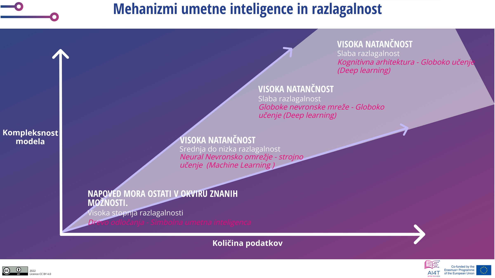

??? info "Metadata"
    - Id: EU.AI4T.O1.M4.2.1t
    - Title: 4.2.1 Ali smo pripravljeni zaupati umetni inteligenci pri sprejemanju odločitev?
    - Type: text
    - Description: Kako se odločiti za uporabo AI v praksi? Razumeti vpliv uporabe orodij umetne inteligence za odločanje in potrebne previdnostne ukrepe pri uporabi
    - Subject: Artificial Intelligence for and by Teachers
    - Authors:
        - AI4T 
        - AI4T
        - Ikram Chraibi Kaadoud, raziskovalec AI
    - Licence: CC BY 4.0
    - Date: 2022-11-15

# Ali ste pripravljeni zaupati umetni inteligenci pri sprejemanju odločitev?

Vse odločitve, sprejete z orodji, ki temeljijo na umetni inteligenci, nimajo enakega učinka.

Pri nekaterih avtomatiziranih odločitvah, kot so "koraki rešitve", ki jih učencu predlaga aplikacija za reševanje matematičnih problemov, se lahko dolgoročno tveganje in škoda štejeta za precej majhna.

Nasprotno pa druge odločitve predstavljajo potencialno škodo in/ali tveganje.

Takrat je treba sprejeti največ previdnostnih ukrepov, predvsem pa mora biti odločitev razložljiva (zakaj je ta odločitev predlagana za to določeno situacijo, za tega določenega učenca ali skupino učencev).

Oglejmo si nekaj meril, ki se uporabljajo za "ocenjevanje" postopka odločanja sistemov, ki temeljijo na umetni inteligenci.

## Razložljivost

Razložljivost - ena od 7 ključnih zahtev za zaupanja vredno UI: "_Razložljivost se nanaša na sposobnost razlage tehničnih procesov sistema UI in s tem povezanih človeških odločitev (npr. področja uporabe sistema). Tehnična razložljivost zahteva, da lahko odločitve, ki jih sprejme sistem UI, razumejo in sledijo ljudje_" [deepl translation] [^1]

Na področju izobraževanja to pomeni, da sta v vsakem orodju za odločanje z umetno inteligenco način predlaganja odločitve in s tem povezana človeška interakcija elementa, do katerih je treba dostopati.

To zahtevo je bolj ali manj enostavno izpolniti, vendar pri nekaterih tehnologijah umetne inteligence pojasnjevanja ni tako preprosto zagotoviti. Na primer pri nevronskih mrežah z več plastmi je pojasnila težko podati. Zato se zdaj razvija novo področje umetne inteligence: eXplainable AI ali XAI, ki je opredeljena kot _umetna inteligenca, pri kateri lahko ljudje razumejo odločitve ali napovedi umetne inteligence. V nasprotju s konceptom "črne skrinjice" pri strojnem učenju, kjer niti njeni oblikovalci ne morejo pojasniti, zakaj je umetna inteligenca sprejela določeno odločitev_." [deepl translation] [^2]

## Razložljivost

Napovedi, izdelane z nekaterimi tehnikami umetne inteligence, je lažje razlagati kot druge. Napoved, narejeno z odločitvenim drevesom, je na primer mogoče razložiti. Vendar pa to niso vedno najbolj zanimive napovedi, ki jih je mogoče narediti.

Na nasprotnem koncu spektra razložljivosti je globinsko učenje, ki ga je težko razložiti, vendar so lahko njegovi rezultati veliko pomembnejši od tistih, narejenih z zelo razložljivo UI.

<figure>
  
  <figcaption>Slika 1: Mehanizmi umetne inteligence in razlagalnost.
 Prirejeno iz Mooc IAI / Ikram Chraibi Kaadoud - CC.BY.SA 2.0.</figcaption>
</figure>

Tako je lahko podpora pri odločanju, ki jo zagotavljajo orodja z nizko razložljivostjo, pomembnejša od podpore, ki jo zagotavljajo orodja z visoko razložljivostjo.

## Od opisa do recepta

Tukaj je prikaz, ki povezuje uporabljeno tehnologijo, njeno zapletenost in strateški rezultat.

<figure>
  
</figure>
_Slika 2: Razvrstitev uporabe analize podatkov od opisa do predpisa[^3] (povzeto po videoposnetku "Learning Analytics" tega predmeta)._

V naslednjih 4 kategorijah je mogoče opaziti povezavo med zapletenostjo uporabljenih metod in strateškimi rezultati.

#### Opisna analitika

Opisna analitika preučuje podatke, da bi odgovorila na vprašanje "Kaj se je zgodilo?".
Te je mogoče zagotoviti v obliki "*enostavnih povzetkov o vzorcu in o opažanjih, ki so bila opravljena. Takšni povzetki so lahko kvantitativni ali vizualni, tj. preprosti za razumevanje grafi*" [deepl translation] [^4]. Temelji na tradicionalnih orodjih brez umetne inteligence.

### Diagnostična analitika

Diagnostična analitika odgovarja na vprašanje "Zakaj se je to zgodilo?".
Pripelje do prepoznavanja narave in vzroka pojava, da se določijo ublažitve in rešitve. Nekatere tehnike, ki se uporabljajo za diagnostično analitiko: Statistične metode, kot so odkrivanje podatkov, podatkovno rudarjenje in korelacije. Te metode lahko vključujejo umetno inteligenco.

### Prediktivna analitika

Prediktivna analitika preučuje podatke ali dogodke, da bi odgovorila na vprašanje "Kaj se bo zgodilo?" ali natančneje "Kaj se bo verjetno zgodilo?".
"*Prediktivna analitika je usmerjena v prihodnost in uporablja pretekle dogodke za predvidevanje prihodnosti. Statistične tehnike napovedne analitike vključujejo modeliranje podatkov, strojno učenje, umetno inteligenco, algoritme globokega učenja in podatkovno rudarjenje.*" [deepl translation] [^5].

### Predpisovalna analitika

Predpisovalna analitika odgovarja na vprašanje "Kaj bi bilo treba storiti?" ali "Kako lahko to uresničimo?".

"*Predpisovalna analitika ne predvideva le, kaj se bo zgodilo in kdaj se bo zgodilo, temveč tudi, zakaj se bo zgodilo. Poleg tega preskriptivna analitika predlaga možnosti odločanja o tem, kako izkoristiti prihodnjo priložnost ali zmanjšati prihodnje tveganje, in prikaže posledice vsake možnosti odločanja*." [deepl translation] [^6]

Če povzamemo, bolj kot so orodja lahko pomembna kot pomoč pri odločanju, bolj kompleksne so informacijske tehnologije in težje jih je razložiti.
Vendar je treba v smislu zagotovljene pomoči ohraniti pozornost na razložljivost in morebitno pazljivost, ki je potrebna pri uporabi orodja IA na področju, kjer so posledice odločitev pomembne in trajne.

[^1]: "*Moreover, trade-offs might have to be made between enhancing a system's explainability (which may reduce its accuracy) or increasing its accuracy (at the cost of explainability). Whenever an AI system has a significant impact on people's lives, it should be possible to demand a suitable explanation of the AI system's decision-making process. Such explanation should be timely and adapted to the expertise of the stakeholder concerned (e.g. layperson, regulator or researcher). In addition, explanations of the degree to which an AI system influences and shapes the organisational decision-making process, design choices of the system, and the rationale for deploying it, should be available (hence ensuring business model transparency).*" From ["Ethics Guidelines for Trustworthy AI"](https://ec.europa.eu/futurium/en/ai-alliance-consultation/guidelines/1.html#Transparency) (consulted 10/16/2022).

[^2]: From wikipedia article on ["Explainable artificial intelligence"](https://en.wikipedia.org/wiki/Explainable_artificial_intelligence) (consulted 10/16/2022).  

[^3]: See in this course the section 1.1.3. on Learning analytics (video).  

[^4]: From wikipedia article on ["Descriptive statistics"](https://en.wikipedia.org/wiki/Descriptive_statistics) (consulted 10/16/2022).  

[^5]: From wikipedia article on ["Predictive Analytics"](https://en.wikipedia.org/wiki/Predictive_analytics) (consulted 10/16/2022).  

[^6]: From wikipedia article on ["Prescriptive Analytics"](https://en.wikipedia.org/wiki/Prescriptive_analytics) (consulted 10/16/2022).
