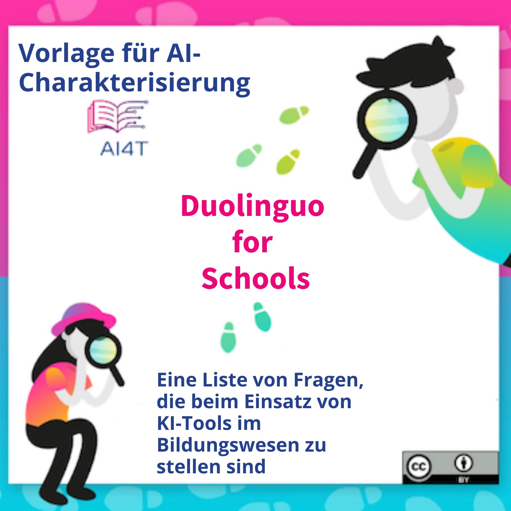

??? info "Metadata"
    - Id: EU.AI4T.O1.M4.3.2a
    - Title: 4.3.2 Aktivität: Fallstudie mit der AI-Vorlage
    - Type: activity
    - Description: Verwendung der KI-Vorlage zur Analyse von Duolingo für die Schule
    - Subject: Artificial Intelligence for and by Teachers
    - Authors:
        - AI4T 
        - Jiajun, Pan - Loria
        - Azim, Roussanaly - Loria
        - Anne, Boyer - Loria
        - AI4T
    - Licence: CC BY 4.0
    - Date: 2022-11-15

# Aktivität: Fallstudie mit AI-Vorlage zur Analyse von Duolingo for Schools

Das AI4T-Konsortium hat "*Duolingo for Schools*" als ein relevantes KI-Tool identifiziert, das von LehrerInnen während des Projekts erprobt werden soll.

Es handelt sich dabei um eine App zum Erlernen von Sprachen, aber die Fragen, die sie als KI aufwirft, sind fächerübergreifend relevant.

Während dieser Aktivität wird Duolingo für Schulen als Fallstudie vorgeschlagen, um die Vorlage für die KI-Charakterisierung zu erproben. Es gibt zwei Besonderheiten von Duolingo für Schulen, die es zu einer guten Fallstudie machen:

1. Duolingo gibt viele Informationen darüber preis, wie es funktioniert,
2. Da Duolingo von vielen Lernenden genutzt wird, wurden viele Fragen von Außenstehenden gestellt, die sich z. B. um den Datenschutz sorgen. Daher ist es einfacher, Einblicke in einige Themen zu bekommen, die im Allgemeinen nicht so einfach über AIERs zu bekommen sind, wie z.B. Datenschutz.

## Duolingo for Schools in eigenen Worten

Hier ist die offizielle Präsentation von Duolingo for Schools auf seinem Blog[^1]: "*Duolingo for Schools ist ein Dashboard direkt im Duolingo-Konto eines Lehrers, das es ihm ermöglicht, Klassenräume und Aufgaben zu erstellen und die Aktivitäten der Schüler zu verfolgen. Wir freuen uns darauf, mit Pädagogen zusammenzuarbeiten, um die weltweit führende Sprachlern-App in die Klassenzimmer zu bringen, mit Funktionen, die die Effektivität der Lehrer und das Lernen der Schüler maximieren*". [deepl translation]

## Einige Ressourcen, die verwendet werden können, um die KI-Funktionen von Duolingo für Schulen zu analysieren:

1. Duolingo for Schools (Teil der Duolingo-Website): [https://schools.duolingo.com/](https://schools.duolingo.com/)
2. Duolingo for Schools - Hilfezentrum: [https://duolingoschools.zendesk.com/hc/en-us](https://duolingoschools.zendesk.com/hc/en-us)
3. Duolingo offizielle Website: [https://www.duolingo.com/](https://www.duolingo.com/)
4. Duolingo-Blog: [https://blog.duolingo.com](https://blog.duolingo.com)
5. Duolingo-Forschungswebsite (wissenschaftlicher Artikel / gemeinsame Nutzung von Datensätzen): [https://research.duolingo.com/](https://research.duolingo.com/)

Dies sind die "offiziellen" Duolingo-Webseiten. Einige interessante Informationen können auf anderen Websites gefunden werden, zögern Sie also nicht, Ihre Recherche zu diversifizieren.

**Möchten Sie die KI-Funktionen von Duolingo for Schools analysieren?**  
_Klicken Sie auf das Bild unten, um die gebrauchsfertige KI-Charakterisierungsvorlage zu laden und füllen Sie sie so weit wie möglich aus._
<a href="Documents/AI4T-Template-Ready-to-use-DE.pdf" target="_blank">
<figure>
  
</figure></a>

## Beispiel der ausgefüllten Vorlage für "Duolingo for Schools"

Hier ist ein Beispiel für die Vervollständigung der Vorlage unter Verwendung der Informationen, die über die oben genannten Links gesammelt wurden, und einiger anderer, leicht zugänglicher Informationen, die über die Websuche gefunden wurden.
Wenn viele Informationen zugänglich sind, sind einige andere Merkmale schwer auszufüllen oder manchmal unmöglich zu finden.

<a href="Documents/AI4T-Template-Case-study-Duolingo-de.pdf" target="_blank">
<figure>
  
</figure></a>

[^1]: [Presentation of Duolingo for Schools](https://blog.duolingo.com/duolingo-for-schools/)
 (consulted on 10/11/2022)
