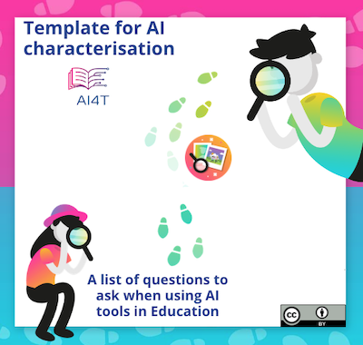

# Activité : Étude de cas avec modèle AI pour analyser Duolingo pour l'école

Le consortium AI4T a identifié "*Duolingo for Schools*" comme un outil d'IA pertinent à expérimenter par les enseignants pendant le projet.

Il s'agit d'une application d'apprentissage des langues, certes, mais les questions qu'elle soulève en tant qu'IA sont pertinentes dans toutes les disciplines.

Au cours de cette activité, Duolingo for Schools est proposé comme étude de cas pour expérimenter le modèle de caractérisation de l'IA. Il y a deux particularités de Duolingo for Schools qui en font une bonne étude de cas :

1. Duolingo partage beaucoup d'informations sur son fonctionnement,
2. Utilisé par de nombreux apprenants, il a fait l'objet de nombreuses questions de la part de personnes extérieures préoccupées par le respect de la vie privée, par exemple. Il est donc plus facile d'avoir un aperçu de certaines questions qui ne sont généralement pas si faciles à avoir sur les AIERs, comme la protection des données.

## Duolingo for Schools en ses propres termes

Voici la présentation officielle de Duolingo for Schools sur son blog [^1] : "*Duolingo for Schools est un tableau de bord à l'intérieur même du compte Duolingo d'un enseignant qui lui permet de créer des classes et des devoirs, et de suivre l'activité des élèves. Nous sommes ravis de collaborer avec les éducateurs pour introduire l'application d'apprentissage des langues numéro un au monde dans les salles de classe, avec des fonctionnalités conçues pour optimiser l'efficacité des enseignants et l'apprentissage des élèves*".

## Quelques ressources qui peuvent être utilisées pour analyser les fonctions d'IA de Duolingo for Schools :

1. Duolingo for School (partie du site Web de Duolingo) : [https://schools.duolingo.com/](https://schools.duolingo.com/)
2. Duolingo pour l'école - Centre d'aide : [https://duolingoschools.zendesk.com/hc/en-us](https://duolingoschools.zendesk.com/hc/en-us)
3. Site officiel de Duolingo : [https://schools.duolingo.com](https://schools.duolingo.com)
4. Blogue de Duolingo : [https://blog.duolingo.com](https://blog.duolingo.com)
5. Site Web de recherche de Duolingo (partage d'articles scientifiques et d'ensembles de données) : [https://research.duolingo.com/](https://research.duolingo.com/)

Ces sites sont les sites "officiels" de Duolingo. Certaines informations intéressantes peuvent être trouvées sur d'autres sites, n'hésitez pas à diversifier vos recherches.

**Voulez-vous analyser les fonctionnalités d'IA de Duolingo pour les écoles ?**  
Cliquez sur l'image ci-dessous pour télécharger le modèle de caractérisation de l'IA prêt à l'emploi et remplissez-le autant que possible.
<a href="./AI4T-Template_Ready_to_use.pdf" target="_blank">
<figure>
  
</figure></a>

## Exemple de modèle complété pour "Duolingo for Schools".

Voici un exemple de modèle complété à l'aide des informations collectées à partir des liens ci-dessus et d'autres informations facilement accessibles par le biais de recherches sur Internet.
Si beaucoup d'informations sont accessibles, certaines autres caractéristiques sont difficiles à remplir, ou parfois impossibles à trouver.

<a href="./AI4T-Case_study_on_AI_Features_For_Duolingo.pdf" target="_blank">
<figure>
  
</figure></a>

[^1]: [Présentation de Duolingo pour les écoles](https://blog.duolingo.com/duolingo-for-schools/)
 (consulté le 10/11/2022)
