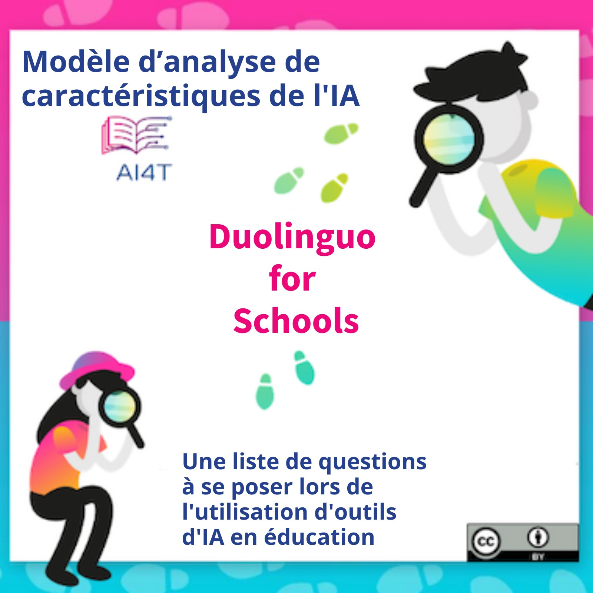

??? info "Metadata"
    - Id: EU.AI4T.O1.M4.3.2a
    - Title: 4.3.2 Activité : Etude de cas avec Duolingo
    - Type: activity
    - Description: Utilisation du modèle pour caractériser Duolingo pour l'école
    - Subject: Artificial Intelligence for and by Teachers
    - Authors:
        - AI4T 
        - Jiajun, Pan - Loria
        - Azim, Roussanaly - Loria
        - Anne, Boyer - Loria
        - AI4T
    - Licence: CC BY 4.0
    - Date: 2022-11-15

# Activité : Étude de cas avec le modèle AI pour analyser Duolingo for Schools

Les partenaires européens d'AI4T ont identifié "*Duolingo for Schools*" comme un outil d'IA pertinent à expérimenter par les enseignants au cours du projet.

Il s'agit d'une application d'apprentissage des langues, certes, mais les questions qu'elle soulève quant à son IA sont pertinentes pour toutes les disciplines.

Au cours de cette activité, Duolingo for Schools est proposé comme étude de cas pour expérimenter le modèle de caractérisation de l'IA. Il y a deux particularités de Duolingo for Schools qui en font une bonne étude de cas :

1. Duolingo partage beaucoup d'informations sur son fonctionnement,
2. Utilisé par de nombreux apprenants, il a fait l'objet de nombreuses questions de la part de personnes extérieures préoccupées par le respect de la vie privée, par exemple. Il est donc plus facile d'avoir un aperçu de certaines questions qui ne sont généralement pas si faciles à avoir sur les AIER, comme la protection des données.

## Duolingo for Schools en ses propres termes

Voici la présentation de Duolingo for Schools sur son blog en anglais[^1] : "*Duolingo for Schools possède un tableau de bord, à l'intérieur même du compte Duolingo d'un enseignant, qui lui permet de créer des classes et des devoirs, et de suivre l'activité des élèves. Nous sommes ravis de collaborer avec les éducateurs pour apporter l'application numéro un au monde d'apprentissage des langues dans les salles de classe, avec des fonctionnalités conçues pour optimiser l'efficacité des enseignants et l'apprentissage des élèves*". [Traduction Deepl]

## Quelques ressources utilisables pour analyser les caractéristiques de l'IA de Duolingo for Schools :

1. Duolingo for Schools (en anglais) : [https://schools.duolingo.com/](https://schools.duolingo.com/)
2. Duolingo for Schools - Centre d'aide en anglais : [https://duolingoschools.zendesk.com/hc/en-us](https://duolingoschools.zendesk.com/hc/en-us)
3. Site officiel de Duolingo : [https://www.duolingo.com/](https://www.duolingo.com/)
4. Blog de Duolingo (en anglais) : [https://blog.duolingo.com](https://blog.duolingo.com)
5. Site Web de recherche de Duolingo (articles scientifiques, outils et données) : [https://research.duolingo.com/](https://research.duolingo.com/)

Ces sites sont les sites "officiels" de Duolingo. Certaines informations intéressantes peuvent être trouvées sur d'autres sites, n'hésitez pas à diversifier vos recherches.

**Voulez-vous analyser les caractéristiques de l'IA de Duolingo for Schools ?**  
Cliquez sur l'image ci-dessous pour télécharger le modèle de caractérisation de l'IA prêt à l'emploi et remplissez-le autant que possible.
<a href="Documents/AI4T-Template-Ready-to-use-fr.pdf" target="_blank">
<figure>
  
</figure></a>

## Exemple de modèle de caractérisation d'IA complété pour "Duolingo for Schools".

Voici un exemple de modèle complété à l'aide des informations collectées à partir des liens ci-dessus et d'autres informations facilement accessibles par le biais de recherches sur Internet.
Si beaucoup d'informations sont accessibles, certaines autres caractéristiques sont difficiles à remplir, ou parfois impossibles à trouver.

<a href="Documents/AI4T-Template-Case-study-Duolingo-fr.pdf" target="_blank">
<figure>
  
</figure></a>

[^1]: [Présentation en anglais de Duolingo for Schools](https://blog.duolingo.com/duolingo-for-schools/)
 (consulté le 10/11/2022)
