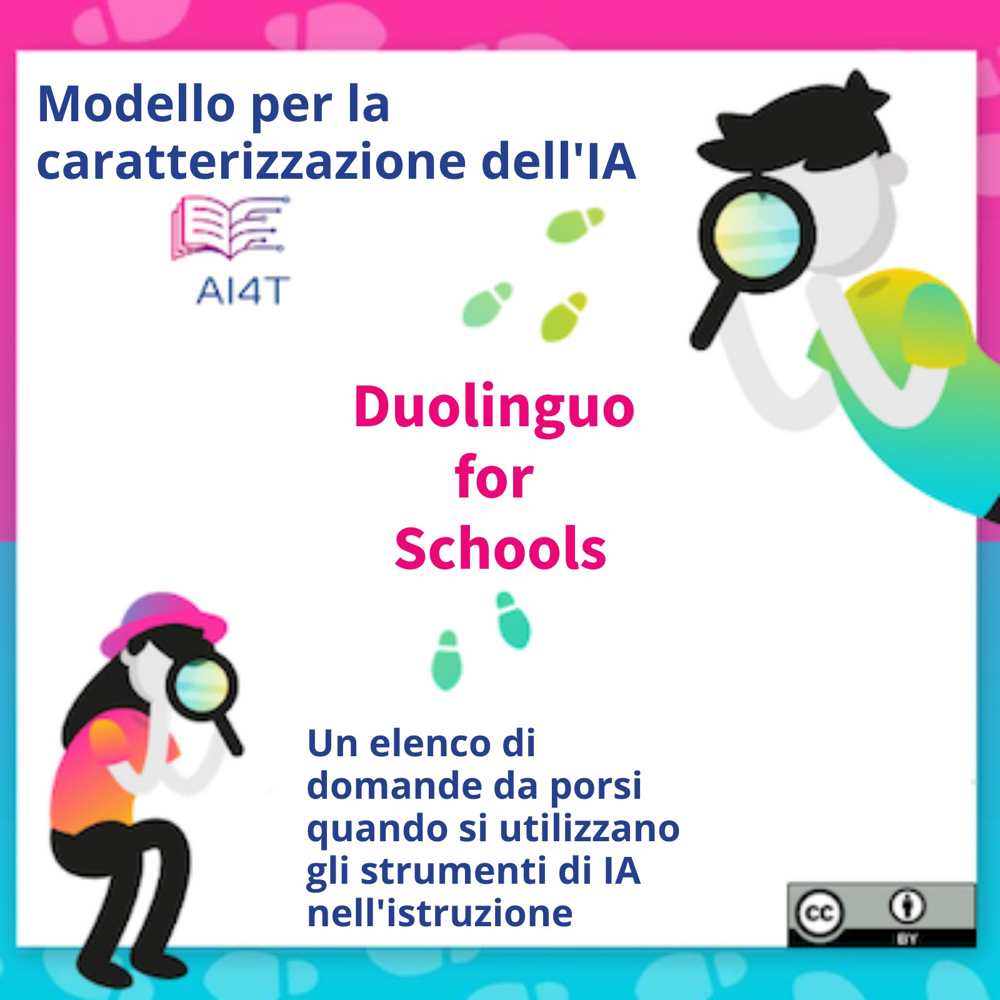

??? info "Metadata"
    - Id: EU.AI4T.O1.M4.3.2a
    - Title: 4.3.2 Attività: Caso di studio con il modello di IA
    - Type: activity
    - Description: Utilizzo del modello di IA per analizzare Duolingo per la scuola
    - Subject: Artificial Intelligence for and by Teachers
    - Authors:
        - AI4T 
        - Jiajun, Pan - Loria
        - Azim, Roussanaly - Loria
        - Anne, Boyer - Loria
        - AI4T
    - Licence: CC BY 4.0
    - Date: 2022-11-15

# Attività: Caso di studio con modello AI per analizzare Duolingo for Schools

Il consorzio AI4T ha identificato "*Duolingo for Schools*" come uno strumento di IA rilevante da sperimentare da parte degli insegnanti durante il progetto.

Si tratta sicuramente di un'app per l'apprendimento delle lingue, ma le domande che solleva come AIER sono rilevanti per tutte le discipline.

Durante questa attività, Duolingo for Schools viene proposto come caso di studio per sperimentare il Template per la caratterizzazione dell'IA. Ci sono due particolarità di Duolingo for Schools che lo rendono un buon caso di studio:

1. Duolingo condivide molte informazioni sul suo funzionamento,
2. Utilizzato da molti studenti, è stato al centro di molte domande da parte di persone esterne preoccupate, ad esempio, per la privacy. È quindi più facile avere approfondimenti su alcune questioni che in genere non sono così facili da avere sulle AIER, come la protezione dei dati.

## Duolingo for Schools nelle sue parole

Ecco la presentazione ufficiale di Duolingo for Schools sul suo blog[^1]: "*Duolingo for Schools è una dashboard all'interno dell'account Duolingo di un insegnante che permette di creare classi e compiti e di seguire le attività degli studenti. Siamo entusiasti di collaborare con gli educatori per portare nelle classi l'applicazione numero uno al mondo per l'apprendimento delle lingue, con funzioni progettate per massimizzare l'efficacia degli insegnanti e l'apprendimento degli studenti*". [deepl translation]

## Alcune risorse che possono essere utilizzate per analizzare le funzioni AI di Duolingo for Schools:

1. Duolingo for Schools (parte del sito web di Duolingo): [https://schools.duolingo.com/](https://schools.duolingo.com/)
2. Duolingo for Schools - Centro di assistenza: [https://duolingoschools.zendesk.com/hc/en-us](https://duolingoschools.zendesk.com/hc/en-us)
3. Sito web ufficiale di Duolingo: [https://www.duolingo.com/](https://www.duolingo.com/)
4. Blog di Duolingo: [https://blog.duolingo.com](https://blog.duolingo.com)
5. Sito web di ricerca di Duolingo (condivisione di articoli scientifici e set di dati): [https://research.duolingo.com/](https://research.duolingo.com/)

Questi sono i siti web "ufficiali" di Duolingo. Alcune informazioni interessanti possono essere trovate su altri siti, quindi non esitate a diversificare la vostra ricerca.

**Vuoi analizzare le funzioni AI di Duolingo for Schools?**  
_Cliccate sull'immagine qui sotto per scaricare il modello di caratterizzazione dell'intelligenza artificiale pronto per l'uso e compilatelo il più possibile._
<a href="Documents/AI4T-Template-Ready-to-use-IT.pdf" target="_blank">
<figure>
  
</figure></a>

## Esempio di modello compilato per "Duolingo for Schools"

Ecco un esempio di completamento del modello utilizzando le informazioni raccolte dai link precedenti e altre informazioni facilmente accessibili tramite ricerche sul web.
Se molte informazioni sono accessibili, altre caratteristiche sono difficili da compilare o talvolta impossibili da trovare.

<a href="Documents/AI4T-Template-Case-study-Duolingo-it.pdf" target="_blank">
<figure>
  
</figure></a>

[^1]: [Presentation of Duolingo for Schools](https://blog.duolingo.com/duolingo-for-schools/)
 (consulted on 10/11/2022)
