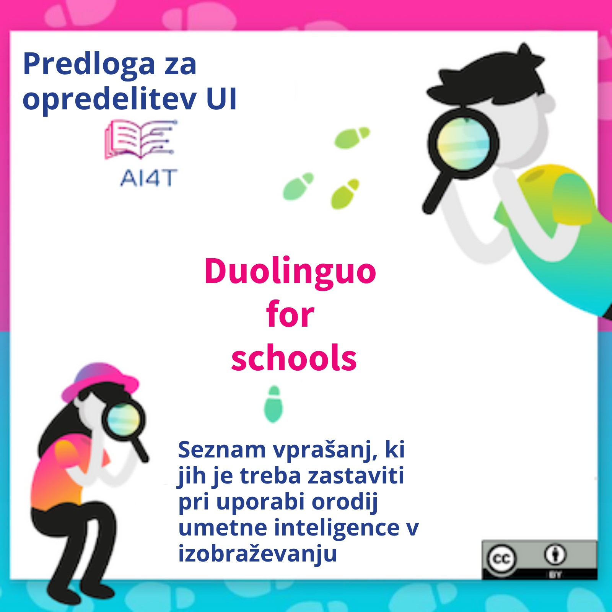

??? info "Metadata"
    - Id: EU.AI4T.O1.M4.3.2a
    - Title: 4.3.2 Dejavnost: Študija primera s predlogo umetne inteligence
    - Type: activity
    - Description: Uporaba predloge umetne inteligence za analizo Duolinga za šolo
    - Subject: Artificial Intelligence for and by Teachers
    - Authors:
        - AI4T 
        - Jiajun, Pan - Loria
        - Azim, Roussanaly - Loria
        - Anne, Boyer - Loria
        - AI4T
    - Licence: CC BY 4.0
    - Date: 2022-11-15

# Dejavnost: Študija primera s predlogo umetne inteligence za analizo Duolinga for Schools

Konzorcij AI4T je opredelil "*Duolingo for Schools*" kot ustrezno orodje umetne inteligence, ki ga bodo učitelji preizkušali med projektom.

Zagotovo gre za aplikacijo za učenje jezikov, vendar so vprašanja, ki jih zastavlja kot AIER, pomembna za vse discipline.

Med to dejavnostjo je Duolingo for Schools predlagan kot študija primera za eksperimentiranje Predloga za opredelitev UI. Duolingo for Schools ima dve posebnosti, zaradi katerih je dobra študija primera:

1. Duolingo deli veliko informacij o svojem delovanju,
2. Ker ga uporabljajo številni učenci, je bil v središču številnih vprašanj zunanjih oseb, ki jih skrbi zasebnost, npr. Zato je lažje dobiti vpogled v nekatera vprašanja, ki jih na splošno ni tako lahko dobiti o AIER, kot je varstvo podatkov.

## Duolingo for Schools v lastnih besedah

Tukaj je uradna predstavitev Duolinga za šole na njegovem blogu[^1]: "*Duolingo for Schools je nadzorna plošča znotraj učiteljevega računa Duolingo, ki mu omogoča ustvarjanje učilnic in nalog ter spremljanje dejavnosti učencev. Veseli nas, da lahko sodelujemo z učitelji in v učilnice vnesemo aplikacijo za učenje jezikov, ki je številka ena na svetu, s funkcijami, namenjenimi čim večji učinkovitosti učiteljev in učencem*". [deepl translation]

## Nekaj virov, ki jih lahko uporabite za analizo funkcij umetne inteligence v Duolingu for Schools:

1. Duolingo for Schools (del spletnega mesta Duolingo): [https://schools.duolingo.com/](https://schools.duolingo.com/)
2. Duolingo for Schools - center za pomoč: [https://duolingoschools.zendesk.com/hc/en-us](https://duolingoschools.zendesk.com/hc/en-us)
3. Uradna spletna stran Duolingo: [https://www.duolingo.com/](https://www.duolingo.com/)
4. Duolingo blog: [https://blog.duolingo.com](https://blog.duolingo.com)
5. Raziskovalno spletišče Duolingo (izmenjava znanstvenih člankov/podatkovnih nizov): [https://research.duolingo.com/](https://research.duolingo.com/)

To so "uradna" spletna mesta Duolingo. Nekaj zanimivih informacij je mogoče najti tudi na drugih spletnih mestih, zato ne oklevajte in popestrite svoje raziskave.

**Želite analizirati funkcije umetne inteligence v Duolingu for Schools?**  
_Cvrknite na spodnjo sliko, da naložite pripravljeno predlogo za opis značilnosti umetne inteligence in jo čim bolj izpolnite._
<a href="Documents/AI4T-Template-Ready-to-use-SI.pdf" target="_blank">
<figure>
  
</figure></a>

## Primer izpolnjene predloge za "Duolingo for Schools"

Tukaj je primer izpolnjevanja predloge z uporabo informacij, zbranih na zgornjih povezavah, in nekaterih drugih zlahka dostopnih informacij, pridobljenih s spletnim iskanjem.
Če je veliko informacij dostopnih, je nekatere druge značilnosti težko izpolniti, včasih pa jih je nemogoče najti.

<a href="Documents/AI4T-Template-Case-study-Duolingo-si.pdf" target="_blank">
<figure>
  
</figure></a>

[^1]: [Presentation of Duolingo for Schools](https://blog.duolingo.com/duolingo-for-schools/)
 (consulted on 10/11/2022)
