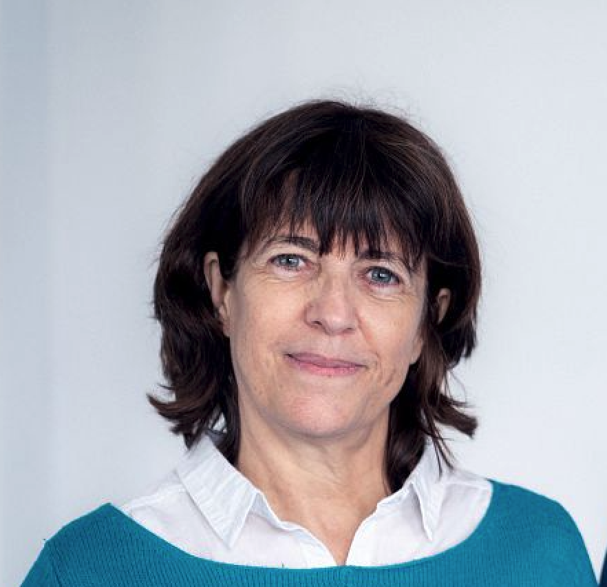

# Wer hat zu diesem Kurs beigetragen?
Wie aus der unten stehenden Liste der Beitragenden hervorgeht, ist dieser Mooc eine gemeinschaftliche Arbeit! Er ist das Ergebnis der Arbeit im Rahmen des europäischen Projekts AI4T und enthält auch Ressourcen aus dem Mooc "Künstliche Intelligenz ... mit Intelligenz!". Er hat auch von den Beiträgen und der Expertise der Partner profitiert, die am Projekt beteiligt waren. Schließlich möchten wir die Unterstützung und Anleitung der Digitalen Direktion für Bildung (MENJ / [DNE-TN2](https://edunumrech.hypotheses.org/author/dnetn2)) bei der Erstellung dieses Kurses betonen.

## Autoren des Mooc

<table style="border: none;">

    <tbody>

        <tr style="border: none;">

            <td style="border: none;" width="20%">

            <td style="border: none; vertical-align: middle;">
                <strong>Anne BOYER</strong> 
                Anne BOYER ist Professorin für Informatik an der Universität von Lothringen. Ihre Forschung am LORIA-Labor konzentriert sich auf künstliche Intelligenz, insbesondere auf personalisierte Empfehlungssysteme und die Modellierung des digitalen Verhaltens der Benutzer.

            </td>

        </tr>

        <tr style="border: none;">

            <td style="border: none;" width="20%">

            <td style="border: none; vertical-align: middle;">

                <strong>Laurent ROMARY</strong> 
                Laurent ROMARY ist Direktor für Information und Wissenschaftskultur bei Inria. Er hat Forschung im Bereich der natürlichen Sprachverarbeitung und der Modellierung halbstrukturierter Dokumente durchgeführt, mit einem besonderen Interesse an Texten und sprachlichen Ressourcen. Er spielte auch eine aktive Rolle bei Standardisierungsbemühungen im ISO-TC-37-Komitee und der Text Encoding Initiative. Seit vielen Jahren ist er an verschiedenen Initiativen zur Förderung der offenen Wissenschaft beteiligt.
            </td>

        </tr>

        <tr style="border: none;">

            <td style="border: none;" width="20%">

            <td style="border: none; vertical-align: middle;">

                <strong>Azim ROUSSANALY</strong> 
                Azim ROUSSANALY ist Dozent und Forscher für Informatik an der Universität von Lothringen. Er forscht am LORIA-Labor und ist stellvertretender Direktor des Instituts für digitale Wissenschaften, Management und Kognition (IDMC). Seine aktuellen Forschungsbereiche umfassen künstliche Intelligenz, Benutzermodellierung, Datenmining und E-Learning.
            </td>

        </tr>

        <tr style="border: none;">

            <td style="border: none;" width="20%">

            <td style="border: none; vertical-align: middle;">

                <strong>Jiajun PAN</strong> 
                Jiajun PAN ist Postdoktorand an der Universität von Lothringen. Seine Arbeit am LORIA-Labor konzentriert sich auf maschinelles Lernen und Datenexploration. Er beteiligt sich an Forschungen zu Zusammenhängen zwischen den persönlichen Merkmalen von Studierenden und Lernerfahrungen.
            </td>

        </tr>

        <tr style="border: none;">

            <td style="border: none;" width="20%">

            <td style="border: none; vertical-align: middle;">

                <strong>Daniela HAU</strong> 
                Daniela HAU ist Leiterin der Abteilung für Innovation im Bildungsministerium von Luxemburg, Mitglied der Arbeitsgruppe ET2020 "Digitale Bildung, Lernen, Lehren und Beurteilen" und des europäischen Expertengremiums für Medienbildung. Sie ist an Pilotstudien/Feldforschungen zur digitalen Innovation im Klassenzimmer beteiligt (z. B. KI, digitales spielbasiertes Lernen, VR/AR-Technologien).
            </td>

        </tr>

        <tr style="border: none;">

            <td style="border: none;" width="20%">

            <td style="border: none; vertical-align: middle;">

                <strong>Claude REUTER</strong> 
                Claude REUTER ist Senior-Projektmanager in der Abteilung für Innovation im Bildungsministerium von Luxemburg und führt Pilotstudien/Feldforschungen zur digitalen Innovation im Klassenzimmer durch (z. B. Computational Thinking, Programmierung, Datenkompetenz). Er ist Mitglied der ICWG-Arbeitsgruppe von EU SchoolNet.
            </td>

        </tr>

        <tr style="border: none;">

            <td style="border: none;" width="20%">

            <td style="border: none; vertical-align: middle;">

                <strong>Nicolas ROUGIER</strong> 
                Nicolas Rougier ist Forschungsdirektor bei Inria und arbeitet am Institut für neurodegenerative Erkrankungen in Bordeaux, wo er das Team für Computational Neuroscience leitet.

            </td>

        </tr>

        <tr style="border: none;">

            <td style="border: none;" width="20%">

            <td style="border: none; vertical-align: middle;">

                <strong>Bénédicte CARDON</strong> 
                Bénédicte Cardon ist Multimedia-Pädagogik-Ingenieurin bei Inria im Learning Lab.
            </td>

        </tr>

        <tr>

            <td style="border: none;" width="20%">

            <td style="border: none; vertical-align: middle;">

                <strong>Marie COLLIN</strong> 
                Marie Collin ist pädagogische Ingenieurin bei Inria im Learning Lab.
            </td>

        </tr>

    </tbody>

</table>

## Direction du Numérique pour l'éducation - MENJ

* Axel JEAN, Valérie MARCON, Clément FANTOLI, Lidia JOVANOVIC, Valérie MARCON, Romuald VERRIER, Büro für digitale Innovationsunterstützung und angewandte Forschung - DNE - TN2.

## Technisches Team

* Laurence FARHI, pädagogische Ingenieurin bei Inria Learning Lab
* Benoit ROSPARS, Informatikentwickler bei Inria Learning Lab
für die Implementierung des Ressourcenportals auf Github sowie des Prozesses zur Übersetzung und Überprüfung von Inhalten.
