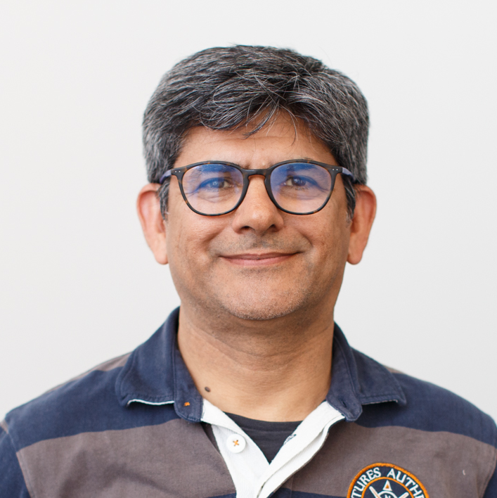
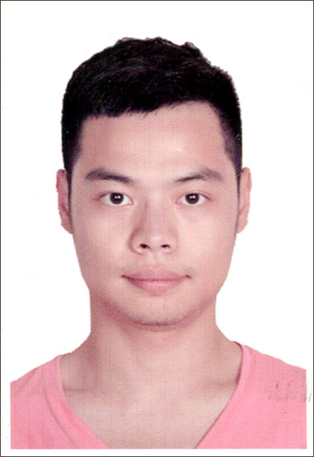

# Chi ha contribuito a questo corso?
Come evidenziato nell'elenco dei contributori qui di seguito, questo Mooc è una creazione collettiva! Risulta dal lavoro svolto all'interno del progetto europeo AI4T e include anche risorse provenienti dal Mooc "Intelligenza Artificiale... con Intelligenza!".
Ha beneficiato anche dei contributi e dell'esperienza dei partner coinvolti nel progetto.
Infine, vogliamo sottolineare il sostegno e l'accompagnamento della Direction du numérique pour l'éducation (MENJ / [DNE-TN2](https://edunumrech.hypotheses.org/author/dnetn2)) nella produzione di questo corso.

## Gli autori del Mooc

<table style="border: none;">

    <tbody>

        <tr style="border: none;">

            <td style="border: none;" width="20%">

            <td style="border: none; vertical-align: middle;">
                <strong>Anne BOYER</strong> 
                Anne BOYER è Professore di Informatica presso l'Università di Lorena. Le sue ricerche presso il laboratorio LORIA si concentrano sull'intelligenza artificiale, con lavori specifici su sistemi di raccomandazione personalizzati e modellazione del comportamento digitale degli utenti.

            </td>

        </tr>

        <tr style="border: none;">

            <td style="border: none;" width="20%">

            <td style="border: none; vertical-align: middle;">

                <strong>Laurent ROMARY</strong> 
                Laurent ROMARY è Direttore dell'informazione e della cultura scientifica presso Inria. Ha condotto ricerche nei campi del trattamento del linguaggio naturale e della modellazione di documenti semi-strutturati, con un interesse particolare per i testi e le risorse linguistiche. Ha anche svolto un ruolo attivo negli sforzi di normalizzazione all'interno del comitato TC 37 dell'ISO e della Text Encoding Initiative. Da molti anni partecipa a varie iniziative legate alla promozione della scienza aperta.

            </td>

        </tr>

        <tr style="border: none;">

            <td style="border: none;" width="20%">

            <td style="border: none; vertical-align: middle;">

                <strong>Azim ROUSSANALY</strong> 
                Azim ROUSSANALY è ricercatore e docente di informatica presso l'Università di Lorena. È ricercatore presso il laboratorio LORIA e vice direttore dell'Istituto di scienze digitali, management e cognizione (IDMC). I suoi attuali campi di ricerca includono l'intelligenza artificiale, la modellazione degli utenti, il data mining e l'e-learning.

            </td>

        </tr>

        <tr style="border: none;">

            <td style="border: none;" width="20%">

            <td style="border: none; vertical-align: middle;">

                <strong>Jiajun PAN</strong> 
                Jiajun PAN è ricercatore post-dottorato presso l'Università di Lorena. La sua attività, svolta presso il laboratorio LORIA, riguarda l'apprendimento automatico e l'esplorazione dei dati. Partecipa alle ricerche sul legame tra le caratteristiche personali degli studenti e le esperienze di apprendimento.

            </td>

        </tr>

        <tr style="border: none;">

            <td style="border: none;" width="20%">

            <td style="border: none; vertical-align: middle;">

                <strong>Daniela HAU</strong> 
                Daniela HAU è responsabile del dipartimento dell'Innovazione presso il Ministero dell'Istruzione del Lussemburgo, membro del gruppo di lavoro ET2020 "Educazione digitale, apprendimento, insegnamento e valutazione" e del gruppo di esperti europei sull'educazione ai media, studi pilota / ricerche sul campo sull'innovazione digitale applicata in classe (ad esempio, intelligenza artificiale, apprendimento basato sul gioco digitale, tecnologie VR/AR).

            </td>

        </tr>

        <tr style="border: none;">

            <td style="border: none;" width="20%">

            <td style="border: none; vertical-align: middle;">

                <strong>Claude REUTER</strong> 
                Claude REUTER è capo progetto senior nel dipartimento dell'Innovazione presso il Ministero dell'Istruzione del Lussemburgo, studi pilota / ricerche sul campo sull'innovazione digitale applicata in classe (ad esempio, pensiero informatico, programmazione, alfabetizzazione dei dati), membro del gruppo di lavoro ICWG di EU SchoolNet.

            </td>

        </tr>

        <tr style="border: none;">

            <td style="border: none;" width="20%">

            <td style="border: none; vertical-align: middle;">

                <strong>Nicolas ROUGIER</strong> 
                Nicolas Rougier è direttore della ricerca presso Inria e lavora presso l'Istituto delle malattie neurodegenerative, a Bordeaux, dove dirige il gruppo di neuroscienze computazionali.

            </td>

        </tr>

        <tr style="border: none;">

            <td style="border: none;" width="20%">

            <td style="border: none; vertical-align: middle;">

                <strong>Bénédicte CARDON</strong> 
                Bénédicte Cardon è ingegnere didattico multimediale presso Inria, all'interno del Learning Lab.

            </td>

        </tr>

        <tr style="border: none;">

            <td style="border: none;" width="20%">

            <td style="border: none; vertical-align: middle;">

                <strong>Marie COLLIN</strong> 
                Marie Collin è ingegnere didattico presso Inria, all'interno del Learning Lab.

            </td>

        </tr>

    </tbody>

</table>

## Direction du Numérique pour l'éducation - MENJ

* Axel JEAN, Valérie MARCON, Clément FANTOLI, Lidia JOVANOVIC, Romuald VERRIER -  bureau du soutien à l'innovation numérique et à la recherche appliquée (*ufficio di supporto all'innovazione digitale e alla ricerca applicata*) - DNE - TN2.

## Team tecnico

* Laurence FARHI, ingegnere didattico presso Inria Learning Lab
* Benoit ROSPARS, sviluppatore informatico presso Inria Learning Lab
per l'implementazione del portale delle risorse su Github e del processo di traduzione e revisione dei contenuti.
