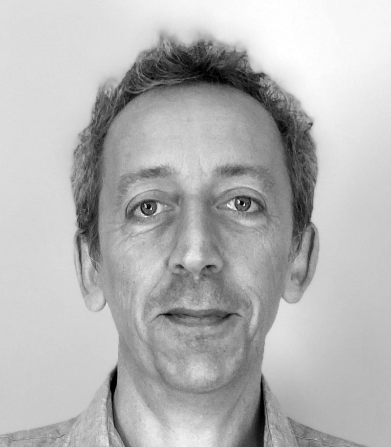

# Kdo je prispeval k temu tečaju?
Kot je razvidno iz spodnjega seznama sodelavcev, je ta Mooc kolektivno delo! Je rezultat dela, opravljenega v okviru evropskega projekta AI4T, vključuje pa tudi vire iz projekta Mooc "Umetna inteligenca ... z inteligenco!". Koristili so mu tudi prispevki in strokovno znanje partnerjev, vključenih v projekt. Na koncu bi radi poudarili podporo in usmerjanje Direction du Numérique pour l'éducation (MENJ / [DNE-TN2](https://edunumrech.hypotheses.org/author/dnetn2)) pri pripravi tega predmeta.

## Mooc Avtorji

<table style="border: none;">

    <tbody>

        <tr style="border: none;">

            <td style="border: none;" width="20%">

            <td style="border: none; vertical-align: middle;">
                <strong>Anne BOYER</strong> 
                Anne BOYER je profesorica računalništva na Univerzi Lorraine. Njene raziskave v laboratoriju LORIA se osredotočajo na umetno inteligenco, pri čemer se ukvarja s personaliziranimi priporočilnimi sistemi in modeliranjem digitalnega vedenja uporabnikov.

            </td>

        </tr>

        <tr style="border: none;">

            <td style="border: none;" width="20%">

            <td style="border: none; vertical-align: middle;">

                <strong>Laurent ROMARY</strong> 
                Laurent ROMARY je direktor za informacije in znanstveno kulturo v družbi Inria. Raziskoval je na področju obdelave naravnega jezika in modeliranja polstrukturiranih dokumentov, pri čemer se posebej zanima za besedila in jezikovne vire. Dejaven je bil tudi pri standardizacijskih prizadevanjih v okviru odbora ISO TC 37 in pobude za kodiranje besedil. Že vrsto let sodeluje pri različnih pobudah, povezanih s spodbujanjem odprte znanosti.
            </td>

        </tr>

        <tr style="border: none;">

            <td style="border: none;" width="20%">

            <td style="border: none; vertical-align: middle;">

                <strong>Azim ROUSSANALY</strong> 
                Azim ROUSSANALY je predavatelj in raziskovalec na področju računalništva na Univerzi v Loreni. Je raziskovalec v laboratoriju LORIA in namestnik direktorja Inštituta za digitalne znanosti, upravljanje in kognicijo (IDMC). Njegova trenutna raziskovalna področja so umetna inteligenca, modeliranje uporabnikov, podatkovno rudarjenje in e-izobraževanje.
            </td>

        </tr>

        <tr style="border: none;">

            <td style="border: none;" width="20%">

            <td style="border: none; vertical-align: middle;">

                <strong>Jiajun PAN</strong> 
                Jiajun PAN je podoktorski raziskovalec na Univerzi v Loreni. Njegovo delo v laboratoriju LORIA se osredotoča na strojno učenje in raziskovanje podatkov. Ukvarja se z raziskavami o povezavi med osebnimi značilnostmi študentov in učnimi izkušnjami.
            </td>

        </tr>

        <tr style="border: none;">

            <td style="border: none;" width="20%">

            <td style="border: none; vertical-align: middle;">

                <strong>Daniela HAU</strong> 
                Daniela HAU je vodja oddelka za inovacije na ministrstvu za izobraževanje v Luksemburgu, članica delovne skupine ET2020 "Digitalno izobraževanje, učenje, poučevanje in ocenjevanje" ter evropske strokovne skupine za medijsko izobraževanje. Sodeluje pri pilotnih študijah/terenskih raziskavah na področju digitalnih inovacij, ki se uporabljajo pri pouku (npr. umetna inteligenca, učenje z digitalnimi igrami, tehnologije VR/AR).
            </td>

        </tr>

        <tr style="border: none;">

            <td style="border: none;" width="20%">

            <td style="border: none; vertical-align: middle;">

                <strong>Claude REUTER</strong> 
                Claude REUTER je višji vodja projektov v oddelku za inovacije na ministrstvu za izobraževanje v Luksemburgu, kjer izvaja pilotne študije/terenske raziskave na področju digitalnih inovacij, ki se uporabljajo pri pouku (npr. računalniško razmišljanje, programiranje, podatkovna pismenost). Je član delovne skupine ICWG v okviru EU SchoolNet.
            </td>

        </tr>

        <tr style="border: none;">

            <td style="border: none;" width="20%">

            <td style="border: none; vertical-align: middle;">

                <strong>Nicolas ROUGIER</strong> 
                Nicolas ROUGIER je direktor raziskav pri družbi Inria in dela na Inštitutu za nevrodegenerativne bolezni v Bordeauxu, kjer vodi skupino za računalniško nevroznanost.

            </td>

        </tr>

        <tr style="border: none;">

            <td style="border: none;" width="20%">

            <td style="border: none; vertical-align: middle;">

                <strong>Bénédicte CARDON</strong> 
                Bénédicte CARDON je inženirka za multimedijsko pedagogiko v podjetju Inria, v učnem laboratoriju.
            </td>

        </tr>

        <tr style="border: none;">

            <td style="border: none;" width="20%">

            <td style="border: none; vertical-align: middle;">

                <strong>Marie COLLIN</strong> 
                Marie COLLIN je pedagoška inženirka v podjetju Inria v okviru učnega laboratorija.
            </td>

        </tr>

    </tbody>

</table>

## Oddelek za digitalno izobraževanje - MENJ (FR)

* Axel JEAN, Valérie MARCON, Clément FANTOLI, Lidia JOVANOVIC, Valérie MARCON, Romuald VERRIER - Urad za podporo digitalnim inovacijam in uporabnim raziskavam - DNE - TN2.

## Tehnična ekipa

* Laurence FARHI, pedagoški inženir v podjetju Inria Learning Lab
* Benoit ROSPARS, razvijalec v podjetju Inria Learning Lab
  za izvajanje portala virov na GitHuu ter delovni tok prevajanja in pregledovanja vsebine.
