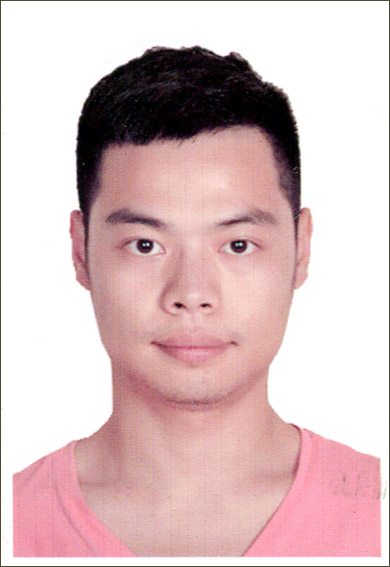

# Qui a contribué au projet ?
Comme le montre la liste des contributeurs ci-dessous, ce Mooc est une œuvre collective ! Il résulte du travail mené au sein du consortium AI4T et  propose également des ressources issues du Mooc Intelligence Artificielle avec Intelligence.
Il a bénéficié également des apports et de l’expertise des partenaires impliqués dans le projet.
Finalement il faut souligner l'engagement de la Direction du numérique pour l'éducation (MENJ /<a href="https://edunumrech.hypotheses.org/author/dnetn2">DNE-TN2</a>) dans la prodcution de ce cours.
## Les auteurs du Mooc

<table style="border: none;">

    <tbody>

        <tr style="border: none;">

            <td style="border: none;" width="20%">

            <td style="border: none; vertical-align: middle;">
                <strong>Anne BOYER</strong> 
                Anne Boyer est Professeure en Informatique à l’Université de Lorraine. Ses recherches menées au sein du laboratoire LORIA se situent dans le domaine de l’intelligence artificielle, avec des travaux notamment sur les systèmes de recommandation personnalisée et la modélisation du comportement numérique des utilisateurs.

            </td>

        </tr>

        <tr style="border: none;">

            <td style="border: none;" width="20%">

            <td style="border: none; vertical-align: middle;">

                <strong>Laurent ROMARY</strong> 
                Laurent Romary est directeur de l'information et de la culture scientifique à Inria. Il a mené des recherches dans les domaines du traitement du langage naturel et de la modélisation de documents semi-structurés, avec un intérêt particulier pour les textes et les ressources linguistiques. Il a également joué un rôle actif dans les efforts de normalisation au sein du comité TC 37 de l'ISO et de la Text Encoding Initiative. Depuis de nombreuses années, il participe à diverses initiatives liées à la promotion de la science ouverte.
            </td>

        </tr>

        <tr style="border: none;">

            <td style="border: none;" width="20%">

            <td style="border: none; vertical-align: middle;">

                <strong>Azim ROUSSANALY</strong> 
                Azim Roussanaly est enseignant-chercheur en informatique à l'Université de Lorraine. Il est hercheur au sein du laboratoire LORIA et directeur adjoint de l'Institut de sciences du digital, management et cognition (IDMC). Ses domaines de recherche actuels sont : l’Intelligence artificielle, la modélisation des utilisateurs, la fouille de données et l’e-éducation.
            </td>

        </tr>

        <tr style="border: none;">

            <td style="border: none;" width="20%">

            <td style="border: none; vertical-align: middle;">

                <strong>Jiajun PAN</strong> 
                Jiajun Pan est chercheur post-doctoral à l’Université de Lorraine. Son activité, menée au sein du laboratoire LORIA porte sur l'apprentissage automatique et à l'exploration des données. Il participe aux recherches sur le lien entre les caractéristiques personnelles des étudiants et les expériences d'apprentissage.
            </td>

        </tr>

        <tr style="border: none;">

            <td style="border: none;" width="20%">

            <td style="border: none; vertical-align: middle;">

                <strong>Nicolas ROUGIER</strong> 
                Nicolas Rougier est directeur de recherche Inria et travaille à l'institut des maladies neurodégénératives, à Bordeaux, où il dirige l'équipe de neurosciences computationnelles. has been a researcher in computer science at Inria since 2011. He works in the AVALON team (Algorithms and Software Architectures for Service-Oriented Platforms) of Inria and the LIP Laboratory of the Ecole Normale Supérieure de Lyon. He co-manages a working group dedicated to the environmental impacts of ICT <a href="http://www.ecoinfo.cnrs.fr">EcoInfo</a>.  

            </td>

        </tr>

        <tr style="border: none;">

            <td style="border: none;" width="20%">

            <td style="border: none; vertical-align: middle;">

                <strong>Bénédicte CARDON</strong> 
                Bénédicte Cardon est ingénieure pédagogique multimédia à Inria, au sein du Learning Lab.
            </td>

        </tr>

        <tr style="border: none;">

            <td style="border: none;" width="20%">

            <td style="border: none; vertical-align: middle;">

                <strong>Marie COLLIN</strong> 
                Marie Collin est ingénieure pédagogique à Inria, au sein du Learning Lab.
            </td>

        </tr>

        <tr style="border: none;">

            <td style="border: none;" width="20%">

            <td style="border: none; vertical-align: middle;">

                <strong>Daniela HAU</strong> 
                Daniela HAU est responsable du département de l'Innovation au ministère de l'Éducation du Luxembourg, membre du groupe de travail ET2020 « Éducation numérique, apprentissage, enseignement et évaluation » et du groupe d'experts européens sur l'éducation aux médias, études pilotes / recherches de terrain sur l'innovation numérique appliquée en classe (par exemple, IA, apprentissage basé sur le jeu numérique, technologies VR/AR)
            </td>

        </tr>

        <tr style="border: none;">

            <td style="border: none;" width="20%">

            <td style="border: none; vertical-align: middle;">

                <strong>Claude REUTER</strong> 
                Claude REUTER est chef de projet senior dans le département de l'Innovation au ministère de l'Éducation du Luxembourg, études pilotes / recherches de terrain sur l'innovation numérique appliquée en classe (par exemple, la pensée informatique, la programmation, la littératie des données), membre du groupe de travail ICWG de EU SchoolNet.
            </td>

        </tr>

    </tbody>

</table>

## Direction du Numérique pour l'éducation - MENSJ

* Axel JEAN, Chef du bureau du soutien à l'innovation numérique et à la recherche appliquée - DNE - TN2
* Valérie MARCON, adjointe au chef du bureau du soutien à l'innovation numérique et à la recherche appliquée - DNE - TN2
* Lidia JOVANOVIC, Enseignant d'anglais, chargée de missions au bureau du soutien à l'innovation numérique et à la recherche appliquée - DNE - TN2

## Support technique

Benoit Rospart & Laurence Fahri pour la mise en place du portail Git et la modélisation de la tarduction des contenus (API DeepL); Inria LearningLab

