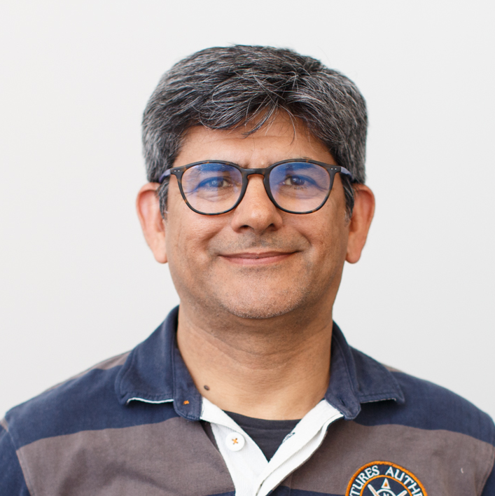

# Who Contributed to this Course?
As shown in the list of contributors below, this Mooc is a collective work! It is the result of the work carried out within the European project AI4T and also includes resources from the Mooc "Artificial Intelligence ... with Intelligence!". It has also benefited from the contributions and expertise of partners involved in the project. Finally, we would like to emphasize the support and guidance of the Direction du Numérique pour l'éducation (MENJ / [DNE-TN2](https://edunumrech.hypotheses.org/author/dnetn2)) in the production of this course.

## Mooc Authors

<table style="border: none;">

    <tbody>

        <tr style="border: none;">

            <td style="border: none;" width="20%">

            <td style="border: none; vertical-align: middle;">
                <strong>Anne BOYER</strong> 
                Anne BOYER is a Professor of Computer Science at the University of Lorraine. Her research at the LORIA laboratory focuses on artificial intelligence, with work on personalized recommendation systems and the modeling of users' digital behavior.

            </td>

        </tr>

        <tr style="border: none;">

            <td style="border: none;" width="20%">

            <td style="border: none; vertical-align: middle;">

                <strong>Laurent ROMARY</strong> 
                Laurent ROMARY is Director of Information and Scientific Culture at Inria. He has conducted research in natural language processing and the modeling of semi-structured documents, with a particular interest in texts and linguistic resources. He has also played an active role in standardization efforts within the ISO TC 37 committee and the Text Encoding Initiative. For many years, he has been involved in various initiatives related to the promotion of open science.
            </td>

        </tr>

        <tr style="border: none;">

            <td style="border: none;" width="20%">

            <td style="border: none; vertical-align: middle;">

                <strong>Azim ROUSSANALY</strong> 
                Azim ROUSSANALY is a lecturer and researcher in computer science at the University of Lorraine. He is a researcher at the LORIA laboratory and deputy director of the Institute of Digital Sciences, Management, and Cognition (IDMC). His current research areas include artificial intelligence, user modeling, data mining, and e-education.
            </td>

        </tr>

        <tr style="border: none;">

            <td style="border: none;" width="20%">

            <td style="border: none; vertical-align: middle;">

                <strong>Jiajun PAN</strong> 
                Jiajun PAN is a post-doctoral researcher at the University of Lorraine. His work at the LORIA laboratory focuses on machine learning and data exploration. He is involved in research on the link between students' personal characteristics and learning experiences.
            </td>

        </tr>

        <tr style="border: none;">

            <td style="border: none;" width="20%">

            <td style="border: none; vertical-align: middle;">

                <strong>Daniela HAU</strong> 
                Daniela HAU is Head of the Innovation Department at the Ministry of Education in Luxembourg, a member of the ET2020 working group "Digital Education, Learning, Teaching, and Assessment," and the European expert group on media education. She is involved in pilot studies/field research on digital innovation applied in the classroom (e.g., AI, digital game-based learning, VR/AR technologies).
            </td>

        </tr>

        <tr style="border: none;">

            <td style="border: none;" width="20%">

            <td style="border: none; vertical-align: middle;">

                <strong>Claude REUTER</strong> 
                Claude REUTER is a senior project manager in the Innovation Department at the Ministry of Education in Luxembourg, conducting pilot studies/field research on digital innovation applied in the classroom (e.g., computational thinking, programming, data literacy). He is a member of the ICWG working group of EU SchoolNet.
            </td>

        </tr>

        <tr style="border: none;">

            <td style="border: none;" width="20%">

            <td style="border: none; vertical-align: middle;">

                <strong>Nicolas ROUGIER</strong> 
                Nicolas Rougier is a research director at Inria and works at the Institute of Neurodegenerative Diseases in Bordeaux, where he leads the Computational Neuroscience team.

            </td>

        </tr>

        <tr style="border: none;">

            <td style="border: none;" width="20%">

            <td style="border: none; vertical-align: middle;">

                <strong>Bénédicte CARDON</strong> 
                Bénédicte Cardon is a multimedia pedagogical engineer at Inria, within the Learning Lab.
            </td>

        </tr>

        <tr style="border: none;">

            <td style="border: none;" width="20%">

            <td style="border: none; vertical-align: middle;">

                <strong>Marie COLLIN</strong> 
                Marie Collin is a pedagogical engineer at Inria, within the Learning Lab.
            </td>

        </tr>

    </tbody>

</table>

##  Direction du Numérique pour l'éducation - MENJ

* Axel JEAN, Valérie MARCON, Clément FANTOLI, Lidia JOVANOVIC, Valérie MARCON, Romuald VERRIER - bureau du soutien à l'innovation numérique et à la recherche appliquée (*Bureau of Support for Digital Innovation and Applied Research*) - DNE - TN2.

## Technical Team

* Laurence FARHI, pedagogical engineer at Inria Learning Lab
* Benoit ROSPARS, developer at Inria Learning Lab
for the implementation of the resource portal on GitHub and the workflow of content translation and review.
