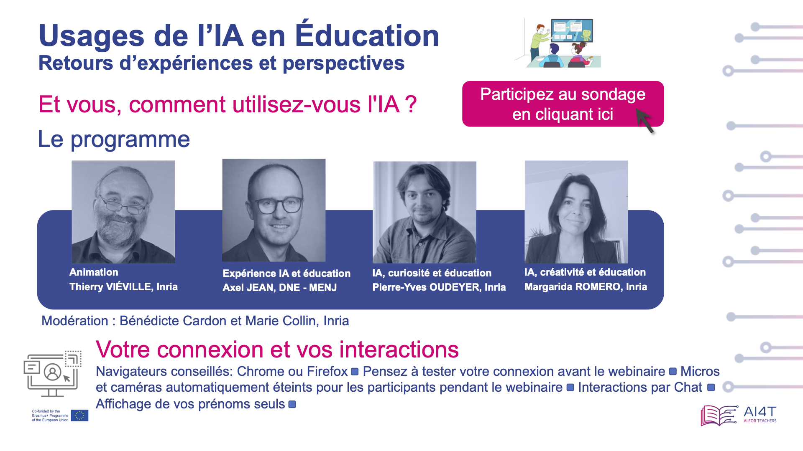

# Usages de l'IA en éducation : retours d'expériences et perspectives

Le 31 janvier 2024, l'équipe pédagogique du Mooc a organisé son premier webinaire autour des 
"Usages de l'IA en éducation : retours d'expériences et perspectives".

<td style="center; border: none; vertical-align: middle;"></td>

## Animation du webinaire par Thierry VIÉVILLE
Thierry est chercheur en neurosciences computationnelles - Inria, Equipe Mnemosyne - *Membre de l'équipe pédagogique du Mooc AI4T*

### IA, usages et éducation par Axel JEAN
Axel est le chef du bureau du soutien à l'innovation numérique et à la recherche appliquée - TN2 DNE - MENJ - *Membre de l'équipe pédagogique du Mooc AI4T*

### L’IA au service de la personnalisation des apprentissages par Pierre-Yves OUDEYER
Pierre-Yves est chercheur en Intelligence artificielle, apprentissage automatique, sciences cognitives - Inria et Conseiller scientifique, EvidenceB.
La curiosité joue un rôle clé dans les apprentissages chez les enfants, à l’école et en dehors. Elle est un des moteurs qui peut les amener à s’épanouir en prenant du plaisir à apprendre, en stimulant leur persévérance et leur créativité. Se basant sur ses travaux fondamentaux en sciences cognitives et en IA pour modéliser la curiosité chez les enfants, l’équipe Flowers à Inria travaille depuis plusieurs années à leur application dans le domaine de l’éducation. Pierre-Yves Oudeyer présentera deux projets réalisés en collaboration entre l’équipe Flowers et l’entreprise edTech evidenceB. L’un utilise des méthodes de personnalisation des apprentissages qui stimulent la curiosité dans le cadre de l’apprentissage des maths, aujourd’hui diffusées à grande échelle dans le logiciel Adaptiv’Maths soutenu par le ministère de l’Education nationale et accessible dans toutes les écoles en France (68.000 classes). L’autre où nous expérimentons les capacités très prometteuses des modèles de langage pour mettre en place des agents conversationnels qui entraînent les enfants à poser des questions curieuses. Il discutera aussi des enjeux de la littératie en IA au collège et au lycée, et de plusieurs outils pédagogiques visant à y contribuer. 


### IA, créativité et éducation par Margarida ROMERO
Margarida est professeure au Laboratoire d’Innovation et Numérique pour l’Education – Université Côte d’Azur
Dans la continuité des travaux du Livre blanc “Enseigner et apprendre à l’ère de l’Intelligence Artificielle. Acculturation, intégration et usages créatifs de l’IA en éducation”, Margarida Romero reviendra sur les usages créatifs mobilisant des IA génératives

## Organisation & modération du webinaire par Bénédicte CARDON et Marie COLLIN
Marie et Bénédicte sont ingénieures pédagogiques au Learning Lab Inria et *membres de l'équipe pédagogique du Mooc*.