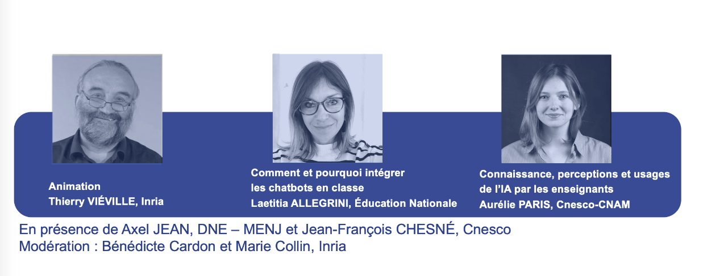

# Usages de l'IA en éducation : Intégrer des outils d'IA en classe.

Le 3 avril 2024, l'équipe pédagogique du Mooc a organisé un deuxième webinaire autour des 
"Usages de l'IA en éducation : intégrer des outils d'IA en classe".

<td style="border: none; vertical-align: middle;"></td>

## Animation du webinaire par Thierry VIÉVILLE.
Thierry est chercheur en neurosciences computationnelles - Inria, Equipe Mnemosyne - *Membre de l'équipe pédagogique du Mooc AI4T*

### Comment et pourquoi intégrer les chatbots en classe ? par Laetitia ALLEGRINI
Laetitia est professeure des écoles spécialisée option F, et mMembre du groupe de travail sur l’IA à la DRANE de l’Académie d’Aix-Marseille.
Aujourd'hui, à l'ère de l'intelligence artificielle (IA), l'enseignant aura à sa disposition de nouveaux outils. L'utilisation et la création d'agents conversationnels ou “chatbots”, peuvent, entre autres, venir assister le professeur, soutenir et accompagner l'élève dans sa formation... Ces aides pourront devenir un outil pédagogique puissant et innovant. Pendant cette présentation, nous répondrons à cette question : "Comment et pourquoi intégrer les chatbots en classe ?". Vous découvrirez pour chacune des trois catégories d'unités conversationnelles des exemples concrets réalisés en classe. Nous pointerons le rôle primordial de l'enseignant dans leur mise en place au sein d'un scénario pédagogique afin d'éviter certains biais. Pour vous, l’intégration des chatbots dans le domaine éducatif pourrait-il symboliser un futur où l’Intelligence Artificielle se transforme en un outil éducatif inclusif, permettant de favoriser l'acquisition des apprentissages ?

### L’évaluation du projet AI4T : connaissance, perceptions et usages de l’IA par les enseignants par Aurélie PARIS 
Aurélie est chargée de mission au Cnesco - CNAM, responsable de la coordination du Groupe de travail Évaluation du projet AI4T.
Cette présentation met en lumière les résultats d’enquêtes issues de l'évaluation, coordonnée par le Cnesco, d'un projet européen de formation des enseignants à l'intelligence artificielle. Ils offrent une vision comparative de la connaissance, des perceptions et des usages de l’IA chez des enseignants de différents pays. Des pistes pour soutenir l’usage de l’IA dans l’éducation, basées sur des retours de terrain, sont également présentées.

## Organisation & modération du webinaire par Bénédicte CARDON et Marie COLLIN
Marie et Bénédicte sont ingénieures pédagogiques au Learning Lab Inria et *membres de l'équipe pédagogique du Mooc*.