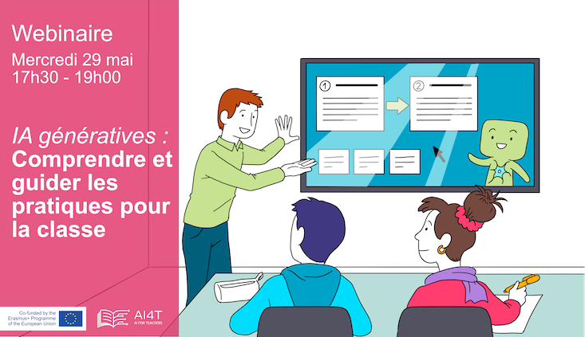

# Generative AI, understanding and guiding its use in the classroom

On May 29th, 2024, the Mooc pedagogical team organised its third webinar about:
"Generative AI, understanding and guiding its use in the classroom".

<td style="border: none; vertical-align: middle;"></td>

### AI: Promises and limits by Nicolas ROUGIER
Nicolas ROUGIER is Director of Research in Computational Cognitive Neuroscience at Inria (Mnemosyne team) - Member of the AI4T Mooc teaching team.
He spoke on the subject of generative AI: promises and limits: ‘The generative AI we have seen in action over the last few years have been improving steadily from generation to generation, promising us that we will soon see real revolutions in the workplace, and even intelligent AI in the general sense. And yet, as with autonomous vehicles, there are many reasons why we are still waiting for widespread production, and general AI seems to be out of reach. In this talk, I will review some of the likely causes and hard limits of generative AI".

### Generative AI - some pedagogical experiences by Guillaume VINIACOURT and Franck BODIN
Guillaume VINIACOURT and Frank BODIN are the national coordinators of the ‘Digital Humanities & Education’ thematic group of the Canopé network.
They spoke on the theme: IAs génératives, quelques expériences pédagogiques.
The domestication of generative AIs by pupils and their teachers has enabled the latter to engage in creative and educational experimentation. Between trial and error and discoveries, these new classroom interactions suggest an evolution in the skills to be developed. Three pedagogical tools will underpin the presentation of these new approaches to the pedagogical use of generative AIs, and will address the issue of guiding pupils towards demanding practices.

### News about AI4T by Axel JEAN
Axel JEAN is Head of the Office of Support for Digital Innovation and Applied Research (DNE-TN2) at the Ministry of National Education and Research - He shared the latest news on the AI4T project and, more generally, on initiatives to promote the enlightened use of AI in education.

## Organisation & moderation of the webinar by Bénédicte CARDON and Marie COLLIN
Marie and Bénédicte are educational engineers at Inria and *members of the Mooc teaching team*.

