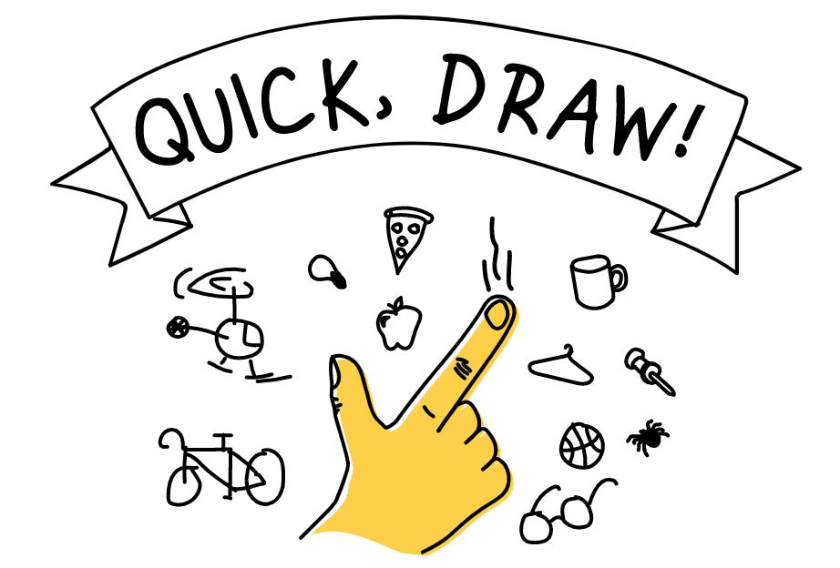

#### AI Just to Play With!

_The following questions refer to the previous contents of Module 1._

Let's test our first program
----------------------------

**In the Tutorial Let's Test our First Program, you train an AI:**

A. The input data are:

- text
- images
- sounds
- videos
- other digital data

B. This AI allows to distinguish 2 categories, how does it proceed?

- it generates a large amount of input data autonomously
- it needs a training phase where each input has been previously labelled by a human
- it needs a training phase with entries from both categories without special annotation

Quick, Draw
-----------

[Quick, Draw](https://quickdraw.withgoogle.com/?locale=en_US) is a game that allows, while having fun drawing, to experiment the functioning of a neural network.

**a. For each game session. How many drawings does QuickDrawn ask you to produce?**

- 2
- 6
- 8
- 12

**b. How long does it take to produce each design?**

- 20 secondes
- 30 secondes
- 40 secondes
- 60 secondes

**c. When does the AI give feedback on its analysis?**

- once the time limit has expired
- on a regular basis
- during the making of the drawing
