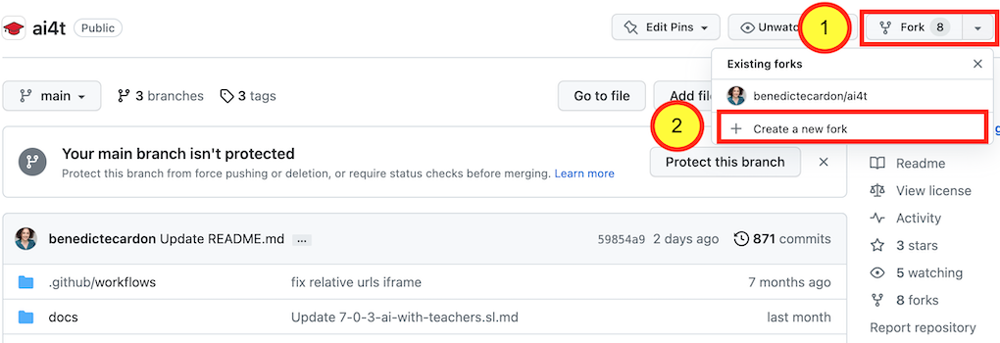

## 1- Create an account on GitHub

The preliminary step is to create an account on GitHub (it's free) if you do not already have one.

<figure class="image-frame">
    
</figure>
<figcaption>Creating an account ob github.</figcaption>

Access to [the sign up page on GitHub](https://github.com/signup){:target="_blank"}

## 2- Access the GitHub repository of the project AI4T

Address of the GitHub repository of the AI4T project: [https://GitHub.com/inrialearninglab/ai4t](https://GitHub.com/inrialearninglab/ai4t){:target="_blank"}

## 3- Create a **fork** of the repository

A fork is an extensive copy of elements (from contents to commands) of
the GitHub repository but it is detached from the **main**.

Therefore you can do whatever you want in it without impacting the AI4T Mooc.
However if you want to keep up with evolution in the **main**, you can **synchronise** your fork whenever you want

<figure class="image-frame">
    
</figure>
<figcaption>Creating a fork on github.</figcaption>

Once created, the fork has to be named.

<figure class="image-frame">
    
</figure>
<figcaption>Naming a fork on github.</figcaption>

**We encourage you to:**

1 : Choose the right name for your account

2 : Keep **AI4T** in the repository name

3 : And to add as **description** the new target language you are
developing

**Remember** : It's always possible to keep up with the evolution of the initial GitHub repository by "sychronising" you own repository with the AI4T one.
<figure class="image-frame">
    
</figure>
<figcaption>Synchronising a fork on github.</figcaption>

## 4- Your fork is now ready at your personalised URL address:

*Example of personalised URL* : https://GitHub.com/ **YOURNAME** /ai4t

<figure class="image-frame">
    
</figure>
<figcaption>ID of a fork as mentionned in the URL of its static web pages.</figcaption>
