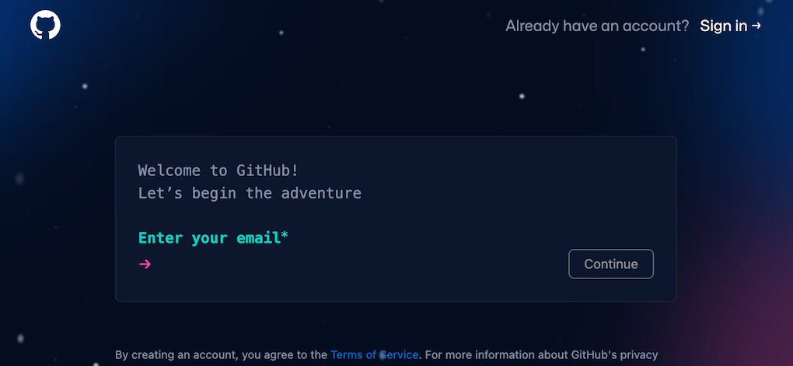
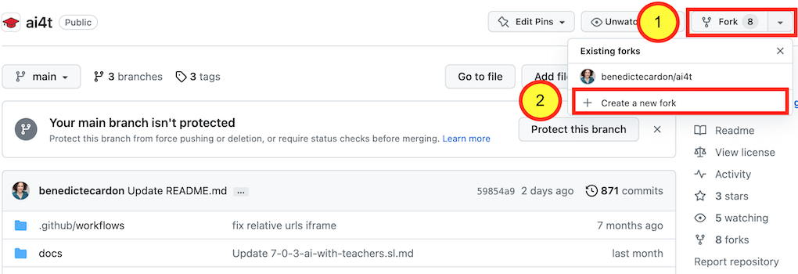
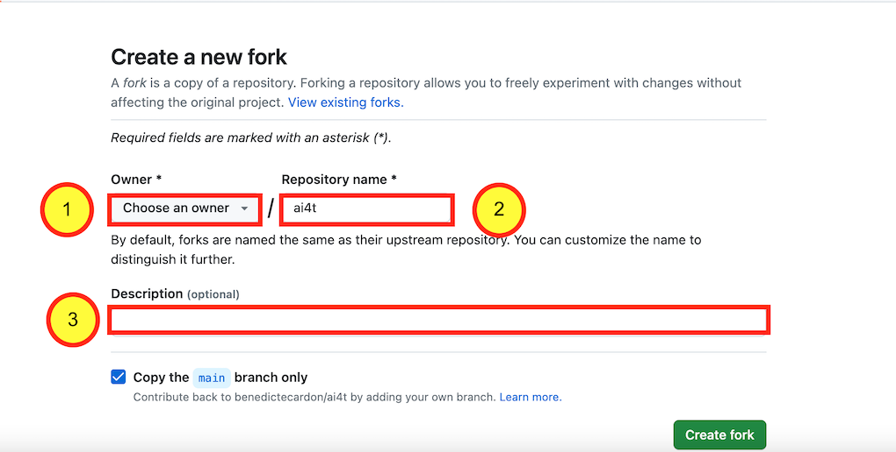
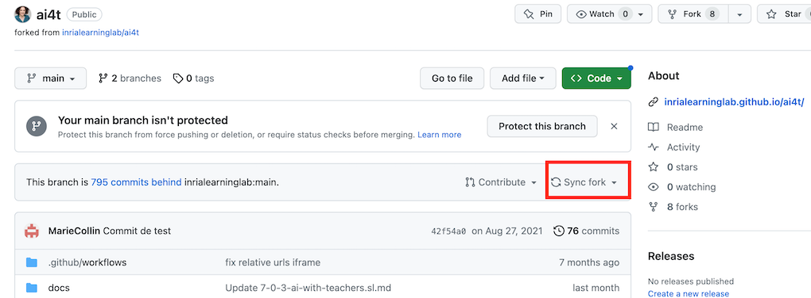

## 1- Créer un compte sur GitHub

L'étape préliminaire consiste à créer un compte sur GitHub (c'est gratuit) si vous n'en avez pas déjà un.

<figure class="image-frame">
    
</figure>
<figcaption>Création d'un compte sur github.</figcaption>

Accès à [la page d'inscription sur GitHub](https://github.com/signup){:target="_blank"}

## 2- Accéder au dépôt GitHub du projet AI4T

Adresse du dépôt GitHub du projet AI4T : [https://GitHub.com/inrialearninglab/ai4t](https://GitHub.com/inrialearninglab/ai4t){:target="_blank"}

## 3- Créer un **fork** du dépôt

Un fork est une copie extensive des éléments (du contenu aux commandes) du dépôt GitHub  mais il est détaché du dépôt principa ou **main**.

Vous pouvez donc y faire ce que vous voulez sans impacter le Mooc AI4T.

Cependant, si vous souhaitez suivre l'évolution du **main**, vous pouvez **synchroniser** votre fork quand vous le souhaitez.

<figure class="image-frame">
    
</figure>
<figcaption>Créer un fork sur github.</figcaption>

Une fois créé, le fork doit être nommé.

<figure class="image-frame">
    
</figure>
<figcaption>Nommer un fork sur github.</figcaption>

**Nous vous encourageons à:**

1 : Choisir le bon nom pour votre compte

2 : Garder **AI4T** dans le nom du dépôt

3 : Et ajouter comme **description** la nouvelle langue cible que vous développez
développer

**N'oubliez pas** : Il est toujours possible de suivre l'évolution du dépôt GitHub initial en "synchronisant" votre propre dépôt avec celui d'AI4T.
<figure class="image-frame">
    
</figure>
<figcaption>Synchroniser un fork sur github.</figcaption>

## 4- Votre fork est maintenant prêt à votre adresse URL personnalisée :

*Exemple d'URL personnalisée* : https://GitHub.com/ **YOURNAME** /ai4t

<figure class="image-frame">
    
</figure>
<figcaption>ID d'un fork telle que mentionnée dans l'URL de ses pages web statiques.</figcaption>
