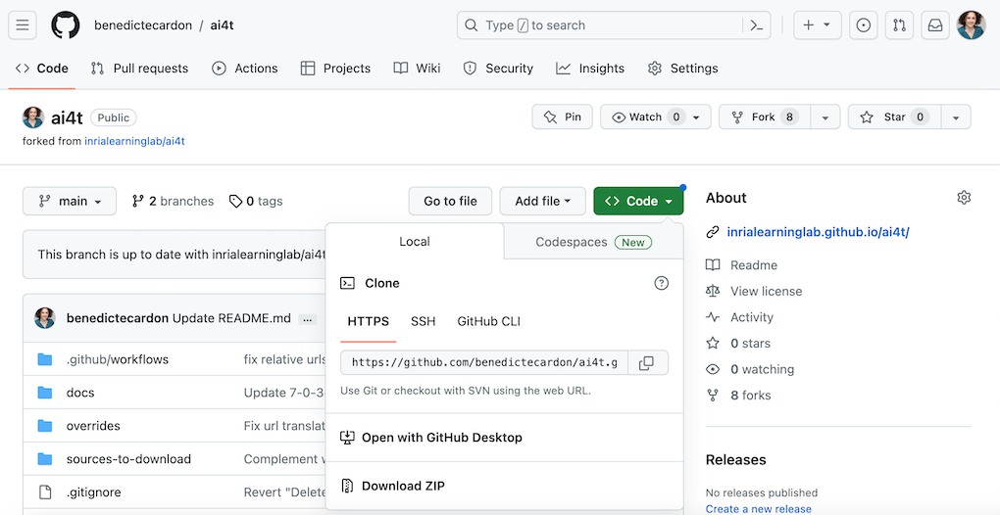
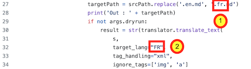
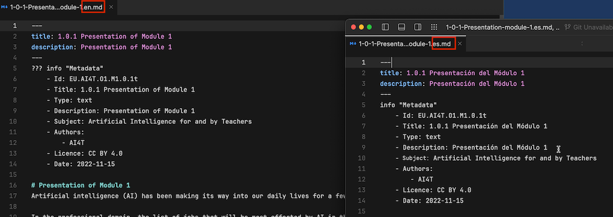
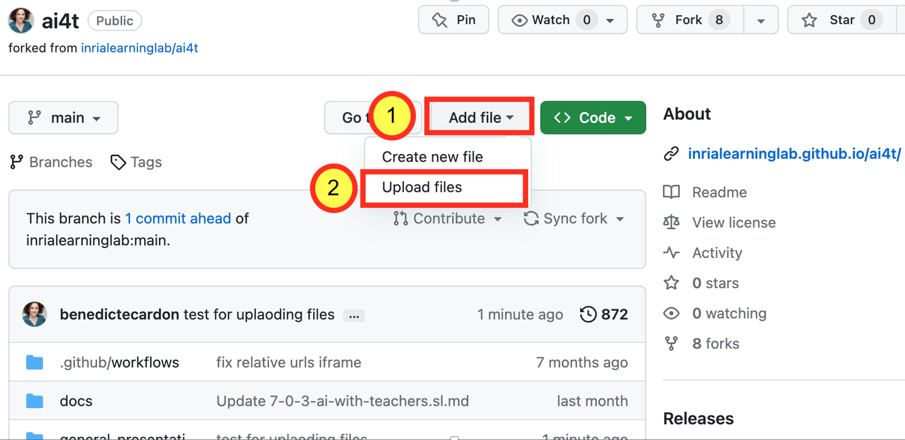

This document is a step-by-step presentation of how to generate **all the textual content** of the Mooc in any target language.
The methodology requires the DeepL API [https://www.deepl.com/pro-api?cta=header-pro-api/](https://www.deepl.com/pro-api?cta=header-pro-api/){:target="_blank"}.
It is based on the work carried out by the Inria Learning Lab (Laurence Farhi / Benoit Rospars + the team members primarily involved in the AI4T project: Marie Collin and Bénédicte Cardon) to **produce and distribute the Mooc content** and associated teaching resources in 5 languages.

To illustrate the different stages of translation, we propose a recurring example with the translation of Mooc content into Spanish.

> Note : This document is complemented by a specific-tutorial for the proof reading of the created files once the machine translation step is completed.

## 1- Access to your fork of the github repository of the project

*Example of URL of a created fork from AI4T* : **https://github.com/ **YOURNAME** /ai4t**

## 2- Download your fork of the github repository as ZIP

<figure class="image-frame">
    
</figure>
<figcaption>Downloading a repository in github as ZIP.</figcaption>

## 3- Unzip the folder
You then have a "ai4t-main" folder

## 4- Create the script in your target language

-   Copy the file **"trad.py"** and paste it under the relevant name using for example **"tradXX.py"** (🏗️ tradES.py for spanish)

-   Open the new file **"tradXX.py"** - the code shown before any modification is for translating english files into french.

Then you have to change the target language according to your needs: the **"fr"** mention has to replaced at two places:

<figure class="image-frame">

</figure>
<figcaption>Example of extract of the trad.py script with mention of the target language (ie.FR).</figcaption>

<figure class="inline-image">
    
    <figcaption>**line 27** : targetPath = srcPath.replace('.en.md','fr.md')</figcaption>
</figure>

<figure class="inline-image">
    
<figcaption>**and line 32** : target_lang="[FR]",</figcaption>
</figure>

🏗️ **For translating to spanish**

<figure class="image-frame">
    
</figure>
<figcaption>Example of extract of trad.py script with adaptation for translation to Spanish.</figcaption>

## 5- Open a terminal and access to the "ai4t-main" folder

Run the commande: `cd+space` then drag and drop the "ai4t-main" folder :

<figure class="image-frame">
    
</figure>
<figcaption>Visualisation of moving the file from file explorer to terminal.</figcaption>

## 6- Set up DeepL

⌨️ Run the command: pip install deepl`
<figure class="image-frame">
    
</figure>
<figcaption>Code command-pip-install-deepl.</figcaption>

## 7- Generate the new files in target languages

⌨️ Run the command: `python tradXX.py --key=xxxxxxxx --path=<folder to translate>`

-   With **"xxxxxxxx"**: **key** of you DeepL API

-   "Folder to translate" : mention a unit folder - use drag and drop

The Mooc is in 4 modules, each module has 3 units (from N-1 to N-3) and an introduction (N-0).

There is also an introductory and a concluding section.

🏗️ for translating from EN to ES the folder containing all pages of Module 4 Unit 3 "artificial-intelligence-at-our-service"

<figure class="image-frame">
    
</figure>
<figcaption>Example of unit folder to drag-and-drop for generating translation.</figcaption>

⌨️ Run the command : `python tradES.py --key=xxxxxxxx --path=`

Two new files in Spanish are generated

-   4-3-1v-artificial-intelligence-at-our-service.es.md

-   4-3-2a-case-study-with-ai-templates.es.md

## 8- Review the created files (formal review)

Using this method, all elements in english in the reference file are translated to the target language.

The some adjustment are to be made for each file as:

-   The elements of the header : title, description (and the author and type of resources when relevant)

-   And the elements of metadata have to be reviewed to ensure the proposer running of the web pages and the presence of compatible Metadata in each languages.

🏗️ **Translation of a file from EN to ES**

<figure class="image-frame">
    
</figure>
<figcaption>Header and Metadata in the the reference EN file.</figcaption>

<figure class="image-frame">
  
</figure>
<figcaption>Header and Metadata in the the ES file before review markdown file in spanish.</figcaption>

**Changes to be made:**

### In the Header

-   **title** instead of **titulo**

-   **description** instead of **descripción**

And when relevant:

-   **contributors** instead of **colaborador**

-   **type** instead of **tipo**

-   **text** instead of **texto**

-   **activity** instead of **actividad**

-   **video** instead **vídeo**

### In the Metadata

-   **Title** instead of **Titulo**

-   **Tipe** instead of **Tipo**

-   **Text** instead of **Texto**

-   **Activity** instead of **Actividad**

-   **Video** instead **Vídeo**

-   **Description** instead of **Descripción**

-   **Subject : Artificial intelligence for and by Teachers** instead of **Asunto: Inteligencia artificial por y para profesores**

-   **Authors** instead of **Autores**

-   **Licence** instead of **Licencia**

-   **Date** instead of **Fecha**

**Note:** Be careful with upper and lower case: some elements require a capital letter at the beginning of the word, others do not.

<figure class="image-frame">
    
</figure>
<figcaption>Header and Metadata in EN and ES files after review markdown files in english and spanish.</figcaption>

## 9- Upload your file on your Github fork

The files in the new target languages were created locally on your computer. You now need to update your github fork.

**Note** that due to the large number of files, it's not possible to do this in one time.

<figure class="image-frame">
    
</figure>
<figcaption>Where to upload files in a fork - screen caption of github.</figcaption>

<figure class="image-frame">
    
</figure>
<figcaption> How to upload files in a fork - screen caption of github.</figcaption>

Do not hesitate to add description of your upload for an easier tracking of the fork evolution and notably for synchronisation with other repositories when wanted

## 10- Review the created files (content + language review)
Directly on github, in order to:

-   Guarantee the linguistic quality of the proposed translation

-   Improve or complement the text according to the local context when required

-   Suggest substitutions or additions in the target language for resources cited in the original language (articles, books, websites, activities, etc.).

**See dedicated tutorial:** [Step 2.2 - Proofreading texts](https://inrialearninglab.github.io/ai4t/3-Build-your-own-training/3-2-Step-2-Translating-the-mooc-resources/3-2-2-Step-2-2.html){:target="_blank"}
