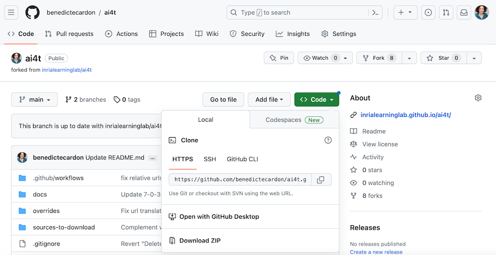
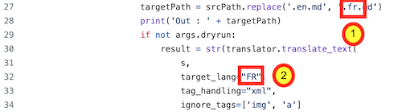
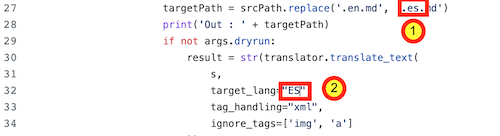
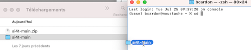
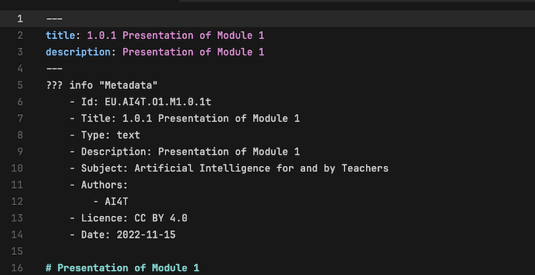
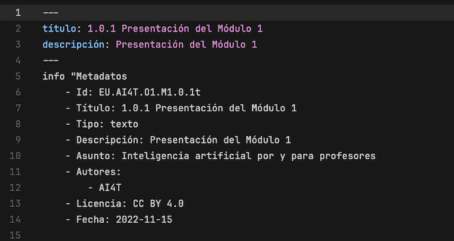
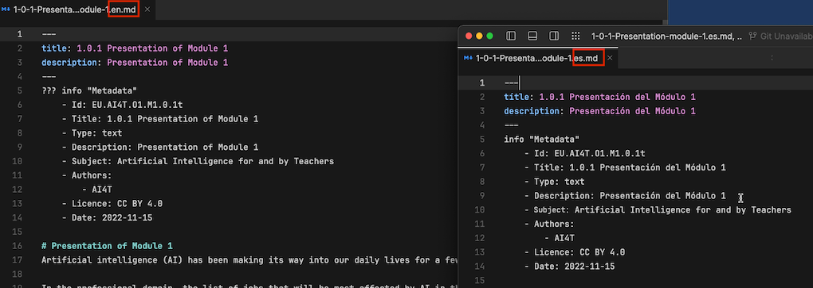
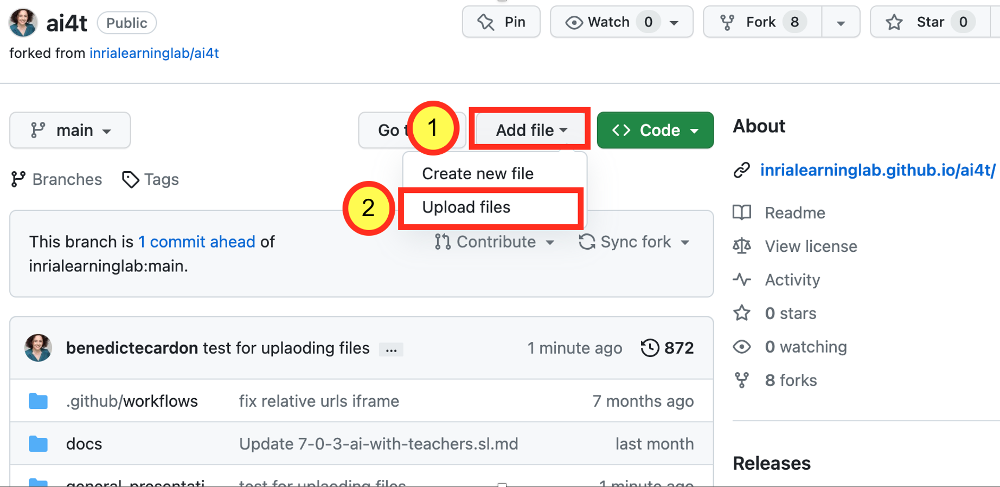
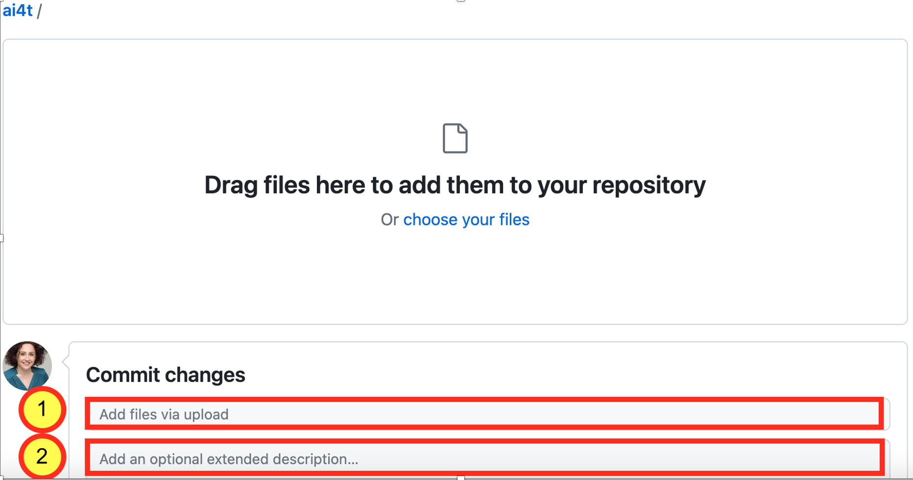

Ce document est une présentation  pas à pas de la manière de générer **tout le contenu textuel** du Mooc dans n'importe quelle langue cible.
Cette méthodologie nécessite l'API DeepL [https://www.deepl.com/pro-api?cta=header-pro-api/](https://www.deepl.com/pro-api?cta=header-pro-api/){:target="_blank"}.
Elle s'appuie sur les travaux menés par l'Inria Learning Lab (Laurence Farhi / Benoit Rospars + les membres de l'équipe plus spécfifiquement impliqués dans le projet AI4T : Marie Collin et Bénédicte Cardon) pour **produire et diffuser les contenus Mooc** et les ressources pédagogiques associées en 5 langues.

Pour illustrer les différentes étapes de la traduction, nous proposons un exemple récurrent avec la traduction des contenus Mooc **en espagnol**.

> Note : Ce document est complété par un tutoriel spécifique pour la relecture des fichiers créés une fois l'étape de traduction automatique terminée.

## 1- Accès à votre fork du dépôt github du projet

*Exemple d'URL d'un fork créé à partir d'AI4T* : **https://github.com/ **YOURNAME** /ai4t**

## 2- Télécharger votre fork du dépôt github au format ZIP

<figure class="image-frame">
    
</figure>
<figcaption>Télécharger un dépôt dans github au format ZIP.</figcaption>

## 3- Décompresser le dossier
Vous avez alors un dossier "ai4t-main".

## 4- Créer le script dans votre langue cible

- Copiez le fichier **"trad.py "** et collez-le sous le nom correspondant en utilisant par exemple **"tradXX.py "** (🏗️ tradES.py pour l'espagnol)

- Ouvrez le nouveau fichier **"tradXX.py"** - le code affiché avant toute modification sert à traduire des fichiers anglais en français.

Vous devez ensuite modifier la langue cible en fonction de vos besoins : la mention **"fr "** doit être remplacée à deux endroits :

<figure class="image-frame">

</figure>
<figcaption>Exemple d'extrait du script trad.py avec mention de la langue cible (ie.FR).</figcaption>

<figure class="inline-image">
    
    <figcaption>**ligne 27** : targetPath = srcPath.replace('.en.md','fr.md')</figcaption>
</figure>

<figure class="inline-image">
    
<figcaption>**et ligne 32** : target_lang="[FR]",</figcaption>
</figure>

🏗️ **Pour la traduction en espagnol**

<figure class="image-frame">
    
</figure>
<figcaption>Exemple d'extrait du script trad.py avec adaptation pour la traduction en espagnol.</figcaption>

## 5- Ouvrir un terminal et accéder au dossier "ai4t-main".

Exécuter la commande : `cd+space` puis glisser-déposer le dossier "ai4t-main" :

<figure class="image-frame">
    
</figure>
<figcaption>Visualisation du déplacement du fichier de l'explorateur de fichiers vers le terminal.</figcaption>

## 6- Mise en place de DeepL

⌨️ Exécuter la commande : pip install deepl`
<figure class="image-frame">
    
</figure>
<figcaption>Code commande-pip-install-deepl.</figcaption>

## 7- Générer les nouveaux fichiers dans les langues cibles

⌨️ Exécutez la commande : `python tradXX.py --key=xxxxxxxx --path=<folder to translate>`

- Avec **"xxxxxxxx "** : **clé** de votre API DeepL 

- **"Dossier à traduire"** : mentionner un dossier unique - utiliser le "glisser-déposer"

Le Mooc est composé de 4 modules, chaque module comporte 3 unités (de N-1 à N-3) et une introduction (N-0).

Il y a également une partie intriductive et une une conclusion.

🏗️ pour la traduction de EN en ES du dossier contenant toutes les pages du Module 4 Unit 3 "artificial-intelligence-at-our-service"

<figure class="image-frame">
    
</figure>
<figcaption>Exemple de dossier d'unité à glisser-déposer pour générer une traduction.</figcaption>

⌨️ Lancez la commande : `python tradES.py --key=xxxxxxxx --path=`

Deux nouveaux fichiers en espagnol sont générés

- 4-3-1v-artificial-intelligence-at-our-service.es.md

- 4-3-2a-case-study-with-ai-templates.es.md

## 8- Examiner les fichiers créés (examen formel)

Avec cette méthode, tous les éléments en anglais du fichier de référence sont traduits dans la langue cible.

Les ajustements à apporter à chaque fichier sont les suivants :

- Les éléments de l'en-tête : titre, description (et l'auteur et le type de ressources le cas échéant)

- Les éléments de métadonnées doivent être revus pour assurer le bon fonctionnement des pages web et la présence de métadonnées compatibles dans chaque langue.

🏗️ **Traduction d'un fichier de l'angalis (EN) vers l'espagnol (ES)**

<figure class="image-frame">
    
</figure>
<figcaption>En-tête et métadonnées dans le fichier EN de référence.</figcaption>

<figure class="image-frame">
  
</figure>
<figcaption>En-tête et métadonnées dans le fichier ES avant révision du fichier markdown en espagnol.</figcaption>

**Modifications à apporter:**

### Dans l'en-tête

- **title** au lieu de **titulo**

- **description** au lieu de **descripción**

Et le cas échéant :

- **contributeurs** au lieu de **colaborador**

- **type** au lieu de **tipo**

- **texte** au lieu de **texto**

- **activity** au lieu de **actividad**

- **video** au lieu de **vídeo**

### Dans les métadonnées

- **Title** au lieu de **Titulo**

- **Tipe** au lieu de **Tipo**

- **Texte** au lieu de **Texte**

- **Activité** au lieu de **Actividad**

- **Vidéo** au lieu de **Vídeo**

- **Description** au lieu de **Descripción**

- **Sujet :  Artificial intelligence for and by Teachers** au lieu de **Asunto : Inteligencia artificial por y para profesores**

- **Autors** au lieu de **Autores**

- **Licence** au lieu de **Licencia**

- **Date** au lieu de **Fecha**

**Note:** Attention aux majuscules et aux minuscules : certains éléments nécessitent une majuscule au début du mot, d'autres non.

<figure class="image-frame">
    
</figure>
<figcaption>En-tête et métadonnées dans les fichiers EN et ES après révision des fichiers markdown en anglais et en espagnol.</figcaption>

## 9- Uploader votre fichier sur votre fork Github

Les fichiers dans les nouvelles langues cibles ont été créés localement sur votre ordinateur. Vous devez maintenant mettre à jour votre fork Github.

**Note** qu'en raison du grand nombre de fichiers, il n'est pas possible de le faire en une seule fois.

<figure class="image-frame">
    
</figure>
<figcaption>Où télécharger des fichiers dans un fork - capture d'écran de github.</figcaption>

<figure class="image-frame">
    
</figure>
<figcaption> Comment télécharger des fichiers dans une "fourche" - légende d'écran de github.</figcaption>

N'hésitez pas à ajouter une description de votre téléchargement pour faciliter le suivi de l'évolution de la fourche et notamment pour la synchronisation avec d'autres dépôts lorsque vous le souhaitez.

## 10- Réviser les fichiers créés (révision du contenu + de la langue)
Directement sur github, afin de :

- Garantir la qualité linguistique de la traduction proposée,

- Améliorer ou compléter le texte en fonction du contexte local si nécessaire,

- Suggérer des substitutions ou des ajouts dans la langue cible pour les ressources citées dans la langue d'origine (articles, livres, sites web, activités, etc.).

**Voir le tutoriel dédié:** [Étape 2.2 - Relecture des textes](https://inrialearninglab.github.io/ai4t//fr/3-Build-your-own-training/3-2-Step-2-Translating-the-mooc-resources/3-2-2-Step-2-2.html){:target="_blank"}
