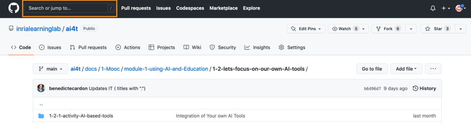
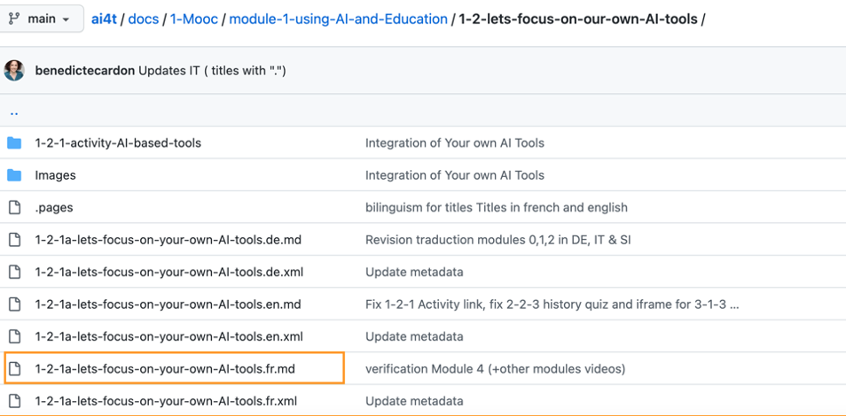
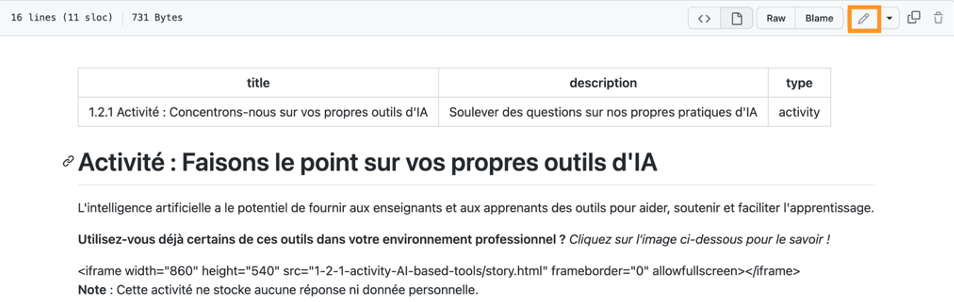
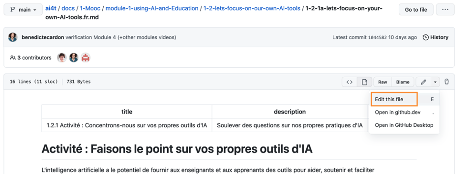
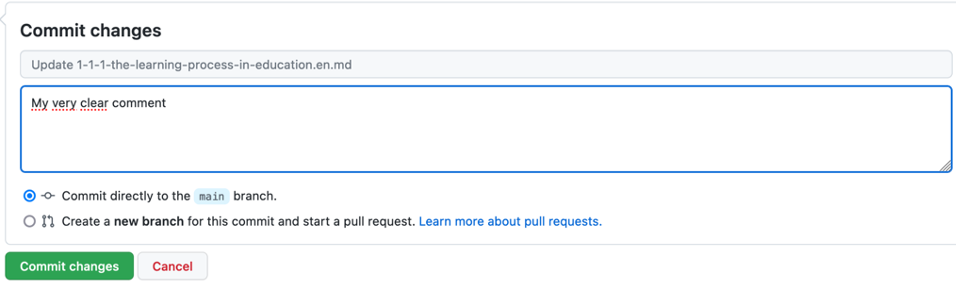

## Where to find the texts of the Mooc to proofread and correct?

All texts, images and activities of the 4 Modules with Presentation and Conclusion Modules are available in the GitHub repository you have created in Step 2-1: ["Creating and translating texts"](3-2-1-Step-2-1.en.md)).

They are accessible at the following url:
https://github.com/**[YOUR-GITHUB-NAME]**/ai4t/tree/main/docs/1-Mooc

Clicking on the text "module-1-using-AI-and-Education" will leads to the contents of the module, organised in chapters:

<figure class="image-frame">
    
</figure>
<figcaption>Contents of folder 1-Mooc as layed out on GitHub.</figcaption>

Clicking on a chapter leads to all the chapter's pages in 5 languages:
<figure class="image-frame">
    
</figure>
<figcaption>Contents of folder 1-2 of the Mooc as layed out on GitHub.</figcaption>

**Nomenclature of file names for chapter pages**
**Example for the page: 1-2-1a-lets-focus-on-your-own-AI-tools.en.md**

-   **1** module 1

-   x-2 chapter 2

-   x-x-1 page 1

-   x-x-xa = page that contains an activity

-   x-x-xv = page that contains a video

-   **lets-focus-on-your-own-AI-tools**: title of the reference file

-   **.fr** language

-   **.md** text in markdown format (lightweight markup language)

-   **.xml** metadata associated with the page of the same name

_In the example mentioned (1-2-1a-lets-focus-on-your-own-AI-tools.en.md), this is the first page of chapter 2 of module 1; it contains an activity._

## The texts

Each chapter (e.g. chapter \"1-1-are-teachers-really-concerned-by-Artificial-Intelligence\") contains:

-   the texts of all pages of this chapter in all languages (.md files in markdown format).

-   the metadata for each page in this chapter in all languages (.xml files).

## The images

They are grouped together for each chapter of the Mooc in an "**Images**" folder. It is important not to remove the content of the "Images" folders. If you wish to add or modify images, be careful of using the same naming procedure as used in the folder.

<figure class="image-frame">
    
</figure>
<figcaption>Identification of an image folder.</figcaption>

## 🔎 Research function

A **search function** in GitHub can help you find the file you want to modify. It is located at the top left of the interface as shown below:

<figure class="image-frame">
    
</figure>
<figcaption>Access to the Search tool on github.</figcaption>

*Example of use of the search tool* : Teacher-in-the-loop.

<figure class="image-frame">
    
</figure>
<figcaption>Example of search result on github.</figcaption>

## How to proofread and correct translated texts

To allow contributors / reviewers to modify the texts of the Github repository:

1.  Create a GitHub account:
[https://GitHub.com/join](https://GitHub.com/join){:target="_blank"} and specify:

a.  their **Username**

b.  their **email address**

2.  Send those infos to the administrator of your repository for updating the list of GitHub accounts that should have the rights of contributors to correct the texts, specifying the "Username" and/or email address used to create the accounts.

Then, you have to connect to your GitHub account 

### How do I edit a text file (.md format) posted on GitHub?

*Example below*: Access to file 1-2-1, the first page of the "1-2-lets-focus-on-our-own-AI-tools" chapter of Module 1, in French.

-   Search and click on the text file (starting with 1-2-1 and ending with .fr.md) located below by the orange box.

<figure class="image-frame">
    
</figure>
<figcaption>Search & click on the text file.</figcaption>

-   After clicking on the page you are looking for, click on the \"Edit\" button (symbolised by a pencil) in the orange box below.
<figure class="image-frame">
    
</figure>
<figcaption>Click on the Edit button.</figcaption>

-   Select the "Edit this file" option in the menu of this button.

<figure class="image-frame">
    
</figure>
<figcaption>Select the Edit file option in the menu.</figcaption>

-   When you are in edit mode, the "Edit file" tab is activated (white background).

The "Preview" mode, which can be activated via the tab of the same name, allows you to check the formatting of your modifications.

<figure class="image-frame">
    
</figure>
<figcaption>Activation of the preview mode.</figcaption>

-   Modify the text

-   Select the "Edit file" mode to edit the .md file.

-   Basic guidelines for writing text in .md format
    - # /#/: level 1 title
    - ## /##/: level 2 title
    - **bold text** /**/ : bold text
    - *italic text* /*/: italic text

-   Presentation of the main functions of the markdown language:
[https://squidfunk.github.io/mkdocs-material/reference/](https://squidfunk.github.io/mkdocs-material/reference/){:target="_blank"}

-   Once you have completed your corrections and checked them in the *Preview* mode, briefly describe the nature of your changes in the **"Commit message"** box.

<figure class="image-frame">
    
</figure>
<figcaption>Description of a commit content in message box.</figcaption>

-   Finally click on the green **Commit changes** button to publish your changes.

<figure class="image-frame">
    
</figure>
<figcaption>Commit button.</figcaption>

> **ATTENTION:**

-   There is no automatic saving of changes: we therefore recommend that you publish your changes (i.e. after clicking on "Commit changes") by correction step (e.g. adding references, improving the translation, adding a paragraph, etc.) for each page.

-   Changes are only visible to other contributors once published.

-   Do **not change** the title of the page (i.e. the name of the file)

Below: 1-2-1a-lets-focus-on-your-own-AI-tools.en.md

<figure class="image-frame">
    
</figure>

-   Do **not change the** page **header** at the top of each page, which is delimited by 2 lines of 3 dashes (---).

<figure class="image-frame">
    
</figure>
<figcaption>Correct setting of a page title in markdown format</figcaption>

>Any action on the contents of this part has important consequences on the display. If you wish to make changes, we suggest you copy the
>header and propose a new wording following the initial version (the crossed-out parts are those that can be modified) as below.

#### Original setting

/---/

title: \"1.2.1 Activity: Focus on your own AI tools

description: Raising questions about our own AI practices

type: activity

/---/

#### Possible changes

/---/

title: \"1.2.1 Activity: ~~Focus on your own xxxxxxxx tools~~

description: ~~Raising questions about our own practice of xxxx~~

type: activity

/---/

## What to check

-   **Graphics and images**
Images and graphics with English text can be replaced:

  - If they are not understandable in English

  - If you find an alternative to replace the image in the target language.

-   **Sources and bibliographical references**

> An important work is to be done in order to complement or replace ressources in English mentioned in the Mooc. Here are two solutions we adopted within the project.

-   Where no substitution is possible: maintenance of the original resource in english (as for example, documents as the  AI Watch, JRC publications, aso.)

-   Where an alternative resource exists, it can be listed alongside the original resource.

In order to be as close as possible to the local context, the addition of references in the target languages is recommended.

-   **Reminder about translation quality /accuracy**

> The translated text are generated by DeepL from one version of the Mooc (we recommand using the english version as a base for further translation). Adjustments to improve the quality of the translation may be required **and** first proofreading must be carried out; sometimes DeepL interprets signs (such as "*") incorrectly and there may be discrepancies in the translation (one or more elements of the text have remained in the source language). A first "formal clean-up" of the translation is therefore useful before moving on to the substantive proofreading.
