## Où trouver les textes du Mooc à relire et à corriger ?

Tous les textes, images et activités des 4 Modules avec Modules de présentation et de conclusion sont disponibles dans le dépôt GitHub que vous avez créé à l'étape 2-1 : ["Créer et traduire des textes"](3-2-1-Etape-2-1.en.md)).

Ils sont accessibles à l'url suivante :
https://github.com/**[VOTRE-NOM-GITHUB]**/ai4t/tree/main/docs/1-Mooc

En cliquant sur le texte "module-1-using-AI-and-Education", on accède au contenu du module, organisé en chapitres :

<figure class="image-frame">
    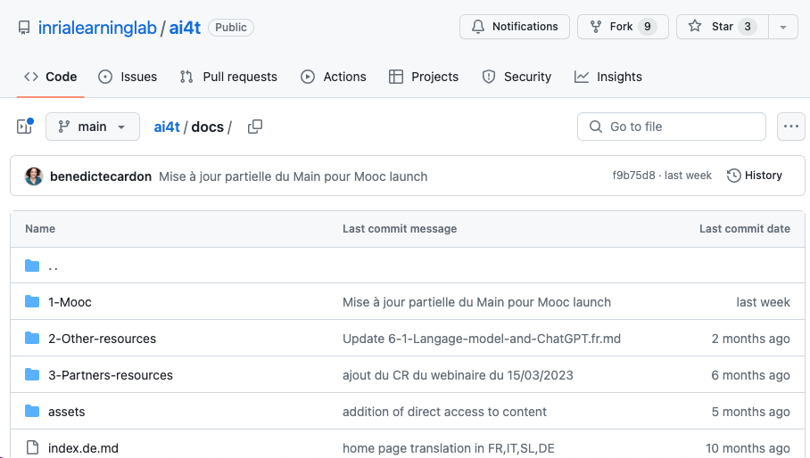
</figure>
<figcaption>Contenu du dossier 1-Mooc tel que présenté sur GitHub.</figcaption>

En cliquant sur un chapitre, on accède à toutes les pages du chapitre en 5 langues :
<figure class="image-frame">
    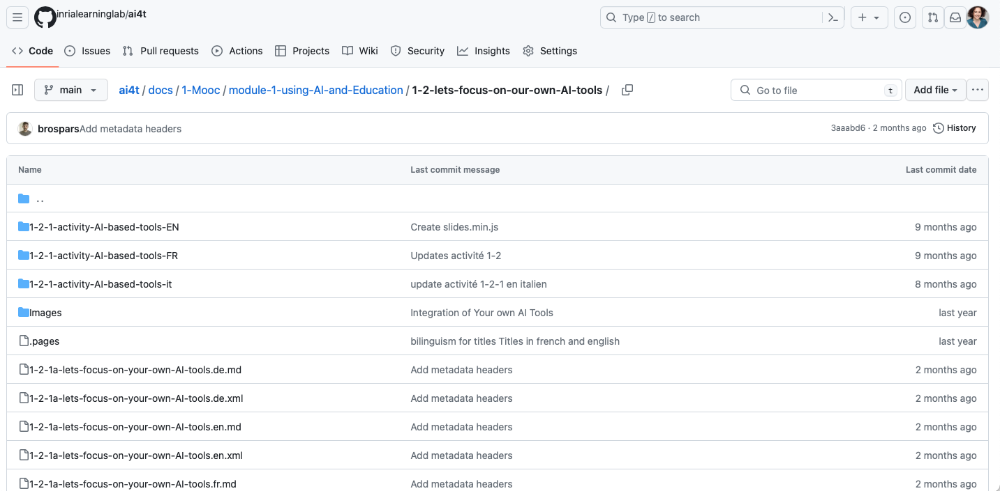
</figure>
<figcaption>Contenu du dossier 1-2 du Mooc tel que présenté sur GitHub.</figcaption>

**Nomenclature des noms de fichiers pour les pages des chapitres**
**Exemple de page : 1-2-1a-lets-focus-on-your-own-AI-tools.en.md**

- **1** module 1

- x-2 chapitre 2

- x-x-1 page 1

- x-x-xa = page contenant une activité

- x-x-xv = page contenant une vidéo

- **lets-focus-on-your-own-AI-tools** : titre du fichier de référence

- **.fr** : langue

- **.md** texte au format markdown (lightweight markup language)

- **.xml** métadonnées associées à la page du même nom

Dans l'exemple cité (1-2-1a-lets-focus-on-your-own-AI-tools.en.md), il s'agit de la première page du chapitre 2 du module 1 ; elle contient une activité.

## Les textes

Chaque chapitre (par exemple le chapitre " 1-1-are-teachers-really-concerned-by-Artificial-Intelligence ") contient :

- les textes de toutes les pages de ce chapitre dans toutes les langues (fichiers .md au format markdown).

- les métadonnées de chaque page de ce chapitre dans toutes les langues (fichiers .xml).

## Les images

Elles sont regroupées pour chaque chapitre du Mooc dans un dossier "**Images**". Il est important de ne pas supprimer le contenu des dossiers "Images". Si vous souhaitez ajouter ou modifier des images, veillez à utiliser la même procédure de nommage que celle utilisée dans le dossier.

<figure class="image-frame">
    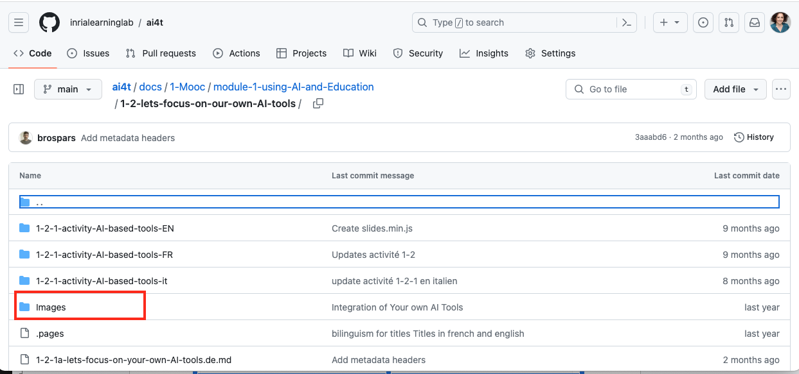
</figure>
<figcaption>Identification d'un dossier d'images.</figcaption>

## 🔎 Fonction de recherche

Une **fonction de recherche** dans GitHub peut vous aider à trouver le fichier que vous souhaitez modifier. Elle est située en haut à gauche de l'interface comme indiqué ci-dessous :

<figure class="image-frame">
    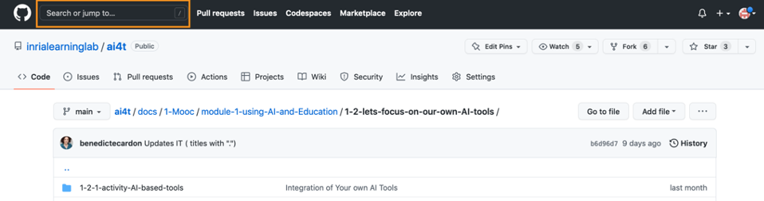
</figure>
<figcaption>Accès à l'outil de recherche sur github.</figcaption>

*Exemple d'utilisation de l'outil de recherche* : Enseignant dans la boucle.

<figure class="image-frame">
    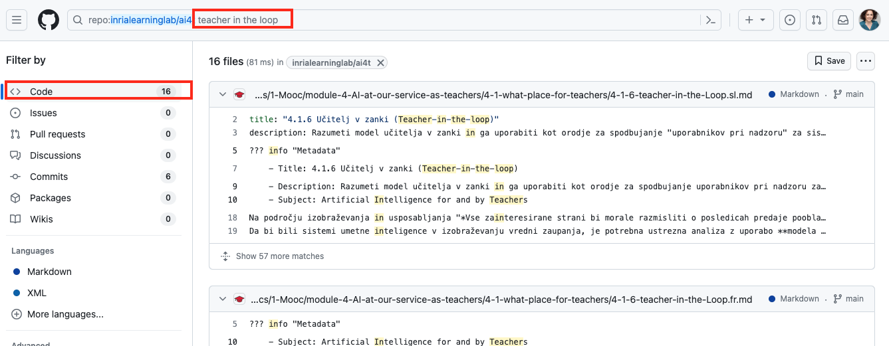
</figure>
<figcaption>Exemple de résultat de recherche sur github.</figcaption>

## Comment relire et corriger des textes traduits

Permettre aux contributeurs / relecteurs de modifier les textes du dépôt Github :

1.  Créez un compte GitHub :
[https://GitHub.com/join](https://GitHub.com/join){:target="_blank"} et spécifier :

a. leur **nom d'utilisateur**

b. leur **adresse électronique**

2.  Envoyez ces informations à l'administrateur de votre dépôt pour qu'il mette à jour la liste des comptes GitHub qui devraient avoir les droits de contributeurs pour corriger les textes, en précisant le "Nom d'utilisateur" et/ou l'adresse e-mail utilisés pour créer les comptes.

Ensuite, vous devez vous connecter à votre compte GitHub 

### Comment éditer un fichier texte (format .md) posté sur GitHub ?

*Exemple ci-dessous : Accès au fichier 1-2-1, la première page du chapitre "1-2-nous-focalisons-sur-nos-propres-outils-AI" du Module 1, en français.

- Recherchez et cliquez sur le fichier texte (commençant par 1-2-1 et se terminant par .fr.md) situé ci-dessous par la boîte orange.

<figure class="image-frame">
    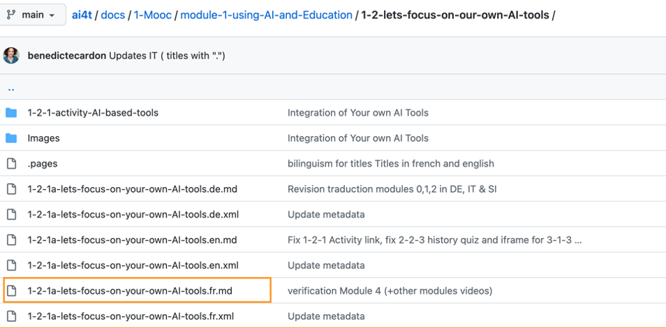
</figure>
<figcaption>Recherchez et cliquez sur le fichier texte.</figcaption>

- Après avoir cliqué sur la page recherchée, cliquez sur le bouton "Editer" (symbolisé par un crayon) dans la boîte orange ci-dessous.
<figure class="image-frame">
    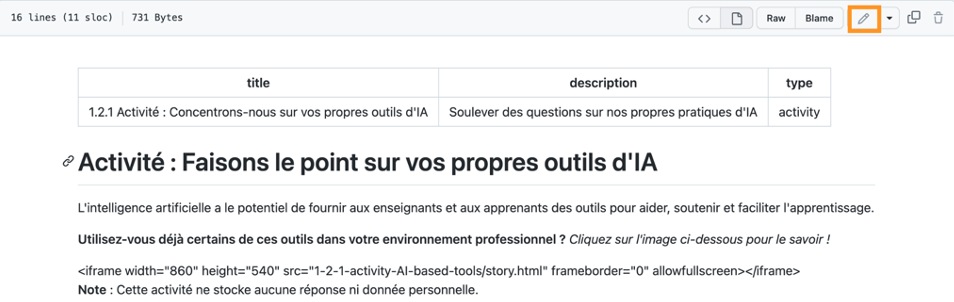
</figure>
<figcaption>Cliquez sur le bouton "Editer".</figcaption>

- Sélectionnez l'option "Editer ce fichier" dans le menu de ce bouton.

<figure class="image-frame">
    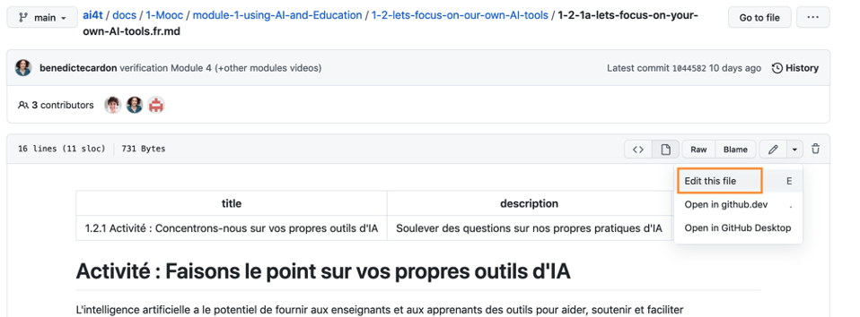
</figure>
<figcaption>Sélectionnez l'option "Editer le fichier" dans le menu.</figcaption>

- Lorsque vous êtes en mode édition, l'onglet "Editer le fichier" est activé (fond blanc).

Le mode "Aperçu", qui peut être activé via l'onglet du même nom, vous permet de vérifier la mise en forme de vos modifications.

<figure class="image-frame">
    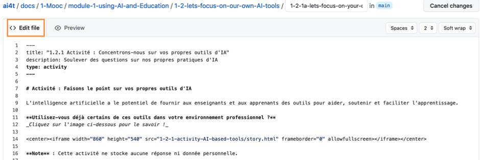
</figure>
<figcaption>Activation du mode de prévisualisation.</figcaption>

- Modifier le texte

- Sélectionnez le mode "Editer le fichier" pour éditer le fichier .md.

- Directives de base pour la rédaction d'un texte au format .md
    - # /#/ : titre de niveau 1
    - ## /##/ : titre de niveau 2
    - **texte en gras** /**/ : texte en gras
    - *texte en italique* /*/ : texte en italique

- Présentation des principales fonctions du langage markdown :
[https://squidfunk.github.io/mkdocs-material/reference/](https://squidfunk.github.io/mkdocs-material/reference/){:target="_blank"}

- Une fois que vous avez terminé vos corrections et que vous les avez vérifiées en mode *Preview*, décrivez brièvement la nature de vos changements dans la case **"Commit message "**.

<figure class="image-frame">
    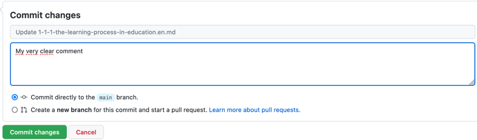
</figure>
<figcaption>Description du contenu d'un commit dans la boîte de message.</figcaption>

- Enfin, cliquez sur le bouton vert **Commit changes** pour publier vos modifications.

<figure class="image-frame">
    
</figure>
<figcaption>Bouton "Valider".</figcaption>

**ATTENTION:**

- Il n'y a pas de sauvegarde automatique des modifications : nous vous recommandons donc de publier vos modifications (c'est-à-dire après avoir cliqué sur "Commit changes") par étape de correction (par exemple, ajout de références, amélioration de la traduction, ajout d'un paragraphe, etc.

- Les modifications ne sont visibles par les autres contributeurs qu'une fois publiées.

- Ne modifiez **pas** le titre de la page (c'est-à-dire le nom du fichier).

Ci-dessous : 1-2-1a-lets-focus-on-your-own-AI-tools.en.md

<figure class="image-frame">
    
</figure>

- Ne **modifiez pas l'**en-tête** de page en haut de chaque page, qui est délimité par 2 lignes de 3 tirets (---).

<figure class="image-frame">
    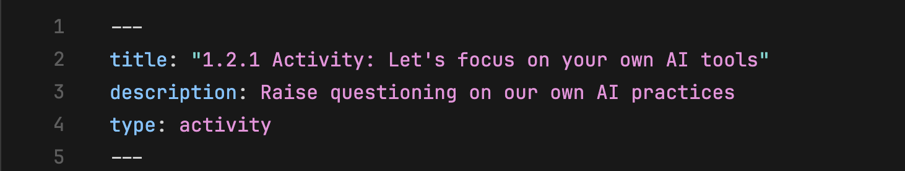
</figure>
<figcaption>Définition correcte d'un titre de page au format markdown</figcaption>

&gt;Toute action sur le contenu de cette partie a des conséquences importantes sur l'affichage. Si vous souhaitez apporter des modifications, nous vous suggérons de copier l'en-tête et de proposer une nouvelle formulation à la suite de la version initiale.
&gt;et de proposer une nouvelle formulation à la suite de la version initiale (les parties barrées sont celles qui peuvent être modifiées) comme ci-dessous.

#### Paramètre original

/---/

titre : \1.2.1 Activité : Se concentrer sur ses propres outils d'IA

description : Soulever des questions sur nos propres pratiques en matière d'IA

type : activité

/---/

#### Changements possibles

/---/

titre : \"1.2.1 Activité : ~~Focus sur vos propres outils xxxxxxxx~~~

description : ~~Soulever des questions sur notre propre pratique de xxxx~~~.

type : activité

/---/

## Ce qu'il faut vérifier

- Graphiques et images**
Les images et les graphiques contenant du texte en anglais peuvent être remplacés :

  - S'ils ne sont pas compréhensibles en anglais

  - Si vous trouvez une alternative pour remplacer l'image dans la langue cible.

- **Sources et références bibliographiques**

&gt; Un travail important est à faire pour compléter ou remplacer les ressources en anglais mentionnées dans le Mooc. Voici deux solutions que nous avons adoptées dans le cadre du projet.

- Lorsqu'aucune substitution n'est possible : maintien de la ressource originale en anglais (comme par exemple, des documents tels que l'AI Watch, les publications du JRC, etc.)

- Lorsqu'une ressource alternative existe, elle peut être listée à côté de la ressource originale.

Afin d'être le plus proche possible du contexte local, l'ajout de références dans les langues cibles est recommandé.

- **Rappel sur la qualité/précision de la traduction**

&gt; Les textes traduits sont générés par DeepL à partir d'une version du Mooc (nous recommandons d'utiliser la version anglaise comme base pour les traductions ultérieures). Des ajustements pour améliorer la qualité de la traduction peuvent être nécessaires **et** une première relecture doit être effectuée ; parfois DeepL interprète des signes (tels que "*") de manière incorrecte et il peut y avoir des divergences dans la traduction (un ou plusieurs éléments du texte sont restés dans la langue source). Un premier "nettoyage formel" de la traduction est donc utile avant de passer à la relecture de fond.
