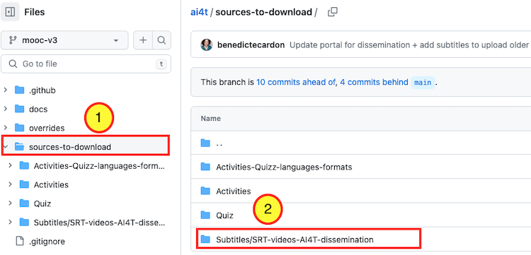
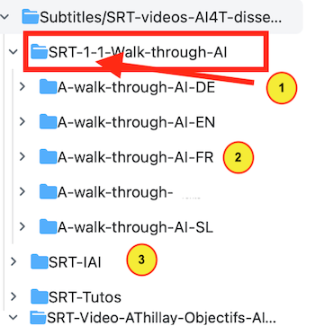

Toutes les vidéos du Mooc sont hébergées sur la chaîne YouTube du projet [https://www.youtube.com/channel/UCBd_PgP_BdhmgdSzz5d83vQ](https://www.youtube.com/channel/UCBd_PgP_BdhmgdSzz5d83vQ){:target="_blank"}.

## Les vidéos sont disponibles en plusieurs langues

Au cours du projet AI4T, la plupart des vidéos du Mooc ont été produites dans les 5 langues du partenariat (c'est-à-dire : anglais, allemand, français, italien et slovène) avec des solutions différentes selon la nature / l'origine de la vidéo.

*Les 6 vidéos "humoristiques" de l'IAI sont:*

- 🔈 à l'origine en français

- 🎧 avec **voix off** en anglais, italien et slovène

- 🎬 avec **sous-titres** en français, anglais, italien et slovène

*Les [introduction](https://inrialearninglab.GitHub.io/ai4t//1-Mooc/general-presentation/0-1-what-does-this-training-offer-us/0-1-1v-why-this-training.html) &amp; [conclusion](https://inrialearninglab.GitHub.io/ai4t//1-Mooc/to-conclude/7-0-1v-ethical-use-of-artificial-intelligence-in-education.html){:target="_blank"} vidéos* d'Alain Thillay, l'un des initiateurs du projet sont :

  - 🔈 originellement en français

  - 🎧 avec **voix-off** en anglais, allemand, italien et slovène

  - 🎬 avec **sous-titres** disponibles en anglais, français, allemand, italien et slovène

  *Les 3 vidéos de [A Walk through AI](https://inrialearninglab.GitHub.io/ai4t//1-Mooc/module-1-using-AI-and-Education/1-1-are-teachers-really-concerned-by-Artificial-Intelligence/1-1-1-the-learning-process-in-education.html){:target="_blank"}* ont été conçues en tenant compte du multilinguisme (absence de contenu textuel dans les vidéos pour faciliter leur adaptation à toutes les langues).

Elles sont :

  - 🔈 originellement en anglais

  - 🎧 avec **doublage** en français, allemand, italien et slovène

  - 🎬 avec **sous-titres** disponibles en anglais, français, allemand, italien et slovène

Note : toutes les voix off et les doublages ont été réalisés par des locuteurs natifs.

## Où trouver les sous-titres des vidéos du Mooc

Tous les sous-titres (au format .srt) sont rassemblés dans un dossier sur le dépôt GitHub. Ils peuvent être téléchargés à partir du dossier [**Subtitles/SRT-videos-AI4T-dissemination**](https://GitHub.com/inrialearninglab/ai4t/tree/mooc-v3/sources-to-download/Subtitles/SRT-videos-AI4T-dissemination)

<figure class="image-frame">
    
</figure>
<figcaption>Localisez le dossier des sous-titres sur GitHub.</figcaption>

<figure class="image-frame">
  
</figure>
<figcaption>Contenu du dossier Subtitles sur GitHub.</figcaption>

<figure class="inline-image">
    
    
Tous les contenus pédagogiques du mooc peuvent être identifiés par le <b>module</b>, l'<b>unité</b> et la <b>partie</b> auxquels ils appartiennent.

</figure>

<figure class="inline-image">
    
    
Pour chaque ressource, les fichiers sont organisés par langue. Note : comme indiqué ci-dessus, la plupart des ressources Mooc sont disponibles en 5 langues, mais certaines sont disponibles en 3 ou 4 langues, en raison des différents besoins des partenaires pendant la phase expérimentale du projet).

</figure>

<figure class="inline-image">
    
    
Il y a 4 dossiers contenant les sous-titres des vidéos :

</figure>

- 1 - SRT-1-1-Walk-through-AI : relatif aux 3 vidéos de "A walk through AI" utilisées dans le module 1,

- 2 - SRT-IAI : relatif aux 6 vidéos IAI utilisées dans les modules 2, 3 et 4,

- 3 - SRT-Tutos : concerne les 3 tutoriels utilisés dans les modules 2 et 3,

- 4 - SRT-Video-AThillay : relatif aux 3 interviews d'Alain Thillay utilisées dans les modules d'introduction et de conclusion.
