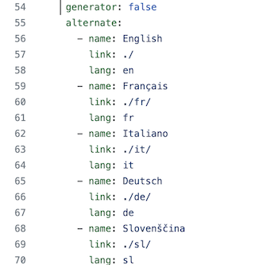
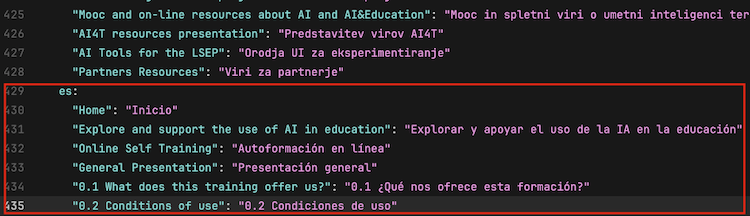
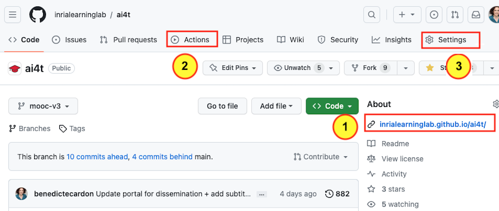
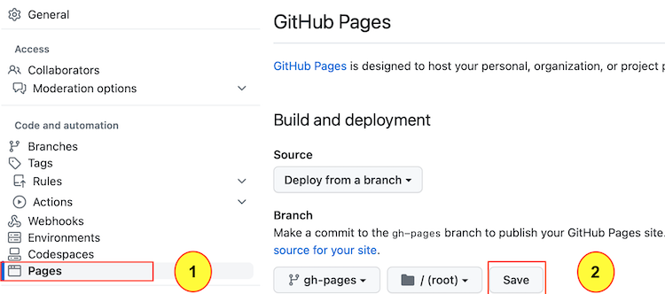
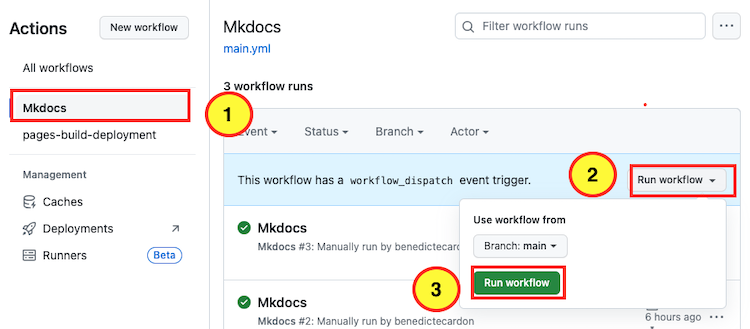

## Update the multilingual navigation

The first set is to update the **mkdocs.yml file**.

*1 - Create the new language for the navigation tab*

Add the new language after the existing ones using the same script.

<figure class="image-frame">
    
</figure>
<figcaption>Script of languages setting in the .yml document.</figcaption>

-   **name** : name of the language as it will appear in the navigation tab

-   **link** : extension of all pages static web pages in the new language

-   **lang** : ID used at the end of each markdown file for a single language

🏗️ For adding Spanish to the navigation tab

-   **name** : Español

-   **link** : . /es/

-   **lang** : es

*2 - Translate titles and contents*

⌨️ Add new entries with the new language id: here **es** for **spanish**. **All existing navigation has to be provided in the new target language**

🏗️ Use **es** for **spanish**

<figure class="image-frame">
    
</figure>
<figcaption>Example of script adaptation to provide navigation in spanish.</figcaption>

## How to generate the static web pages

Using GitHub pages, it is possible to generate static web pages and consult all the resources of the Mooc using a web browser.
On your GitHub project page, you can display the predefined address of the static web pages as[YOURNAME[.GitHub.io/ai4t/]

<figure class="image-frame" >
      tab.">
</figure>
<figcaption>Access to the predefined address of the static webpages and localisation of action tab.</figcaption>

<figure class="inline-image">
    
    
Access the visualisation of the GitHub pages.

</figure>

<figure class="inline-image">
    
    
Action tab : place to go to generate the static web pages.

</figure>

<figure class="inline-image">
    
    
Setting tab : update to make before going to <b>Action</b>- the action tab.

</figure>

<figure class="image-frame" >
    
</figure>
<figcaption>Access to the setting for the commit of github-pages.</figcaption>

<figure class="inline-image">
    
    
Once in the setting, choose the Pages tab.

</figure>

<figure class="inline-image">
    
    
Click on the button to commit changes in the gh-pages.

</figure>

<figure class="image-frame" >
    
</figure>
<figcaption>How to generate a new workflow in the action tab.</figcaption>

In order to generate the workflow, select the 3 elements in the order shown above.

It take time (several minutes) for the task to be completed. Then there is a time lag with the generation of static web pages, so you have to wait a little before you can view them on **YOURNAME.GitHub.io/ai4t/**.

These instructions are a very simplified presentation of how to view Gitbub pages. For more details, consult the official git documentation: [https://pages.GitHub.com/](https://pages.GitHub.com/)
