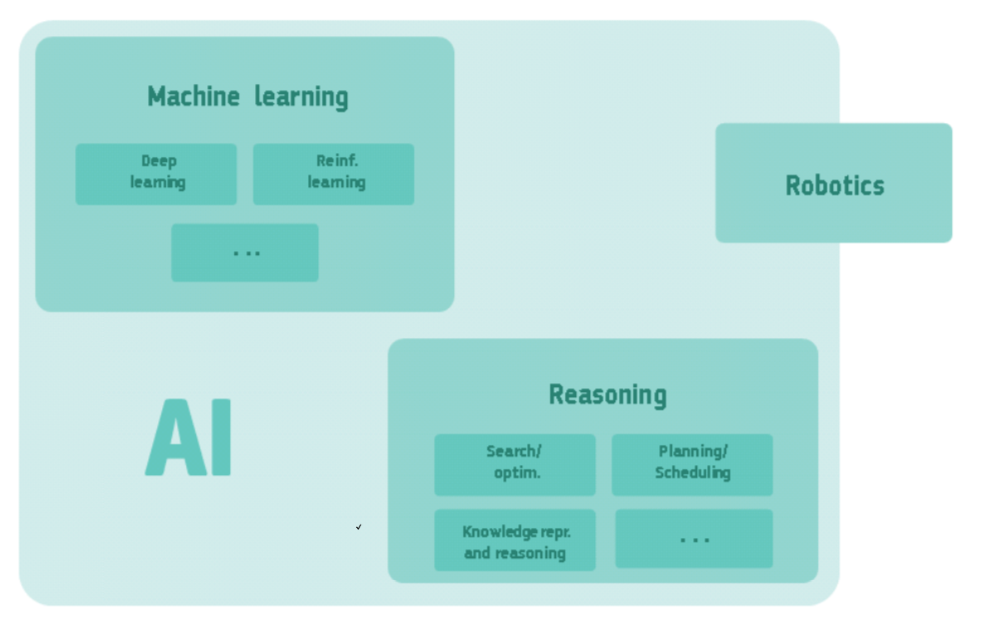
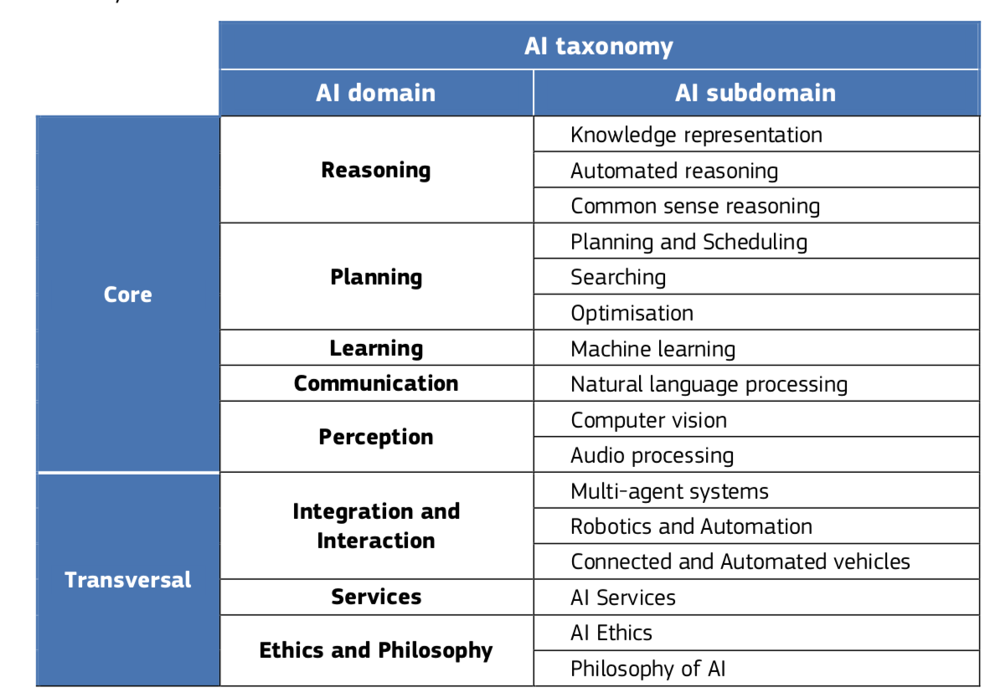

# What types of AI applications in Education

As a scientific discipline, AI covers several sub-areas of expertise and their associated techniques[^1] as depicted on the following figure, created by the European High-Level Expert Group on Artificial Intelligence. Some of them are often quoted, others less known.

<figure> 
   
  <figcaption> A simplified overview of AI's sub-disciplines and their relationship. Both machine learning and reasoning include many other techniques, and robotics includes techniques that are outside AI. The whole of AI falls within the computer science discipline. </figcaption> 
</figure>

Among the possible classifications of AI scientific domains, the following table presents an AI taxonomy[^2] according to the family functions possibly performed by AI.

<figure> 
   
  <figcaption> AI taxonomy of AI scientific domains and subdomains
 </figcaption> 
</figure>

Let's see which AI techniques are used in the AI-based education-oriented applications proposed by Holmes & al. in 2019[^3].

<figure> 
   
  <figcaption> Different types of current AI-based systems for Education (from Holmes & al. 2019) </figcaption> 
</figure>

Each specific AI-based educational tool or resource has its own specific techniques. However, it is sometimes possible to guess which ones are likely to be used for a given resource.

Let's take some examples:

- **Dialogue-based tutoring system**, as a student teaching service
Such systems are likely to use: **communication** techniques such as natural language processing for speech and language understanding and generation and **reasoning** techniques for tutoring purposes

- **Course recommendation**, as a student supporting service
As for personalised marketing offers and recommendations functions that can be found on the Internet, course recommendation systems are probably based on **machine learning** techniques by analysing relevant current data related to the student learning path and identifying similarities to previous generalised student learning paths.

- **Student attention and emotion detection**, as a teacher supporting service
Such a system is likely to use **perception** techniques (computer vision for facial recognition for example) and **machine learning** techniques to analyse the student's facial expressions or behaviour if such information are collected and analysed.

[^1]: A definition of AI: main capabilities and disciplines - High-Level Expert Group on Artificial Intelligence, European Commission - 2019.

[^2]: AI Watch - Defining Artificial Intelligence - 2.0. Towards an operational definition and taxonomy for the AI landscape - Samoili, S., López Cobo, M., Delipetrev, B., Martínez-Plumed, F., Gómez, E., and De Prato, G. - EUR 30873 EN, Publications Office of the European Union, Luxembourg, 2021, ISBN 978-92-76-42648-6, doi:10.2760/019901, JRC126426.

[^3]: Artificial Intelligence In Education: Promises and Implications for Teaching and Learning - Wayne Holmes, Maya Bialik, Charles Fadel - Boston, MA, Center for Curriculum Redesign, 2019.
